# 🏗️ tiny-lm — Architecture Document

> **A learning-focused repository for pre-training small language models from scratch, end to end.**
>
> Inspired by [nanochat](https://github.com/karpathy/nanochat), built with [PyTorch Lightning](https://lightning.ai/docs/pytorch/stable/) and a config-driven pipeline.

---

## Table of Contents

- [🏗️ tiny-lm — Architecture Document](#️-tiny-lm--architecture-document)
  - [Table of Contents](#table-of-contents)
  - [1. High-Level Overview](#1-high-level-overview)
  - [2. Directory Structure](#2-directory-structure)
  - [3. End-to-End Pipeline](#3-end-to-end-pipeline)
    - [Pipeline Steps in Detail](#pipeline-steps-in-detail)
  - [4. Configuration System](#4-configuration-system)
    - [Config Relationships](#config-relationships)
  - [5. Model Architectures](#5-model-architectures)
    - [5.1 GPT-2](#51-gpt-2)
    - [5.2 Llama 3](#52-llama-3)
    - [5.3 Shared Building Blocks](#53-shared-building-blocks)
    - [Architecture Comparison Table](#architecture-comparison-table)
  - [6. Tokenizer Pipeline](#6-tokenizer-pipeline)
  - [7. Data Pipeline](#7-data-pipeline)
  - [8. Training Loop](#8-training-loop)
    - [Learning Rate Schedule](#learning-rate-schedule)
  - [9. Inference](#9-inference)
  - [10. Module Dependency Graph](#10-module-dependency-graph)
  - [11. How to Run](#11-how-to-run)
    - [Prerequisites](#prerequisites)
    - [Step 0: Install Dependencies](#step-0-install-dependencies)
    - [Step 1: Train the Tokenizer](#step-1-train-the-tokenizer)
    - [Step 2: Tokenize the Dataset](#step-2-tokenize-the-dataset)
    - [Step 3: Train the Model](#step-3-train-the-model)
    - [Step 4: Generate Text (Inference)](#step-4-generate-text-inference)
    - [Step 5 (Optional): Upload to HuggingFace Hub](#step-5-optional-upload-to-huggingface-hub)
    - [Running Tests](#running-tests)
    - [Utility Scripts](#utility-scripts)
  - [Output Artifacts](#output-artifacts)
  - [Key Dependencies](#key-dependencies)

---

## 1. High-Level Overview


---

## 2. Directory Structure

```
tiny-lm/
├── configs/                    # All YAML configurations
│   ├── datasets/               #   Dataset source definitions (HF / local)
│   │   ├── tinystories.yaml
│   │   └── swallow-code.yaml
│   ├── tokenizers/             #   Tokenizer training configs
│   │   ├── tinystories-8k.yaml
│   │   └── swallow-code-16k.yaml
│   ├── models/                 #   Model architecture configs
│   │   ├── gpt2-8k-2l.yaml
│   │   └── llama3-16k.yaml
│   ├── training/               #   Training hyperparameters
│   │   └── gpt2-8k.yaml
│   └── data/                   #   Binary data loading configs
│       └── tinystories-8k.yaml
│
├── tiny_lm/                    # Core Python package
│   ├── model/                  #   Model implementations
│   │   ├── architectures/      #     Full model classes
│   │   │   ├── gpt2/           #       GPT-2 model + block
│   │   │   └── llama3/         #       Llama 3 model + block
│   │   ├── attention/          #     Multi-Head Attention (MHA/GQA/MQA)
│   │   ├── feedforward/        #     FFN (Standard + SwiGLU)
│   │   ├── normalization/      #     LayerNorm + RMSNorm
│   │   ├── position/           #     Learned Positional Emb + RoPE
│   │   ├── activation/         #     GELU activation
│   │   └── config.py           #     GPT2Config, Llama3Config
│   ├── tokenizer/              #   Tokenizer training (rustbpe + tiktoken)
│   │   ├── trainer_rust.py
│   │   └── config.py
│   ├── dataset/                #   Dataset loading & config
│   │   ├── dataset_loader.py
│   │   ├── config.py
│   │   └── filters/
│   ├── data/                   #   Binary data loading for training
│   │   └── bin/
│   │       ├── dataset.py      #     BinTokenDataset (torch Dataset)
│   │       ├── data_module.py  #     BinTokenDataModule (Lightning)
│   │       └── config.py       #     BinDataConfig
│   ├── training/               #   Training module & callbacks
│   │   ├── lm_module.py        #     CausalLMModule (LightningModule)
│   │   ├── config.py           #     TrainingConfig
│   │   └── callbacks/          #     Custom callbacks
│   │       ├── gpu.py          #       GpuStatsMonitor
│   │       ├── tokens.py       #       TokensMonitor
│   │       └── progress.py     #       OptimizerStepProgressBar
│   ├── tracking/               #   Experiment tracking
│   │   └── trackio_logger.py   #     TrackioLogger (Lightning Logger)
│   └── utils/                  #   Utilities
│       └── precision.py        #     Precision helpers
│
├── scripts/                    # Entry-point scripts
│   ├── data/
│   │   ├── download_data.py    #   Download raw dataset
│   │   ├── train_tokenizer.py  #   Train BPE tokenizer
│   │   └── tokenize_data.py    #   Tokenize dataset → .bin files
│   ├── training/
│   │   ├── train_gpt2.py       #   Main training script
│   │   ├── count_model_params.py
│   │   └── find_batch_size.py
│   ├── inference/
│   │   ├── generate_from_ckpt.py       # Generate from .ckpt
│   │   └── generate_from_safetensors.py # Generate from safetensors
│   └── hf_hub/
│       └── upload_gpt2.py      #   Upload model to HF Hub
│
├── tests/                      # Test suite (pytest)
│   ├── data/
│   └── model/
│
├── pyproject.toml              # Project metadata & dependencies (uv)
├── run_training.sh             # Convenience training launcher
└── uv.lock                    # Lockfile for reproducible installs
```

---

## 3. End-to-End Pipeline

```mermaid
flowchart LR
    subgraph "Phase 1: Data Preparation"
        A1["📥 Download Dataset<br/><code>download_data.py</code>"]
        A2["🔤 Train Tokenizer<br/><code>train_tokenizer.py</code>"]
        A3["📄 Tokenize Data<br/><code>tokenize_data.py</code>"]
        A1 --> A2 --> A3
    end

    subgraph "Phase 2: Training"
        B1["🧠 Build Model<br/>(GPT-2 / Llama 3)"]
        B2["⚡ Lightning Trainer<br/><code>train_gpt2.py</code>"]
        B3["💾 Checkpoints<br/><code>runs/*/checkpoints/</code>"]
        B1 --> B2 --> B3
    end

    subgraph "Phase 3: Inference & Deploy"
        C1["🔮 Generate Text<br/><code>generate_from_ckpt.py</code>"]
        C2["☁️ Upload to HF Hub<br/><code>upload_gpt2.py</code>"]
    end

    A3 --> B2
    B3 --> C1
    B3 --> C2

    style A1 fill:#e1f5fe
    style A2 fill:#e1f5fe
    style A3 fill:#e1f5fe
    style B1 fill:#fff3e0
    style B2 fill:#fff3e0
    style B3 fill:#fff3e0
    style C1 fill:#e8f5e9
    style C2 fill:#e8f5e9
```



### Pipeline Steps in Detail

| Step               | Script                                    | Input                           | Output                             | Config                                                                      |
| ------------------ | ----------------------------------------- | ------------------------------- | ---------------------------------- | --------------------------------------------------------------------------- |
| 1. Download Data   | `scripts/data/download_data.py`           | HuggingFace dataset name        | Cached dataset                     | `configs/datasets/*.yaml`                                                   |
| 2. Train Tokenizer | `scripts/data/train_tokenizer.py`         | Raw text corpus                 | `tokenizers/<name>/tokenizer.pkl`  | `configs/tokenizers/*.yaml`                                                 |
| 3. Tokenize Data   | `scripts/data/tokenize_data.py`           | Raw text + tokenizer            | `data/<name>/train.bin`, `val.bin` | `configs/tokenizers/*.yaml`                                                 |
| 4. Train Model     | `scripts/training/train_gpt2.py`          | `.bin` files + model config     | `runs/<name>/checkpoints/*.ckpt`   | `configs/models/*.yaml` + `configs/training/*.yaml` + `configs/data/*.yaml` |
| 5. Generate Text   | `scripts/inference/generate_from_ckpt.py` | Checkpoint + tokenizer + prompt | Generated text                     | Model config + tokenizer config                                             |
| 6. Upload to Hub   | `scripts/hf_hub/upload_gpt2.py`           | Checkpoint                      | HuggingFace model repo             | Model config                                                                |

---

## 4. Configuration System

The project uses a fully **YAML-driven configuration system** with five config categories. Each config has a corresponding Python `@dataclass` with validation.

```mermaid
graph LR
    subgraph "Config Files (YAML)"
        DC["configs/datasets/<br/>*.yaml"]
        TC["configs/tokenizers/<br/>*.yaml"]
        MC["configs/models/<br/>*.yaml"]
        TRC["configs/training/<br/>*.yaml"]
        BDC["configs/data/<br/>*.yaml"]
    end

    subgraph "Python Dataclasses"
        DC1["DatasetConfig<br/><i>tiny_lm.dataset.config</i>"]
        TC1["TokenizerConfig<br/><i>tiny_lm.tokenizer.config</i>"]
        MC1["GPT2Config / Llama3Config<br/><i>tiny_lm.model.config</i>"]
        TRC1["TrainingConfig<br/><i>tiny_lm.training.config</i>"]
        BDC1["BinDataConfig<br/><i>tiny_lm.data.bin.config</i>"]
    end

    DC -->|from_yaml()| DC1
    TC -->|from_yaml()| TC1
    MC -->|from_yaml()| MC1
    TRC -->|from_yaml()| TRC1
    BDC -->|from_yaml()| BDC1
```

### Config Relationships

```mermaid
graph TB
    DS["DatasetConfig<br/>• name, source<br/>• text_field<br/>• splits"]

    TK["TokenizerConfig<br/>• vocab_size, type<br/>• special_tokens<br/>• output_dir<br/>• dataset_config →"]

    MC_GPT["GPT2Config<br/>• vocab_size, d_model<br/>• n_layers, n_heads<br/>• d_ff, context_length<br/>• dropout rates"]

    MC_LL["Llama3Config<br/>• vocab_size, d_model<br/>• n_layers, n_heads<br/>• n_kv_heads<br/>• rope_theta, norm_eps"]

    TC["TrainingConfig<br/>• learning_rate, scheduler<br/>• warmup_ratio, max_steps<br/>• precision, grad_clip<br/>• val/save intervals"]

    BD["BinDataConfig<br/>• train_path, val_path<br/>• block_size, stride<br/>• batch_size, dtype<br/>• eos_token_id"]

    TK -->|references| DS
    MC_GPT -->|used by| TC
    MC_LL -->|used by| TC
    BD -->|feeds into| TC
```



---

## 5. Model Architectures

### 5.1 GPT-2

A **decoder-only transformer** using pre-norm architecture with learned positional embeddings.

```mermaid
graph TB
    subgraph "GPT2 Model"
        IN["Input Token IDs<br/>(batch, seq_len)"]
        TE["Token Embedding<br/>nn.Embedding"]
        PE["Learned Positional Embedding<br/>LearnedPositionalEmbedding"]
        ADD1["➕ Add"]
        ED["Embedding Dropout"]

        subgraph "GPT2Block × N"
            LN1["LayerNorm"]
            MHA["Multi-Head Attention<br/>(MHA)"]
            DRP1["Residual Dropout"]
            ADD2["➕ Residual Add"]
            LN2["LayerNorm"]
            FFN["FeedForward<br/>(Linear → GELU → Linear)"]
            DRP2["Residual Dropout"]
            ADD3["➕ Residual Add"]
        end

        LNF["Final LayerNorm"]
        LMH["LM Head<br/>(Linear, weight-tied)"]
        OUT["Logits<br/>(batch, seq_len, vocab)"]

        IN --> TE
        IN --> PE
        TE --> ADD1
        PE --> ADD1
        ADD1 --> ED
        ED --> LN1
        LN1 --> MHA
        MHA --> DRP1
        DRP1 --> ADD2
        ED -.->|residual| ADD2
        ADD2 --> LN2
        LN2 --> FFN
        FFN --> DRP2
        DRP2 --> ADD3
        ADD2 -.->|residual| ADD3
        ADD3 --> LNF
        LNF --> LMH
        LMH --> OUT
    end

    style TE fill:#e3f2fd
    style PE fill:#e3f2fd
    style MHA fill:#fff9c4
    style FFN fill:#f3e5f5
    style LMH fill:#e8f5e9
```



**Key characteristics:**
- **Positional encoding**: Learned absolute positional embeddings
- **Normalization**: LayerNorm (pre-norm)
- **Activation**: GELU
- **Feed-forward**: Standard 2-layer FFN (`d_model → d_ff → d_model`)
- **Attention**: Standard Multi-Head Attention (MHA) via `F.scaled_dot_product_attention` (Flash Attention)
- **Weight tying**: `lm_head.weight = token_emb.weight`

### 5.2 Llama 3

A modern **decoder-only transformer** with RoPE, RMSNorm, SwiGLU, and Grouped Query Attention.

```mermaid
graph TB
    subgraph "Llama3 Model"
        IN2["Input Token IDs<br/>(batch, seq_len)"]
        TE2["Token Embedding<br/>nn.Embedding"]
        ED2["Embedding Dropout"]
        ROPE["RoPE Module<br/>(Precomputed freqs_cis)"]

        subgraph "Llama3Block × N"
            RN1["RMSNorm"]
            GQA["Multi-Head Attention<br/>(GQA with RoPE)"]
            DRP3["Residual Dropout"]
            ADD4["➕ Residual Add"]
            RN2["RMSNorm"]
            SWG["SwiGLU FFN<br/>(w2(SiLU(w1(x)) · w3(x)))"]
            DRP4["Residual Dropout"]
            ADD5["➕ Residual Add"]
        end

        RNF["Final RMSNorm"]
        LMH2["LM Head<br/>(Linear, weight-tied)"]
        OUT2["Logits<br/>(batch, seq_len, vocab)"]

        IN2 --> TE2
        TE2 --> ED2
        IN2 -.->|seq_len| ROPE
        ROPE -.->|freqs_cis| GQA
        ED2 --> RN1
        RN1 --> GQA
        GQA --> DRP3
        DRP3 --> ADD4
        ED2 -.->|residual| ADD4
        ADD4 --> RN2
        RN2 --> SWG
        SWG --> DRP4
        DRP4 --> ADD5
        ADD4 -.->|residual| ADD5
        ADD5 --> RNF
        RNF --> LMH2
        LMH2 --> OUT2
    end

    style TE2 fill:#e3f2fd
    style ROPE fill:#ffecb3
    style GQA fill:#fff9c4
    style SWG fill:#f3e5f5
    style LMH2 fill:#e8f5e9
```



**Key characteristics:**
- **Positional encoding**: Rotary Position Embeddings (RoPE) — no absolute positional embeddings
- **Normalization**: RMSNorm (pre-norm)
- **Activation**: SiLU (inside SwiGLU)
- **Feed-forward**: SwiGLU gated FFN (`w2(SiLU(w1(x)) * w3(x))`)
- **Attention**: Grouped Query Attention (GQA) via `F.scaled_dot_product_attention` (Flash Attention) — `n_kv_heads < n_heads`
- **Weight tying**: `lm_head.weight = token_emb.weight`

### 5.3 Shared Building Blocks


### Architecture Comparison Table

| Feature               | GPT-2                               | Llama 3                             |
| --------------------- | ----------------------------------- | ----------------------------------- |
| **Position Encoding** | Learned absolute                    | RoPE                                |
| **Normalization**     | LayerNorm                           | RMSNorm                             |
| **FFN Type**          | Standard (2-layer)                  | SwiGLU (gated, 3-layer)             |
| **Activation**        | GELU                                | SiLU (in SwiGLU)                    |
| **Attention**         | MHA via SDPA (n_kv_heads = n_heads) | GQA via SDPA (n_kv_heads < n_heads) |
| **Attention Backend** | Flash Attention (auto)              | Flash Attention (auto)              |
| **QKV Bias**          | ❌ Off by default                    | ❌ Off by default                    |
| **Weight Tying**      | ✅ token_emb ↔ lm_head               | ✅ token_emb ↔ lm_head               |

---

## 6. Tokenizer Pipeline


**Tokenizer details:**
- **Algorithm**: BPE (Byte Pair Encoding)
- **Training backend**: `rustbpe` (Rust, very fast)
- **Inference backend**: `tiktoken` (fast encode/decode)
- **Split pattern**: GPT-4 style regex pattern preserving newlines
- **Special tokens**: `<pad>`, `<eos>`, `<bos>`, `<unk>` — added after the base vocabulary

---

## 7. Data Pipeline


**Binary format details:**
- Token IDs are stored as flat numpy arrays (`uint16` for vocab < 65536, else `uint32`)
- `BinTokenDataset` memory-maps the `.bin` files and serves fixed-length windows (`block_size`) with a configurable `stride`
- Each sample returns `(x, y)` where `y = x` shifted by 1 (next-token prediction)
- Validation set can mask targets after `<eos>` tokens to handle padding
- DataLoaders use `persistent_workers=True` (workers stay alive between epochs) and `prefetch_factor=4` for smooth GPU feeding

---

## 8. Training Loop

```mermaid
flowchart TB
    subgraph "CausalLMModule (LightningModule)"
        FWD["forward(input_ids) → logits"]
        LOSS["CrossEntropyLoss<br/>(ignore_index=-100)"]
        OPT["AdamW Optimizer<br/>(weight_decay, betas, eps)"]
        SCHED["Cosine LR Scheduler<br/>(warmup + decay)"]

        FWD --> LOSS
        LOSS --> OPT
        OPT --> SCHED
    end

    subgraph "Lightning Trainer"
        TR["pl.Trainer<br/>• accelerator=auto<br/>• precision=bf16-mixed<br/>• accumulate_grad_batches<br/>• gradient_clip_val"]

        subgraph "Callbacks"
            CB1["ModelCheckpoint<br/>(every N steps)"]
            CB2["LearningRateMonitor"]
            CB3["OptimizerStepProgressBar"]
            CB4["TokensMonitor<br/>(tokens/sec tracking)"]
            CB5["GpuStatsMonitor<br/>(GPU util, memory)"]
        end

        LOG["TrackioLogger<br/>(experiment tracking)"]
    end

    DM["BinTokenDataModule"] --> TR
    TR --> FWD
    TR --> CB1
    TR --> CB2
    TR --> CB3
    TR --> CB4
    TR --> CB5
    TR --> LOG
```



### Learning Rate Schedule

```mermaid
graph LR
    subgraph "Cosine Schedule with Warmup"
        W["Warmup Phase<br/>(linear ramp)"] --> C["Cosine Decay Phase<br/>(from lr → min_lr)"]
    end
```



**Training features:**
- **Optimizer**: AdamW with configurable weight decay, betas, and epsilon
- **Scheduler**: Cosine decay with linear warmup (`warmup_ratio × max_steps`)
- **Precision**: bf16-mixed by default (configurable)
- **TF32**: Enabled via `torch.set_float32_matmul_precision("high")` for faster FP32 matmuls on Ampere+ GPUs
- **JIT compilation**: Model compiled with `torch.compile()` for Triton kernel fusion
- **Flash Attention**: Uses `F.scaled_dot_product_attention` (SDPA) with automatic backend selection
- **Gradient clipping**: By norm (default: 1.0)
- **Gradient accumulation**: Configurable `accumulate_grad_batches`
- **Metrics logged**: `train_loss`, `train_ppl`, `val_loss`, `val_ppl`, `lr`, `tokens/sec`, GPU stats
- **Checkpointing**: Every N optimizer steps + `last.ckpt`

---

## 9. Inference


**Sampling strategy:**
1. Apply **temperature** scaling to logits
2. Apply **top-p** (nucleus) sampling — sort by probability, keep smallest set summing to `p`
3. Stop on `<eos>` token or `max_new_tokens` reached

**GPU optimizations (inference):**
- **TF32**: Enabled via `torch.set_float32_matmul_precision("high")`
- **JIT compilation**: Model compiled with `torch.compile()` for fused kernel execution
- **Flash Attention**: Uses `F.scaled_dot_product_attention` (SDPA) inside the model

---

## 10. Module Dependency Graph


---

## 11. How to Run

### Prerequisites

- **Python** ≥ 3.10
- **uv** — fast Python package manager ([install guide](https://docs.astral.sh/uv/getting-started/installation/))
- **CUDA-capable GPU** (recommended, e.g. NVIDIA RTX series)
- **Git** (for version tracking during runs)

### Step 0: Install Dependencies

```bash
# Clone the repository
git clone https://github.com/ferjorosa/tiny-lm.git
cd tiny-lm

# Install all dependencies with uv (creates .venv automatically)
uv sync
```

> `uv sync` reads `pyproject.toml` and `uv.lock` to install exact pinned versions. PyTorch will be installed from the CUDA 12.8 wheel index.

### Step 1: Train the Tokenizer

```bash
uv run python scripts/data/train_tokenizer.py \
    --config configs/tokenizers/tinystories-8k.yaml
```

**What it does:**
- Downloads the TinyStories dataset from HuggingFace
- Trains a BPE tokenizer with 8192 vocab using `rustbpe`
- Saves `tokenizers/tinystories-8k/tokenizer.pkl` and `metadata.txt`

### Step 2: Tokenize the Dataset

```bash
uv run python scripts/data/tokenize_data.py \
    --config configs/tokenizers/tinystories-8k.yaml
```

**What it does:**
- Loads the raw dataset and the trained tokenizer
- Tokenizes all text and writes `data/tinystories-8k-tokenized/train.bin` and `val.bin`
- Saves `metadata.json` with token counts and statistics

### Step 3: Train the Model

```bash
uv run python scripts/training/train_gpt2.py \
    --model-config configs/models/gpt2-8k-2l.yaml \
    --training-config configs/training/gpt2-8k.yaml \
    --data-config configs/data/tinystories-8k.yaml
```

Or use the convenience script:

```bash
bash run_training.sh
```

**What it does:**
- Builds a GPT-2 model from the YAML config
- Loads pre-tokenized binary data
- Trains with PyTorch Lightning (bf16-mixed, cosine LR, gradient clipping)
- Logs metrics to Trackio
- Saves checkpoints to `runs/<run-name>/checkpoints/`

**Environment variable (optional):**
```bash
export TRACKIO_PROJECT="tiny-lm"  # Trackio project name
```

### Step 4: Generate Text (Inference)

```bash
uv run python scripts/inference/generate_from_ckpt.py \
    --checkpoint runs/<run-name>/checkpoints/last.ckpt \
    --model-config configs/models/gpt2-8k-2l.yaml \
    --tokenizer tokenizers/tinystories-8k/tokenizer.pkl \
    --tokenizer-config configs/tokenizers/tinystories-8k.yaml \
    --prompt "Once upon a time" \
    --max-new-tokens 300 \
    --temperature 0.8 \
    --top-p 0.95 \
    --add-bos
```

### Step 5 (Optional): Upload to HuggingFace Hub

```bash
uv run python scripts/hf_hub/upload_gpt2.py \
    --checkpoint runs/<run-name>/checkpoints/last.ckpt \
    --model-config configs/models/gpt2-8k-2l.yaml
```

### Running Tests

```bash
uv run pytest tests/ -v
```

### Utility Scripts

```bash
# Count model parameters
uv run python scripts/training/count_model_params.py \
    --model-config configs/models/gpt2-8k-2l.yaml

# Find optimal batch size
uv run python scripts/training/find_batch_size.py \
    --model-config configs/models/gpt2-8k-2l.yaml
```

---

## Output Artifacts

| Artifact          | Location                             | Description                     |
| ----------------- | ------------------------------------ | ------------------------------- |
| Trained tokenizer | `tokenizers/<name>/tokenizer.pkl`    | Serialized tiktoken encoding    |
| Tokenized data    | `data/<name>/train.bin`, `val.bin`   | Binary token streams            |
| Data metadata     | `data/<name>/metadata.json`          | Vocab size, token counts, stats |
| Run checkpoints   | `runs/<run-name>/checkpoints/*.ckpt` | Lightning model checkpoints     |
| Run configs       | `runs/<run-name>/configs/`           | Copy of YAML configs used       |

---

## Key Dependencies

| Package             | Role                                           |
| ------------------- | ---------------------------------------------- |
| `torch`             | Core deep learning framework                   |
| `pytorch-lightning` | Training loop, callbacks, distributed training |
| `rustbpe`           | Fast BPE tokenizer training (Rust backend)     |
| `tiktoken`          | Fast tokenizer inference (encode/decode)       |
| `datasets`          | HuggingFace dataset loading                    |
| `trackio`           | Experiment tracking & monitoring               |
| `pyyaml`            | YAML config parsing                            |
| `transformers`      | HuggingFace model format utilities             |
| `numpy`             | Binary data handling                           |
