# 🚀 Model Deployment Guide — tiny-lm to Ollama, Open WebUI & Beyond

> **Complete guide for converting your trained tiny-lm model and running it in Ollama,
> Open WebUI, and other serving platforms.**

---

## Table of Contents

1. [Overview & Pipeline](#1-overview--pipeline)
2. [Step 1: Convert to HuggingFace Format](#2-step-1-convert-to-huggingface-format)
3. [Step 2: Convert to GGUF](#3-step-2-convert-to-gguf)
4. [Step 3: Import into Ollama](#4-step-3-import-into-ollama)
5. [Step 4: Use with Open WebUI](#5-step-4-use-with-open-webui)
6. [Advanced: Thinking Models](#6-advanced-thinking-models)
7. [Advanced: Tool Calling Models](#7-advanced-tool-calling-models)
8. [Keeping Model Size Small](#8-keeping-model-size-small)
9. [Troubleshooting](#9-troubleshooting)

---

## 1. Overview & Pipeline

```mermaid
flowchart LR
    subgraph "Training (tiny-lm)"
        A["⚡ Train Model<br/>train_gpt2.py"] --> B["💾 Lightning .ckpt"]
    end

    subgraph "Conversion"
        B --> C["🔄 convert_to_hf_gpt2.py<br/>(tiny-lm → HF format)"]
        C --> D["📦 HuggingFace Files<br/>config.json + model.safetensors<br/>+ tokenizer files"]
        D --> E["🔄 convert_hf_to_gguf.py<br/>(llama.cpp)"]
        E --> F["📦 GGUF File<br/>tiny-stories.gguf"]
    end

    subgraph "Serving"
        F --> G["🦙 Ollama<br/>ollama run tiny-stories"]
        G --> H["🌐 Open WebUI<br/>Chat Interface"]
        F --> I["💻 llama.cpp<br/>CLI inference"]
    end

    style A fill:#fff9c4
    style F fill:#c8e6c9
    style G fill:#bbdefb
    style H fill:#e1bee7
```



### File Size at Each Stage

| Stage                   | File                    | Size (Speed Run ~5M params)       |
| ----------------------- | ----------------------- | --------------------------------- |
| Lightning `.ckpt`       | `last.ckpt`             | ~52 MB (includes optimizer state) |
| HuggingFace SafeTensors | `model.safetensors`     | ~26 MB (FP32) / ~13 MB (FP16)     |
| GGUF F16                | `tiny-stories-f16.gguf` | ~13 MB                            |
| GGUF Q8_0               | `tiny-stories-q8.gguf`  | ~7 MB                             |
| GGUF Q4_K_M             | `tiny-stories-q4.gguf`  | ~4 MB                             |

---

## 2. Step 1: Convert to HuggingFace Format

The conversion script maps tiny-lm's custom weight naming to HuggingFace's
`GPT2LMHeadModel` format. This handles:

- **Conv1D transposition**: HF GPT-2 uses Conv1D (transposed Linear layers)
- **QKV concatenation**: tiny-lm stores Q, K, V separately; HF concatenates them into `c_attn`
- **LayerNorm naming**: `gamma/beta` → `weight/bias`
- **Tokenizer files**: Creates `tokenizer.json`, `special_tokens_map.json`, etc.

### Run the Conversion

```bash
uv run python scripts/export/convert_to_hf_gpt2.py \
    --checkpoint runs/<run-name>/checkpoints/last.ckpt \
    --model-config configs/models/gpt2-8k-2l-speed.yaml \
    --tokenizer tokenizers/tinystories-8k/tokenizer.pkl \
    --tokenizer-config configs/tokenizers/tinystories-8k.yaml \
    --output-dir exports/hf-gpt2-speed \
    --dtype float32
```

> 💡 Use `--dtype float32` for maximum GGUF compatibility. The quantization step
> will reduce the size later.

### Output Files

```
exports/hf-gpt2-speed/
├── config.json                # HuggingFace GPT2Config
├── model.safetensors          # Weights (HF naming)
├── tokenizer.json             # Tokenizer vocabulary
├── tokenizer_config.json      # Tokenizer settings
├── special_tokens_map.json    # BOS/EOS/PAD/UNK mapping
└── generation_config.json     # Default generation params
```

### Verify the Conversion

```python
from transformers import GPT2LMHeadModel

model = GPT2LMHeadModel.from_pretrained("exports/hf-gpt2-speed")
print(f"Parameters: {sum(p.numel() for p in model.parameters())/1e6:.1f}M")
# Output: Parameters: 6.8M
```

---

## 3. Step 2: Convert to GGUF

[GGUF](https://github.com/ggerganov/ggml/blob/master/docs/gguf.md) is the binary
format used by `llama.cpp` and Ollama. It supports quantization for smaller file
sizes and faster inference.

### Install llama.cpp

```bash
# Option A: Clone and build from source
git clone https://github.com/ggerganov/llama.cpp
cd llama.cpp

# Install Python conversion dependencies
pip install -r requirements/requirements-convert_hf_to_gguf.txt

# Option B: Use pre-built release (Windows)
# Download from https://github.com/ggerganov/llama.cpp/releases
```

### Convert HF → GGUF

```bash
# Convert to GGUF with F16 precision (full quality)
python llama.cpp/convert_hf_to_gguf.py exports/hf-gpt2-speed/ \
    --outtype f16 \
    --outfile exports/gguf/tiny-stories-f16.gguf
```

### Quantize for Smaller Size

```bash
# Quantize to Q8_0 (very close to full quality, ~50% size reduction)
./llama.cpp/build/bin/llama-quantize \
    exports/gguf/tiny-stories-f16.gguf \
    exports/gguf/tiny-stories-q8.gguf \
    Q8_0

# Quantize to Q4_K_M (good quality/size balance, ~75% size reduction)
./llama.cpp/build/bin/llama-quantize \
    exports/gguf/tiny-stories-f16.gguf \
    exports/gguf/tiny-stories-q4.gguf \
    Q4_K_M
```

### Quantization Options (Smallest to Largest)

| Quantization | Bits   | Size (5M model) | Quality         | Best For                       |
| ------------ | ------ | --------------- | --------------- | ------------------------------ |
| Q2_K         | 2-bit  | ~2 MB           | ⚠️ Poor          | Extreme size constraints       |
| Q4_K_M       | 4-bit  | ~4 MB           | ✅ Good          | **Recommended for this model** |
| Q5_K_M       | 5-bit  | ~5 MB           | ✅ Very good     | Balance                        |
| Q8_0         | 8-bit  | ~7 MB           | ✅ Near-lossless | Quality-focused                |
| F16          | 16-bit | ~13 MB          | ✅ Full quality  | Debugging / reference          |

> 💡 For a ~5M param model, **Q4_K_M** is recommended. The model is already so small
> that even Q4 produces good results, and you get a ~4 MB model file.

### Test with llama.cpp CLI

```bash
# Quick test before importing to Ollama
./llama.cpp/build/bin/llama-cli \
    -m exports/gguf/tiny-stories-q4.gguf \
    -p "Once upon a time" \
    -n 100 \
    --temp 0.8
```

---

## 4. Step 3: Import into Ollama

### Install Ollama

Download from [https://ollama.ai/download](https://ollama.ai/download) (Windows, Mac, Linux).

After installation, verify:
```bash
ollama --version
```

### Create a Modelfile

Create a file called `Modelfile` in your project root:

```dockerfile
# Modelfile for tiny-stories
FROM ./exports/gguf/tiny-stories-q4.gguf

# Generation parameters
PARAMETER temperature 0.8
PARAMETER top_p 0.95
PARAMETER top_k 40
PARAMETER repeat_penalty 1.1
PARAMETER stop "<eos>"

# Template: plain text completion (no chat format needed for story generation)
TEMPLATE "{{.Prompt}}"

# System prompt
SYSTEM "You are a children's story generator. Continue the story in a creative and engaging way."
```

### Import into Ollama

```bash
# Create the model (this copies the GGUF into Ollama's storage)
ollama create tiny-stories -f Modelfile

# Verify it's listed
ollama list
```

### Run It!

```bash
# Interactive chat
ollama run tiny-stories "Once upon a time there was a little"

# Single generation via CLI
echo "The big dog went to the" | ollama run tiny-stories

# API call (OpenAI-compatible)
curl http://localhost:11434/api/generate -d '{
  "model": "tiny-stories",
  "prompt": "Once upon a time",
  "stream": false,
  "options": {
    "temperature": 0.8,
    "num_predict": 200
  }
}'

# Chat API (OpenAI-compatible)
curl http://localhost:11434/v1/chat/completions -d '{
  "model": "tiny-stories",
  "messages": [{"role": "user", "content": "Tell me a story about a cat"}]
}'
```

### Manage Your Model

```bash
# List all models
ollama list

# Show model info
ollama show tiny-stories

# Remove model
ollama rm tiny-stories

# Copy / rename
ollama cp tiny-stories my-stories
```

---

## 5. Step 4: Use with Open WebUI

[Open WebUI](https://github.com/open-webui/open-webui) is a beautiful, self-hosted
web interface for LLMs. It connects directly to Ollama.

```mermaid
flowchart LR
    U["👤 User<br/>(Browser)"] --> OW["🌐 Open WebUI<br/>localhost:3000"]
    OW --> OL["🦙 Ollama<br/>localhost:11434"]
    OL --> M["📦 tiny-stories<br/>(GGUF model)"]

    style OW fill:#e1bee7
    style OL fill:#bbdefb
    style M fill:#c8e6c9
```



### Option A: Docker (Recommended)

```bash
# Pull and run Open WebUI (connects to Ollama automatically)
docker run -d \
  -p 3000:8080 \
  --add-host=host.docker.internal:host-gateway \
  -e OLLAMA_BASE_URL=http://host.docker.internal:11434 \
  -v open-webui:/app/backend/data \
  --name open-webui \
  --restart always \
  ghcr.io/open-webui/open-webui:main
```

Then open **http://localhost:3000** in your browser.

### Option B: pip Install

```bash
pip install open-webui
open-webui serve --port 3000
```

### Using Open WebUI

1. **Open** http://localhost:3000
2. **Create an account** (local only, first user becomes admin)
3. **Select model**: Click the model dropdown at the top → select `tiny-stories`
4. **Chat**: Type your prompt and enjoy the conversation!

### Open WebUI Features

- 🎨 **Beautiful chat interface** with markdown rendering
- 📁 **Conversation history** saved locally
- ⚙️ **Per-chat model settings** (temperature, top-p, etc.)
- 📋 **System prompts** — customize per conversation
- 👥 **Multi-user support** with role-based access
- 🔗 **OpenAI-compatible API** — use it from code too
- 📱 **Mobile-friendly** responsive design

### Open WebUI with Multiple Models

If you have multiple trained models (Speed Run, Baseline, etc.), create separate
Ollama models for each:

```bash
# Speed Run model
ollama create tiny-stories-speed -f Modelfile.speed

# Baseline model (after converting it)
ollama create tiny-stories-baseline -f Modelfile.baseline
```

All models will appear in Open WebUI's model selector!

---

## 6. Advanced: Thinking Models

> ⚠️ **Note**: The current tiny-lm models are **not** trained for thinking/reasoning.
> This section explains how to **add thinking capabilities** to your training pipeline.

### What Are Thinking Models?

Thinking models (like DeepSeek R1, QwQ, etc.) use special tokens to mark an internal
"thought process" before generating the actual response:

```
<think>
The user wants a story about a cat. I should include:
- A character name
- A problem to solve
- A happy ending
</think>

Once upon a time, there was a curious cat named Whiskers...
```

### How to Add Thinking to tiny-lm

#### Step 1: Add Special Tokens

Add `<think>` and `</think>` tokens to your tokenizer config:

```yaml
# configs/tokenizers/tinystories-8k-thinking.yaml
special_tokens:
  pad: "<pad>"
  eos: "<eos>"
  bos: "<bos>"
  unk: "<unk>"
  think_start: "<think>"
  think_end: "</think>"
```

#### Step 2: Prepare Training Data with Thinking

Format your training data to include thinking blocks:

```python
# Example training data format
training_example = """<bos><think>
I need to write a story about a dog and a ball.
The dog should be friendly and the story should have a lesson.
</think>
Once upon a time, there was a big brown dog named Max.
Max loved to play with his red ball in the park.
One day, the ball rolled into the pond.
Max was scared of the water, but he wanted his ball.
He took a deep breath and jumped in!
Max learned that being brave can help you get what you want.
<eos>"""
```

#### Step 3: Train with Thinking Data

```bash
# Use the same training pipeline, but with thinking-formatted data
uv run python scripts/training/train_gpt2.py \
    --model-config configs/models/gpt2-8k-2l-speed.yaml \
    --training-config configs/training/gpt2-8k-speed.yaml \
    --data-config configs/data/tinystories-8k-thinking.yaml
```

#### Step 4: Ollama Modelfile for Thinking

```dockerfile
FROM ./tiny-stories-thinking-q4.gguf

PARAMETER temperature 0.8
PARAMETER stop "<eos>"
PARAMETER stop "</think>"

TEMPLATE """{{.Prompt}}<think>
"""

SYSTEM "Think step by step, then write a story."
```

#### Alternative: Use a Pre-trained Thinking Model in Ollama

Instead of training your own, use an existing small thinking model:

```bash
# DeepSeek R1 distilled models (smallest)
ollama run deepseek-r1:1.5b    # 1.5B params, ~1 GB

# Qwen 2.5 with thinking (small)
ollama run qwen2.5:0.5b        # 0.5B params, ~400 MB
```

---

## 7. Advanced: Tool Calling Models

> ⚠️ **Note**: Tool calling requires training (or fine-tuning) with structured
> tool-calling data. The current tiny-lm models do not support this.

### What Is Tool Calling?

Tool calling allows the model to invoke external functions/APIs:

```json
User: "What's the weather in London?"

Model response:
{
  "tool_calls": [{
    "function": {
      "name": "get_weather",
      "arguments": "{\"city\": \"London\"}"
    }
  }]
}
```

### How to Add Tool Calling to tiny-lm

#### Step 1: Define Tool Call Tokens

```yaml
# Additional special tokens for tool calling
special_tokens:
  tool_call_start: "<tool_call>"
  tool_call_end: "</tool_call>"
  tool_result_start: "<tool_result>"
  tool_result_end: "</tool_result>"
```

#### Step 2: Training Data Format

```
<bos>User: What's 5 + 3?
<tool_call>
{"name": "calculator", "arguments": {"expression": "5 + 3"}}
</tool_call>
<tool_result>
8
</tool_result>
The answer is 8!
<eos>
```

#### Step 3: Ollama Modelfile for Tool Calling

```dockerfile
FROM ./tiny-stories-tools-q4.gguf

PARAMETER temperature 0.1
PARAMETER stop "<eos>"
PARAMETER stop "</tool_call>"

TEMPLATE """{{ if .Tools }}
Available tools:
{{ range .Tools }}
- {{ .Function.Name }}: {{ .Function.Description }}
  Parameters: {{ .Function.Parameters }}
{{ end }}
{{ end }}

{{ .Prompt }}
"""
```

#### Alternative: Use Pre-trained Tool-Calling Models

For actual tool calling, use models already trained for it:

```bash
# Smallest models with tool calling support
ollama run qwen2.5:0.5b        # 0.5B params, supports tools
ollama run llama3.2:1b          # 1B params, tool support
ollama run mistral:7b           # 7B params, excellent tools
```

### Open WebUI + Tool Calling

Open WebUI supports tool calling through its **Functions** feature:

1. Go to **Workspace** → **Functions**
2. Create a new function (Python code)
3. The model can invoke it during chat

Example Open WebUI function:
```python
class Calculator:
    """Simple calculator tool."""

    def calculate(self, expression: str) -> str:
        """Evaluate a math expression."""
        try:
            return str(eval(expression))
        except Exception as e:
            return f"Error: {e}"
```

---

## 8. Keeping Model Size Small

### Size Comparison: All Options

| Model                        | Params | GGUF Q4 Size | RAM Usage | Good For         |
| ---------------------------- | ------ | ------------ | --------- | ---------------- |
| **tiny-stories (Speed Run)** | 5M     | **~4 MB**    | ~50 MB    | Story generation |
| **tiny-stories (Baseline)**  | 29M    | **~18 MB**   | ~100 MB   | Better stories   |
| Qwen 2.5 0.5B                | 500M   | ~350 MB      | ~600 MB   | General chat     |
| Llama 3.2 1B                 | 1B     | ~700 MB      | ~1.2 GB   | Tool calling     |
| Phi-3 Mini 3.8B              | 3.8B   | ~2.5 GB      | ~4 GB     | Reasoning        |

### Tips for Minimum Model Size

1. **Use Q4_K_M quantization** — Best quality-to-size ratio
2. **Reduce vocab_size** — 4K or 2K vocab for niche domains
3. **Shorter context** — 128 or 64 tokens if stories are very short
4. **Fewer layers** — 1 layer is the absolute minimum
5. **Smaller d_model** — 128 or 256 for the smallest models

### Ultra-Tiny Config (~1M params, ~1 MB GGUF)

```yaml
# configs/models/gpt2-8k-1l-ultra.yaml
vocab_size: 8192
context_length: 128
d_model: 128
n_layers: 1
n_heads: 4
d_ff: 512
dropout: 0.1
emb_dropout: 0.1
attn_dropout: 0.1
resid_dropout: 0.1
```

---

## 9. Troubleshooting

### Common Issues

#### "model architecture not supported"
The GGUF conversion may not recognize the model. Ensure your `config.json` has:
```json
{
  "architectures": ["GPT2LMHeadModel"],
  "model_type": "gpt2"
}
```

#### Ollama shows garbled output
This usually means the tokenizer wasn't converted correctly. Try:
1. Re-export with `--dtype float32`
2. Verify the vocab size matches between `config.json` and the GGUF file
3. Check that special tokens (BOS/EOS) are correctly mapped

#### Open WebUI can't find Ollama
```bash
# Check Ollama is running
ollama list

# If using Docker, ensure the host URL is correct
docker run -e OLLAMA_BASE_URL=http://host.docker.internal:11434 ...

# On Windows, Ollama runs on localhost:11434 by default
curl http://localhost:11434/api/tags
```

#### GGUF conversion fails with "unknown tensor"
The HF weight names must exactly match GPT-2's expected format. Verify with:
```python
from safetensors import safe_open
with safe_open("exports/hf-gpt2-speed/model.safetensors", framework="pt") as f:
    for k in f.keys():
        print(k)
```

Expected keys pattern:
```
transformer.wte.weight
transformer.wpe.weight
transformer.h.0.ln_1.weight
transformer.h.0.ln_1.bias
transformer.h.0.attn.c_attn.weight
transformer.h.0.attn.c_attn.bias
transformer.h.0.attn.c_proj.weight
transformer.h.0.attn.c_proj.bias
transformer.h.0.ln_2.weight
transformer.h.0.ln_2.bias
transformer.h.0.mlp.c_fc.weight
transformer.h.0.mlp.c_fc.bias
transformer.h.0.mlp.c_proj.weight
transformer.h.0.mlp.c_proj.bias
transformer.ln_f.weight
transformer.ln_f.bias
```

---

## Quick Start: Full Pipeline (Copy-Paste)

```bash
# 1. Convert to HuggingFace format
uv run python scripts/export/convert_to_hf_gpt2.py \
    --checkpoint runs/gpt2-8k-2l-speed-tinystories-8k-speed-20260214-140824/checkpoints/last.ckpt \
    --model-config configs/models/gpt2-8k-2l-speed.yaml \
    --tokenizer tokenizers/tinystories-8k/tokenizer.pkl \
    --tokenizer-config configs/tokenizers/tinystories-8k.yaml \
    --output-dir exports/hf-gpt2-speed \
    --dtype float32

# 2. Clone llama.cpp & convert to GGUF
git clone https://github.com/ggerganov/llama.cpp
pip install -r llama.cpp/requirements/requirements-convert_hf_to_gguf.txt
python llama.cpp/convert_hf_to_gguf.py exports/hf-gpt2-speed/ \
    --outtype f16 --outfile exports/gguf/tiny-stories-f16.gguf

# 3. Quantize to Q4
./llama.cpp/build/bin/llama-quantize \
    exports/gguf/tiny-stories-f16.gguf \
    exports/gguf/tiny-stories-q4.gguf Q4_K_M

# 4. Create Ollama model
cat > Modelfile << 'EOF'
FROM ./exports/gguf/tiny-stories-q4.gguf
PARAMETER temperature 0.8
PARAMETER top_p 0.95
PARAMETER stop "<eos>"
TEMPLATE "{{.Prompt}}"
SYSTEM "You are a children's story generator."
EOF
ollama create tiny-stories -f Modelfile

# 5. Run it!
ollama run tiny-stories "Once upon a time"

# 6. (Optional) Start Open WebUI
docker run -d -p 3000:8080 \
    --add-host=host.docker.internal:host-gateway \
    -e OLLAMA_BASE_URL=http://host.docker.internal:11434 \
    -v open-webui:/app/backend/data \
    --name open-webui \
    ghcr.io/open-webui/open-webui:main

# Open http://localhost:3000 and select "tiny-stories"
```

---

> 📝 This guide was created for the **tiny-lm** Speed Run model (~5M params).
> The same process works identically for the Baseline (~29M params) or any other
> profile — just change the config paths accordingly.
