# 🏋️ Training Profiles — tiny-lm

> **Choose your training tier based on time budget and desired quality.**
>
> All profiles use the **TinyStories** dataset with the same 8K BPE tokenizer.
> No data re-preparation is needed — every profile reuses the existing `train.bin` / `val.bin`.

---

## Table of Contents

1. [Quick Reference](#1-quick-reference)
2. [Profile Details](#2-profile-details)
   - [⚡ Speed Run (~1 hour)](#21--speed-run-1-hour)
   - [🔹 Baseline (~15 hours)](#22--baseline-15-hours)
   - [🔷 Enhanced (~4–6 hours)](#23--enhanced-46-hours)
   - [💎 Quality (~24–36 hours)](#24--quality-2436-hours)
3. [How Each Knob Affects Training](#3-how-each-knob-affects-training)
4. [Scaling Strategy — Going From Speed Run to Better Models](#4-scaling-strategy--going-from-speed-run-to-better-models)
5. [How to Run](#5-how-to-run)
6. [Expected Outcomes by Tier](#6-expected-outcomes-by-tier)
7. [Tips for Faster Experimentation](#7-tips-for-faster-experimentation)
8. [Deployment & Serving — Ollama, vLLM, and More](#8-deployment--serving--ollama-vllm-and-more)

---

## 1. Quick Reference

| Profile         | Params | Context | Steps | Tokens Seen | Est. Time (RTX 5070) | Quality                      |
| --------------- | ------ | ------- | ----- | ----------- | -------------------- | ---------------------------- |
| ⚡ **Speed Run** | ~5M    | 256     | 500   | ~16M        | **~30–60 min**       | Low — coherent fragments     |
| 🔷 **Enhanced**  | ~15M   | 512     | 1000  | ~130M       | **~4–6 hours**       | Medium — readable stories    |
| 🔹 **Baseline**  | ~29M   | 1024    | 1962  | ~450M       | **~15 hours**        | Good — fluent short stories  |
| 💎 **Quality**   | ~29M   | 1024    | 5886  | ~1.35B      | **~24–36 hours**     | High — consistent narratives |

> **Rule of thumb**: Model quality scales with **(1) parameters** × **(2) tokens seen** × **(3) context length**.
> Diminishing returns kick in when tokens seen ≈ 20× parameter count ([Chinchilla scaling](https://arxiv.org/abs/2203.15556)).

---

## 2. Profile Details

### 2.1 ⚡ Speed Run (~1 hour)

> **Goal**: Learn the full pipeline end-to-end in under an hour. Sacrifice quality for speed.

**Config files** (already created):
- `configs/models/gpt2-8k-2l-speed.yaml`
- `configs/training/gpt2-8k-speed.yaml`
- `configs/data/tinystories-8k-speed.yaml`

**Model architecture:**

| Parameter        | Value   |
| ---------------- | ------- |
| `d_model`        | 384     |
| `n_layers`       | 2       |
| `n_heads`        | 4       |
| `d_ff`           | 1536    |
| `context_length` | 256     |
| `vocab_size`     | 8192    |
| **Total params** | **~5M** |

**Training settings:**

| Parameter                 | Value  | Rationale                                   |
| ------------------------- | ------ | ------------------------------------------- |
| `batch_size`              | 128    | Larger batch fills GPU with short sequences |
| `block_size`              | 256    | Short context = fast per-step               |
| `accumulate_grad_batches` | 1      | No accumulation overhead                    |
| `max_steps`               | 500    | Enough to see loss converge                 |
| `learning_rate`           | 6.0e-4 | Higher LR for smaller model                 |
| `warmup_ratio`            | 0.02   | Quick warmup                                |

**Tokens per update**: `128 × 256 × 1 = 32,768`
**Total tokens trained on**: `500 × 32,768 ≈ 16.4M`

**What to expect:**
- ✅ Loss drops from ~9.0 → ~4.0–4.5
- ✅ Model generates short, somewhat coherent text fragments
- ✅ Great for verifying the pipeline works end-to-end
- ⚠️ Stories may be repetitive or trail off
- ⚠️ 256-token context limits story length

---

### 2.2 🔹 Baseline (~15 hours)

> **Goal**: The default training profile. Produces a competent tiny story generator.

**Config files** (existing):
- `configs/models/gpt2-8k-2l.yaml`
- `configs/training/gpt2-8k.yaml`
- `configs/data/tinystories-8k.yaml`

**Model architecture:**

| Parameter        | Value    |
| ---------------- | -------- |
| `d_model`        | 768      |
| `n_layers`       | 2        |
| `n_heads`        | 4        |
| `d_ff`           | 3072     |
| `context_length` | 1024     |
| `vocab_size`     | 8192     |
| **Total params** | **~29M** |

**Training settings:**

| Parameter                 | Value  |
| ------------------------- | ------ |
| `batch_size`              | 56     |
| `block_size`              | 1024   |
| `accumulate_grad_batches` | 4      |
| `max_steps`               | 1962   |
| `learning_rate`           | 3.0e-4 |
| `warmup_ratio`            | 0.01   |

**Tokens per update**: `56 × 1024 × 4 = 229,376`
**Total tokens trained on**: `1962 × 229,376 ≈ 450M`

**What to expect:**
- ✅ Loss reaches ~3.0–3.5
- ✅ Generates fluent short stories with characters, settings, and simple plots
- ✅ Good benchmark for comparing improvements

---

### 2.3 🔷 Enhanced (~4–6 hours)

> **Goal**: A middle ground — significantly better than Speed Run, much faster than Baseline. Best for iterating on ideas.

**Config files** (create these to use this tier):
- `configs/models/gpt2-8k-2l-enhanced.yaml`
- `configs/training/gpt2-8k-enhanced.yaml`
- `configs/data/tinystories-8k-enhanced.yaml`

**Model architecture:**

| Parameter        | Value    |
| ---------------- | -------- |
| `d_model`        | 512      |
| `n_layers`       | 2        |
| `n_heads`        | 4        |
| `d_ff`           | 2048     |
| `context_length` | 512      |
| `vocab_size`     | 8192     |
| **Total params** | **~15M** |

**Training settings:**

| Parameter                 | Value  | Rationale                         |
| ------------------------- | ------ | --------------------------------- |
| `batch_size`              | 80     | Balanced for 512-length sequences |
| `block_size`              | 512    | 2× longer context than Speed Run  |
| `accumulate_grad_batches` | 2      | Moderate effective batch          |
| `max_steps`               | 1000   | Enough for solid convergence      |
| `learning_rate`           | 4.0e-4 | Mid-range LR                      |
| `warmup_ratio`            | 0.01   | Standard warmup                   |

**Tokens per update**: `80 × 512 × 2 = 81,920`
**Total tokens trained on**: `1000 × 81,920 ≈ 82M`

**What to expect:**
- ✅ Loss reaches ~3.5–3.8
- ✅ Generates readable short stories
- ✅ Longer context allows for more complete narratives than Speed Run
- ⚠️ Won't match the full Baseline quality

**Sample config YAMLs** (for reference — create these files if you want to use this tier):

<details>
<summary>configs/models/gpt2-8k-2l-enhanced.yaml</summary>

```yaml
# GPT-2 enhanced: ~15M params, 512 context
vocab_size: 8192
context_length: 512
d_model: 512
n_layers: 2
n_heads: 4
d_ff: 2048
dropout: 0.1
emb_dropout: 0.1
attn_dropout: 0.1
resid_dropout: 0.1
```
</details>

<details>
<summary>configs/training/gpt2-8k-enhanced.yaml</summary>

```yaml
precision: "bf16-mixed"
ignore_index: -100
weight_decay: 0.1
betas: [0.9, 0.95]
eps: 1.0e-8
grad_clip_norm: 1.0
learning_rate: 4.0e-4
scheduler: "cosine"
warmup_ratio: 0.01
min_lr: 6.0e-5
accumulate_grad_batches: 2
max_steps: 1000
val_every_n_steps: 50
system_metrics_every_n_steps: 5
save_every_n_steps: 100
resume_from_checkpoint: null
```
</details>

<details>
<summary>configs/data/tinystories-8k-enhanced.yaml</summary>

```yaml
train_path: "data/tinystories-8k-tokenized/train.bin"
val_path: "data/tinystories-8k-tokenized/val.bin"
block_size: 512
stride: 512
dtype: "uint16"
eos_token_id: 2
batch_size: 80
num_workers: 4
pin_memory: true
drop_last: true
```
</details>

---

### 2.4 💎 Quality (~24–36 hours)

> **Goal**: Push the current 2-layer architecture to its limits. Train for 3× more steps on the same data (multiple epochs).

**Config files** (create these to use this tier):
- Uses: `configs/models/gpt2-8k-2l.yaml` (same model as Baseline)
- `configs/training/gpt2-8k-quality.yaml` (new — more steps)
- Uses: `configs/data/tinystories-8k.yaml` (same data as Baseline)

**Model architecture**: Same as Baseline (~29M params)

**Training settings:**

| Parameter                 | Value  | Rationale                              |
| ------------------------- | ------ | -------------------------------------- |
| `batch_size`              | 56     | Same as Baseline                       |
| `block_size`              | 1024   | Same as Baseline                       |
| `accumulate_grad_batches` | 4      | Same as Baseline                       |
| `max_steps`               | 5886   | 3× more steps (multiple data epochs)   |
| `learning_rate`           | 3.0e-4 | Same as Baseline                       |
| `warmup_ratio`            | 0.005  | Shorter warmup relative to total       |
| `min_lr`                  | 3.0e-5 | Lower min LR for extended cosine decay |

**Tokens per update**: `56 × 1024 × 4 = 229,376`
**Total tokens trained on**: `5886 × 229,376 ≈ 1.35B` (~3 epochs over the dataset)

**What to expect:**
- ✅ Loss reaches ~2.5–3.0
- ✅ Stories are more coherent with better grammar and plot structure
- ✅ Approaches the limits of a 2-layer model
- ⚠️ Diminishing returns after ~2 epochs — watch for val_loss plateau

<details>
<summary>configs/training/gpt2-8k-quality.yaml</summary>

```yaml
precision: "bf16-mixed"
ignore_index: -100
weight_decay: 0.1
betas: [0.9, 0.95]
eps: 1.0e-8
grad_clip_norm: 1.0
learning_rate: 3.0e-4
scheduler: "cosine"
warmup_ratio: 0.005
min_lr: 3.0e-5
accumulate_grad_batches: 4
max_steps: 5886
val_every_n_steps: 100
system_metrics_every_n_steps: 5
save_every_n_steps: 200
resume_from_checkpoint: null
```
</details>

---

## 3. How Each Knob Affects Training

Understanding what each parameter does helps you design your own profiles:

```mermaid
graph TB
    subgraph "⏱️ Training Time Factors"
        direction TB
        MS["max_steps<br/>More steps = more time<br/>(linear)"]
        BS["batch_size × block_size<br/>Larger = more GPU work per step<br/>(sub-linear with GPU util)"]
        AG["accumulate_grad_batches<br/>More = more forward passes per update<br/>(linear)"]
        NL["n_layers<br/>More layers = slower forward/backward<br/>(~linear)"]
        DM["d_model / d_ff<br/>Wider model = more compute<br/>(~quadratic)"]
        CL["context_length / block_size<br/>Longer = O(n²) attention cost"]
    end

    subgraph "📈 Quality Factors"
        direction TB
        P["Parameters (d_model × n_layers)<br/>More params = more capacity"]
        T["Total Tokens Seen<br/>(steps × batch × seq_len)<br/>More data = better generalization"]
        C["Context Length<br/>Longer = more coherent output"]
        LR["Learning Rate Schedule<br/>Proper tuning prevents under/overfitting"]
    end

    MS --> T
    BS --> T
    AG --> T
    NL --> P
    DM --> P
    CL --> C

    style MS fill:#ffcdd2
    style BS fill:#ffcdd2
    style AG fill:#ffcdd2
    style NL fill:#ffcdd2
    style DM fill:#ffcdd2
    style CL fill:#ffcdd2
    style P fill:#c8e6c9
    style T fill:#c8e6c9
    style C fill:#c8e6c9
    style LR fill:#c8e6c9
```



### Parameter Impact Table

| Knob             | Increase → Time | Increase → Quality          | Recommended Range             |
| ---------------- | --------------- | --------------------------- | ----------------------------- |
| `d_model`        | ↑↑ (quadratic)  | ↑↑ (more capacity)          | 128–1024 for tiny models      |
| `n_layers`       | ↑ (linear)      | ↑↑ (deeper reasoning)       | 2–6 for tiny models           |
| `d_ff`           | ↑ (linear)      | ↑ (wider FFN)               | Usually 4× d_model            |
| `n_heads`        | ≈ (same FLOPS)  | ↑ (more attention patterns) | 4–8 for tiny models           |
| `context_length` | ↑↑ (quadratic)  | ↑ (longer coherence)        | 128–1024                      |
| `batch_size`     | ↑ (sub-linear)  | ↑ (stable gradients)        | Fill GPU memory               |
| `max_steps`      | ↑ (linear)      | ↑ (more data seen)          | Until val_loss plateaus       |
| `learning_rate`  | —               | ↑↓ (sweet spot exists)      | 3e-4 to 1e-3 for small models |

---

## 4. Scaling Strategy — Going From Speed Run to Better Models

If you've completed the Speed Run and want better quality, here's the **recommended progression**:

```mermaid
flowchart LR
    A["⚡ Speed Run<br/>5M params, 256 ctx<br/>500 steps<br/>~1 hour"] --> B["🔷 Enhanced<br/>15M params, 512 ctx<br/>1000 steps<br/>~4-6 hours"]
    B --> C["🔹 Baseline<br/>29M params, 1024 ctx<br/>1962 steps<br/>~15 hours"]
    C --> D["💎 Quality<br/>29M params, 1024 ctx<br/>5886 steps<br/>~24-36 hours"]
    D --> E["🚀 Beyond<br/>See suggestions below"]

    style A fill:#fff9c4
    style B fill:#bbdefb
    style C fill:#c8e6c9
    style D fill:#e1bee7
    style E fill:#ffccbc
```



### Step-by-Step Scaling Guide

#### Step 1: Increase Context Length (256 → 512)
- **Why**: The biggest quality jump comes from letting the model see longer sequences
- **Time cost**: ~2× per step (attention is O(n²))
- **Expected gain**: Stories go from incoherent fragments to readable paragraphs

#### Step 2: Increase Model Width (384 → 512–768 d_model)
- **Why**: Wider models learn richer representations
- **Time cost**: ~2–4× per step
- **Expected gain**: Better vocabulary usage, more varied sentence structures

#### Step 3: Increase Training Steps / Tokens
- **Why**: Even a good model underfits with too few tokens
- **Rule of thumb**: Train on at least 10–20× your parameter count in tokens
  - 5M param model → needs ≥ 50–100M tokens
  - 29M param model → needs ≥ 290–580M tokens
- **Time cost**: Linear in steps

#### Step 4: Add More Layers (2 → 4–6)
- **Why**: Depth helps the model learn hierarchical patterns (grammar → sentences → stories)
- **Time cost**: ~Linear per layer
- **Expected gain**: More coherent multi-sentence narratives
- **⚠️ Caveat**: Deeper models need more tokens to train properly

#### Step 5: Go Beyond (Advanced)
If you want to push further:

| Improvement              | What to Do                                                                               | Expected Impact          |
| ------------------------ | ---------------------------------------------------------------------------------------- | ------------------------ |
| **More data**            | Add [OpenWebText](https://huggingface.co/datasets/Skylion007/openwebtext) or custom data | Broader knowledge        |
| **Larger vocab**         | Train a 16K or 32K tokenizer                                                             | Better token efficiency  |
| **Llama 3 architecture** | Switch to RoPE + SwiGLU + GQA (already in codebase!)                                     | Better per-param quality |
| **Multi-GPU**            | Use `devices=2+` in Lightning Trainer                                                    | Linear speedup           |
| **Longer training**      | 10K+ steps with proper LR schedule                                                       | Lower loss               |
| **Regularization**       | Tune dropout, weight decay                                                               | Reduce overfitting       |

---

## 5. How to Run

### Prerequisites

All profiles require the data to be prepared first (Steps 1–2 from [ARCHITECTURE.md](ARCHITECTURE.md#11-how-to-run)):

```bash
# Step 1: Train tokenizer (if not done already)
uv run python scripts/data/train_tokenizer.py \
    --config configs/tokenizers/tinystories-8k.yaml

# Step 2: Tokenize dataset (if not done already)
uv run python scripts/data/tokenize_data.py \
    --config configs/tokenizers/tinystories-8k.yaml
```

### Run a Profile

```bash
# ⚡ Speed Run (~1 hour)
uv run python scripts/training/train_gpt2.py \
    --model-config configs/models/gpt2-8k-2l-speed.yaml \
    --training-config configs/training/gpt2-8k-speed.yaml \
    --data-config configs/data/tinystories-8k-speed.yaml

# 🔹 Baseline (~15 hours)
uv run python scripts/training/train_gpt2.py \
    --model-config configs/models/gpt2-8k-2l.yaml \
    --training-config configs/training/gpt2-8k.yaml \
    --data-config configs/data/tinystories-8k.yaml
```

### Generate Text from a Checkpoint

After training completes, generate text to evaluate quality:

```bash
uv run python scripts/inference/generate_from_ckpt.py \
    --checkpoint runs/<run-name>/checkpoints/last.ckpt \
    --model-config configs/models/gpt2-8k-2l-speed.yaml \
    --tokenizer-dir tokenizers/tinystories-8k \
    --prompt "Once upon a time" \
    --max-tokens 100 \
    --temperature 0.8
```

---

## 6. Expected Outcomes by Tier

### Loss Curves (Approximate)

```
Loss
 9.0 ┤
     │╲
 8.0 ┤ ╲
     │  ╲
 7.0 ┤   ╲
     │    ╲
 6.0 ┤     ╲
     │      ╲
 5.0 ┤       ╲───── ⚡ Speed Run (~4.0-4.5)
     │        ╲
 4.0 ┤─────────╲──────────── 🔷 Enhanced (~3.5-3.8)
     │          ╲
 3.5 ┤───────────╲───────────────── 🔹 Baseline (~3.0-3.5)
     │            ╲
 3.0 ┤─────────────╲──────────────────── 💎 Quality (~2.5-3.0)
     │              ╲
 2.5 ┤               ╲─────────────────────────
     └──────────────────────────────────────── Steps
      0   100  500  1000  1962  3000  5886
```

### Sample Output Quality (Illustrative)

**⚡ Speed Run:**
> Once upon a time there was a little girl. She was very happy. She went to the park. She played.

**🔷 Enhanced:**
> Once upon a time there was a little girl named Lily. She loved to play in the garden. One day, she found a pretty flower and showed it to her mom.

**🔹 Baseline:**
> Once upon a time there was a little girl named Lily. She loved to play in the park with her friends. One sunny day, Lily found a shiny red ball near the big tree. She picked it up and smiled. "Look what I found!" she said to her friend Tom.

**💎 Quality:**
> Once upon a time there was a little girl named Lily who loved to explore the forest behind her house. One morning, she discovered a tiny door hidden under a mushroom. She knocked three times, and a friendly mouse peeked out. "Would you like to come in for tea?" asked the mouse. Lily was so excited that she nodded and carefully stepped inside.

---

## 7. Tips for Faster Experimentation

1. **Start small, scale up**: Always validate your changes with a Speed Run before committing to a long training
2. **Watch val_loss**: If val_loss stops decreasing or starts increasing, you're overfitting — stop early
3. **Use checkpoints**: Set `resume_from_checkpoint` to continue training from where you left off
4. **Batch size tuning**: Run `scripts/training/find_batch_size.py` to find the max batch size for your GPU
5. **Monitor GPU utilization**: Check the `GpuStatsMonitor` logs — if GPU util < 80%, increase batch size
6. **Windows note**: `torch.compile()` (Triton) is not available on Windows; training will be ~10–20% slower than Linux with the same hardware

---

## 8. Deployment & Serving — Ollama, vLLM, and More

Once you've trained a model, you'll want to actually **use** it. This section covers the main serving options, from simplest to most production-ready.

### Comparison: Which Serving Option to Use?


| Feature                 | Built-in Script | Ollama                     | vLLM                       | HuggingFace           |
| ----------------------- | --------------- | -------------------------- | -------------------------- | --------------------- |
| **Setup effort**        | ✅ Zero          | 🔶 Medium (GGUF conversion) | 🔶 Medium (HF wrapper)      | 🔶 Medium (HF wrapper) |
| **Chat UI**             | ❌ CLI only      | ✅ Built-in                 | ❌ API only                 | ❌ API / code          |
| **REST API**            | ❌               | ✅ OpenAI-compatible        | ✅ OpenAI-compatible        | ✅ via `pipeline`      |
| **CPU inference**       | ✅ Slow          | ✅ Good (GGUF quantized)    | ❌ GPU only                 | ✅ Slow                |
| **GPU inference**       | ✅               | ✅                          | ✅ Fastest (PagedAttention) | ✅                     |
| **Concurrent requests** | ❌ Single        | 🔶 Limited                  | ✅ Excellent                | 🔶 Manual              |
| **Quantization**        | ❌               | ✅ Q4/Q8 GGUF               | ✅ AWQ/GPTQ                 | ✅ bitsandbytes        |
| **Best for**            | Quick testing   | Local experimentation      | Production serving         | Ecosystem integration |

---

### 8.1 Built-in Inference Script (Simplest)

The fastest way to test your trained model — no conversion needed:

```bash
uv run python scripts/inference/generate_from_ckpt.py \
    --checkpoint runs/<run-name>/checkpoints/last.ckpt \
    --model-config configs/models/gpt2-8k-2l-speed.yaml \
    --tokenizer tokenizers/tinystories-8k/tokenizer.pkl \
    --tokenizer-config configs/tokenizers/tinystories-8k.yaml \
    --prompt "Once upon a time" \
    --max-new-tokens 200 \
    --temperature 0.8 \
    --top-p 0.95 \
    --add-bos
```

**Pros**: Zero setup, works immediately after training.
**Cons**: No API, no chat UI, single-threaded.

---

### 8.2 Ollama (Local Chat & API)

[Ollama](https://ollama.ai/) provides a great local chat experience with an OpenAI-compatible API. However, it requires your model to be in **GGUF format** (llama.cpp's binary format).

#### Why Ollama?
- 🖥️ Beautiful local CLI chat experience
- 🌐 OpenAI-compatible REST API (`localhost:11434`)
- 📦 Easy model management (`ollama list`, `ollama rm`)
- ⚡ Optimized CPU+GPU inference via llama.cpp
- 🗜️ Built-in quantization support (Q4, Q5, Q8)

#### Conversion Pipeline: tiny-lm → Ollama


#### Step-by-Step Guide

**Step 1: Export to SafeTensors** (you already have this!)

```bash
uv run python scripts/hf_hub/upload_gpt2.py \
    --repo-id your-username/tiny-stories-speed \
    --checkpoint runs/<run-name>/checkpoints/last.ckpt \
    --model-config configs/models/gpt2-8k-2l-speed.yaml \
    --training-config configs/training/gpt2-8k-speed.yaml \
    --tokenizer tokenizers/tinystories-8k/tokenizer.pkl \
    --tokenizer-config configs/tokenizers/tinystories-8k.yaml
```

**Step 2: Create a HuggingFace-compatible `config.json`**

Ollama / llama.cpp needs a standard HuggingFace `config.json`. Create this in your export directory:

```json
{
  "architectures": ["GPT2LMHeadModel"],
  "model_type": "gpt2",
  "vocab_size": 8192,
  "n_embd": 384,
  "n_layer": 2,
  "n_head": 4,
  "n_inner": 1536,
  "n_positions": 256,
  "activation_function": "gelu",
  "layer_norm_epsilon": 1e-5,
  "bos_token_id": 1,
  "eos_token_id": 2,
  "torch_dtype": "bfloat16"
}
```

> ⚠️ **Note**: The tiny-lm GPT-2 implementation uses a custom architecture (weight naming, etc.) that differs from HuggingFace's `GPT2LMHeadModel`. You will need to write a **weight mapping script** that renames the state_dict keys to match HuggingFace's expected format. See the [Key Mapping Reference](#key-mapping-reference-tiny-lm--huggingface-gpt-2) below.

**Step 3: Convert to GGUF with llama.cpp**

```bash
# Clone llama.cpp
git clone https://github.com/ggerganov/llama.cpp
cd llama.cpp

# Install Python dependencies
pip install -r requirements.txt

# Convert HF model to GGUF (F16 precision)
python convert_hf_to_gguf.py /path/to/hf_export/ --outtype f16 --outfile tiny-stories.gguf

# (Optional) Quantize to Q4 for smaller size + faster CPU inference
./build/bin/llama-quantize tiny-stories.gguf tiny-stories-q4.gguf Q4_K_M
```

**Step 4: Create Ollama Modelfile**

Create a file called `Modelfile`:

```dockerfile
FROM ./tiny-stories-q4.gguf

PARAMETER temperature 0.8
PARAMETER top_p 0.95
PARAMETER stop "<eos>"

TEMPLATE "{{.Prompt}}"

SYSTEM "You are a tiny story generator. Continue the story."
```

**Step 5: Import and Run in Ollama**

```bash
# Install Ollama: https://ollama.ai/download
# Create the model
ollama create tiny-stories -f Modelfile

# Run it!
ollama run tiny-stories "Once upon a time"

# Use the API
curl http://localhost:11434/api/generate -d '{
  "model": "tiny-stories",
  "prompt": "Once upon a time",
  "stream": false
}'
```

#### Key Mapping Reference: tiny-lm → HuggingFace GPT-2

The tiny-lm model uses different weight names than HuggingFace's GPT-2. Here's the mapping you'll need:

| tiny-lm Key                       | HuggingFace GPT-2 Key                                       |
| --------------------------------- | ----------------------------------------------------------- |
| `token_emb.weight`                | `transformer.wte.weight`                                    |
| `pos_emb.pos_emb.weight`          | `transformer.wpe.weight`                                    |
| `blocks.{i}.norm1.weight`         | `transformer.h.{i}.ln_1.weight`                             |
| `blocks.{i}.norm1.bias`           | `transformer.h.{i}.ln_1.bias`                               |
| `blocks.{i}.attn.W_q.weight`      | `transformer.h.{i}.attn.c_attn.weight` (needs concat Q,K,V) |
| `blocks.{i}.attn.W_k.weight`      | (concatenated into `c_attn`)                                |
| `blocks.{i}.attn.W_v.weight`      | (concatenated into `c_attn`)                                |
| `blocks.{i}.attn.out_proj.weight` | `transformer.h.{i}.attn.c_proj.weight`                      |
| `blocks.{i}.ffn.fc1.weight`       | `transformer.h.{i}.mlp.c_fc.weight`                         |
| `blocks.{i}.ffn.fc2.weight`       | `transformer.h.{i}.mlp.c_proj.weight`                       |
| `blocks.{i}.norm2.weight`         | `transformer.h.{i}.ln_2.weight`                             |
| `final_norm.weight`               | `transformer.ln_f.weight`                                   |
| `lm_head.weight`                  | `lm_head.weight` (tied to `wte`)                            |

> 💡 **Tip**: A conversion script (`scripts/export/convert_to_hf.py`) would automate this mapping. This is a good addition to the codebase!

---

### 8.3 vLLM (High-Throughput GPU Serving)

[vLLM](https://docs.vllm.ai/) is a high-throughput inference engine using **PagedAttention** for efficient GPU memory management. It provides an OpenAI-compatible API server.

#### vLLM vs Ollama for Single GPU — Which is Better?

**Short answer**: For a tiny model (5–29M params) on a single GPU, **Ollama is the better choice** for most use cases. Here's why:

| Consideration                     | Ollama                       | vLLM                                  |
| --------------------------------- | ---------------------------- | ------------------------------------- |
| **Tiny model (< 100M params)**    | ✅ Perfect fit                | 🔶 Overkill                            |
| **Setup complexity**              | Simple (`ollama create`)     | Needs HF-format model + config        |
| **Memory overhead**               | Low (GGUF is lean)           | Higher (Python runtime + CUDA graphs) |
| **Throughput (concurrent users)** | Good for 1–5 users           | ✅ Excellent for 10–1000+ users        |
| **Latency (single request)**      | ✅ Very low                   | Low (but startup overhead)            |
| **CPU fallback**                  | ✅ Excellent (GGUF quantized) | ❌ GPU only                            |
| **Chat UI**                       | ✅ Built-in CLI               | ❌ Need separate frontend              |
| **Quantization**                  | ✅ Q4/Q5/Q8 GGUF              | ✅ AWQ/GPTQ/FP8                        |
| **Windows support**               | ✅ Native                     | 🔶 WSL2 recommended                    |
| **Continuous batching**           | ❌                            | ✅ Key advantage                       |
| **Best for**                      | Local dev, demos, learning   | Production APIs with many users       |

#### When vLLM *Does* Make Sense

vLLM shines when you have:
- **Many concurrent users** (10+) hitting the model simultaneously
- **Production API** requirements (autoscaling, load balancing)
- **Larger models** (1B+ params) where PagedAttention saves significant GPU memory
- **Throughput matters more than latency** (batch processing, evaluations)

For your current learning experiment with a 5–29M param model, vLLM's advantages (PagedAttention, continuous batching) don't provide meaningful benefits because the model is so small that it fits trivially in GPU memory.

#### Using vLLM (If You Want To)

If your model is converted to HuggingFace format (with `config.json` + `model.safetensors`):

```bash
# Install vLLM (Linux / WSL2 recommended)
pip install vllm

# Start the OpenAI-compatible server
python -m vllm.entrypoints.openai.api_server \
    --model /path/to/hf_export/ \
    --port 8000 \
    --dtype bfloat16 \
    --max-model-len 256  # match your context_length

# Query it (OpenAI-compatible API)
curl http://localhost:8000/v1/completions \
  -H "Content-Type: application/json" \
  -d '{
    "model": "/path/to/hf_export/",
    "prompt": "Once upon a time",
    "max_tokens": 100,
    "temperature": 0.8
  }'
```

> ⚠️ **Important**: vLLM requires the model to be in **HuggingFace Transformers format** with a standard `config.json`. The same weight mapping described in the [Ollama section](#key-mapping-reference-tiny-lm--huggingface-gpt-2) applies here.

---

### 8.4 Other Serving Options

| Option                                                                                          | Best For                         | Notes                                                             |
| ----------------------------------------------------------------------------------------------- | -------------------------------- | ----------------------------------------------------------------- |
| **[llama.cpp](https://github.com/ggerganov/llama.cpp)**                                         | Raw CLI / embedded use           | Ollama uses this under the hood. Use directly for maximum control |
| **[TGI (Text Generation Inference)](https://github.com/huggingface/text-generation-inference)** | HuggingFace ecosystem production | Docker-based, HF-native                                           |
| **[ONNX Runtime](https://onnxruntime.ai/)**                                                     | Cross-platform deployment        | Export to ONNX → run anywhere (CPU, mobile, browser)              |
| **[TorchServe](https://pytorch.org/serve/)**                                                    | PyTorch-native serving           | Can serve the model as-is without conversion                      |
| **[Gradio](https://gradio.app/)**                                                               | Quick demo / web UI              | Wrap the built-in inference in a Gradio interface                 |

### 8.5 Quick Demo with Gradio (No Conversion Needed)

The fastest way to get a web UI without any model conversion:

```bash
pip install gradio
```

```python
# scripts/demo/gradio_app.py
import gradio as gr
import pickle
import torch
from tiny_lm.model.architectures.gpt2 import GPT2
from tiny_lm.model.config import GPT2Config

# Load model
config = GPT2Config.from_yaml("configs/models/gpt2-8k-2l-speed.yaml")
model = GPT2(
    vocab_size=config.vocab_size, d_model=config.d_model,
    n_layers=config.n_layers, n_heads=config.n_heads,
    d_ff=config.d_ff, context_length=config.context_length,
    emb_dropout=0.0, attn_dropout=0.0, resid_dropout=0.0, ffn_dropout=0.0,
)
ckpt = torch.load("runs/<run-name>/checkpoints/last.ckpt", map_location="cuda")
state = {k[len("model."):]: v for k, v in ckpt["state_dict"].items() if k.startswith("model.")}
model.load_state_dict(state)
model.to("cuda").eval()

with open("tokenizers/tinystories-8k/tokenizer.pkl", "rb") as f:
    tokenizer = pickle.load(f)

@torch.no_grad()
def generate(prompt, max_tokens=200, temperature=0.8):
    ids = torch.tensor([tokenizer.encode(prompt)], device="cuda")
    for _ in range(int(max_tokens)):
        logits = model(ids[:, -config.context_length:])
        next_logits = logits[:, -1, :] / temperature
        probs = torch.softmax(next_logits, dim=-1)
        next_token = torch.multinomial(probs, 1)
        ids = torch.cat([ids, next_token], dim=1)
        if next_token.item() == 2:  # <eos>
            break
    return tokenizer.decode(ids[0].tolist())

demo = gr.Interface(
    fn=generate,
    inputs=[
        gr.Textbox(label="Prompt", value="Once upon a time"),
        gr.Slider(50, 500, value=200, label="Max Tokens"),
        gr.Slider(0.1, 2.0, value=0.8, label="Temperature"),
    ],
    outputs=gr.Textbox(label="Generated Story"),
    title="🧒 TinyStories Generator",
    description="Generate children's stories with a tiny GPT-2 model",
)
demo.launch()
```

Run it with:
```bash
uv run python scripts/demo/gradio_app.py
```

This opens a web UI at `http://localhost:7860` — no model conversion needed!

---

### 8.6 Recommended Path for This Project

Given that this is a **learning experiment** with a tiny model:

```
1. 🟢 Start here:     Built-in script (generate_from_ckpt.py)
2. 🟢 Quick demo:     Gradio web UI (no conversion needed)
3. 🔵 If you want more: Ollama (convert to GGUF for local chat)
4. 🟣 If going to prod:  vLLM (for serving many users)
```

> 💡 **Bottom line**: For a single-GPU, single-user learning experiment, **Ollama > vLLM**. vLLM is the right choice when you scale to a larger model (1B+ params) or need to serve many concurrent users in production.

---

> 📝 **Hardware reference**: All time estimates are for an **NVIDIA RTX 5070** with bf16-mixed precision.
> Adjust proportionally for other GPUs (e.g., RTX 4090 ≈ similar, RTX 3080 ≈ 1.5–2× slower).
