# 🤖 RoboMicroPython-LM — Architecture Document

> **A tiny, purpose-built language model for generating MicroPython robotics code on ESP32, with multilingual documentation support.**
>
> Inspired by [tiny-lm](https://github.com/ferjorosa/tiny-lm), adapted for **structured code generation** targeting the [Blockly](https://developers.google.com/blockly) + MicroPython + ESP32 ecosystem.

---

## Table of Contents

1.  [High-Level Overview](#1-high-level-overview)
2.  [Project Goals & Constraints](#2-project-goals--constraints)
3.  [Directory Structure](#3-directory-structure)
4.  [End-to-End Pipeline](#4-end-to-end-pipeline)
5.  [Data Strategy](#5-data-strategy)
6.  [Configuration System](#6-configuration-system)
7.  [Tokenizer Pipeline](#7-tokenizer-pipeline)
8.  [Model Architecture](#8-model-architecture)
9.  [Training Pipeline](#9-training-pipeline)
10. [Inference & Deployment](#10-inference--deployment)
11. [Quantization Strategy](#11-quantization-strategy)
12. [Multilingual Support](#12-multilingual-support)
13. [Module Dependency Graph](#13-module-dependency-graph)
14. [How to Run](#14-how-to-run)
15. [Output Artifacts](#15-output-artifacts)
16. [Key Dependencies](#16-key-dependencies)

---

## 1. High-Level Overview

```mermaid
graph TB
    subgraph "📦 RoboMicroPython-LM Project"
        direction TB

        A["📚 Training Data<br/>(Syllabus, Code, Docs, Blockly API)"]
        B["🔤 Tokenizer Training<br/>(Code-Aware BPE)"]
        C["📄 Data Tokenization<br/>(Structured → Binary .bin)"]
        D["🧠 Model Definition<br/>(Tiny GPT-2 / Tiny Llama)"]
        E["⚡ Training Loop<br/>(PyTorch Lightning)"]
        F["🌐 Multilingual Docs<br/>(18 Indian + 7 World Languages)"]
        G["📊 Monitoring<br/>(Trackio / W&B)"]
        H["💾 Checkpoints<br/>(.ckpt / safetensors)"]
        I["🔮 Inference<br/>(Code Generation)"]
        J["📱 On-Device Deploy<br/>(ONNX / TFLite)"]

        A --> B
        A --> C
        F --> C
        B --> C
        C --> E
        D --> E
        E --> G
        E --> H
        H --> I
        H --> J
    end

    subgraph "⚙️ Config-Driven"
        Y1["configs/datasets/*.yaml"]
        Y2["configs/tokenizers/*.yaml"]
        Y3["configs/models/*.yaml"]
        Y4["configs/training/*.yaml"]
        Y5["configs/data/*.yaml"]
        Y6["configs/languages/*.yaml"]
    end

    Y1 -.-> A
    Y2 -.-> B
    Y2 -.-> C
    Y3 -.-> D
    Y4 -.-> E
    Y5 -.-> E
    Y6 -.-> F
```



---

## 2. Project Goals & Constraints

### Primary Goals

| #   | Goal                            | Description                                                                                           |
| --- | ------------------------------- | ----------------------------------------------------------------------------------------------------- |
| 1   | **MicroPython Code Generation** | Generate syntactically correct MicroPython code for ESP32 robotics from natural language descriptions |
| 2   | **Blockly API Awareness**       | Model understands the full set of firmware-exposed functions available via Blockly blocks             |
| 3   | **Gradewise Curriculum**        | Leverage 100 graded projects with working code, descriptions, and hardware module lists               |
| 4   | **Multilingual Documentation**  | Support 25+ languages for documentation generation (18 Indian + 7 world languages)                    |
| 5   | **Tiny Model Size**             | Keep model ≤ 150M parameters (target: 25M–80M) without compromising grammar or code quality           |
| 6   | **Cross-Device Inference**      | Run on RTX 5 series → laptop GPUs → mobile phones                                                     |

### Hard Constraints

| Constraint            | Specification                                                              |
| --------------------- | -------------------------------------------------------------------------- |
| **Max Model Size**    | ≤ 150M parameters (FP16); ≤ 40MB quantized (INT4) for mobile               |
| **Context Length**    | 512–1024 tokens (sufficient for single MicroPython functions + docstrings) |
| **Vocab Size**        | 8K–16K tokens (code-specialized; much smaller than general-purpose LLMs)   |
| **Grammar Quality**   | Must produce syntactically valid Python ≥ 95% of the time                  |
| **Code Correctness**  | Generated code must match firmware API signatures                          |
| **Inference Latency** | < 500ms for 100-token generation on RTX 5070; < 3s on mobile               |

---

## 3. Directory Structure

```
robo-micropython-lm/
├── ARCHITECTURE.md                 # This file
├── DATA_REQUIREMENTS.md            # Detailed data needs & collection guide
├── TUTORIAL.md                     # Children's learning tutorial
├── TRAINING_GUIDE.md               # Step-by-step training instructions
│
├── configs/                        # All YAML configurations
│   ├── datasets/                   #   Dataset source definitions
│   │   ├── robo-syllabus.yaml
│   │   ├── micropython-docs.yaml
│   │   └── blockly-api.yaml
│   ├── tokenizers/                 #   Tokenizer training configs
│   │   ├── robo-code-8k.yaml       #     8K vocab (code-focused)
│   │   └── robo-code-16k.yaml      #     16K vocab (code + multilingual)
│   ├── models/                     #   Model architecture configs
│   │   ├── robo-tiny-25m.yaml      #     25M params (mobile-ready)
│   │   ├── robo-small-50m.yaml     #     50M params (laptop)
│   │   └── robo-medium-80m.yaml    #     80M params (desktop GPU)
│   ├── training/
│   │   ├── pretrain-base.yaml
│   │   └── finetune-instruct.yaml
│   ├── data/
│   │   └── robo-code-8k.yaml
│   └── languages/                  #   Language selection configs
│       ├── all-languages.yaml
│       ├── indian-only.yaml
│       ├── world-only.yaml
│       └── custom.yaml
│
├── data/                           # Raw & processed data
│   ├── raw/
│   │   ├── syllabus/               #   100 graded projects (JSON/YAML)
│   │   ├── blockly_api/            #   Blockly function definitions
│   │   ├── micropython_docs/       #   MicroPython standard library docs
│   │   ├── esp32_docs/             #   ESP32-specific documentation
│   │   └── multilingual/           #   Translated documentation
│   ├── processed/
│   │   ├── train.bin
│   │   ├── val.bin
│   │   └── metadata.json
│   └── augmented/
│
├── robo_lm/                        # Core Python package
│   ├── model/
│   │   ├── architectures/
│   │   │   ├── robo_gpt2/
│   │   │   └── robo_llama/
│   │   ├── attention/
│   │   ├── feedforward/
│   │   ├── normalization/
│   │   ├── position/
│   │   ├── activation/
│   │   └── config.py
│   ├── tokenizer/
│   │   ├── trainer.py
│   │   ├── code_tokenizer.py
│   │   └── config.py
│   ├── dataset/
│   │   ├── syllabus_loader.py
│   │   ├── blockly_api_loader.py
│   │   ├── multilingual_loader.py
│   │   ├── dataset_loader.py
│   │   └── config.py
│   ├── data/bin/
│   │   ├── dataset.py
│   │   ├── data_module.py
│   │   └── config.py
│   ├── training/
│   │   ├── lm_module.py
│   │   ├── config.py
│   │   └── callbacks/
│   ├── inference/
│   │   ├── code_generator.py
│   │   ├── validator.py
│   │   └── api_checker.py
│   ├── export/
│   │   ├── onnx_export.py
│   │   ├── tflite_export.py
│   │   └── quantize.py
│   ├── multilingual/
│   │   ├── language_config.py
│   │   ├── translation_data.py
│   │   └── supported_languages.py
│   ├── tracking/
│   │   └── trackio_logger.py
│   └── utils/
│       ├── precision.py
│       └── code_utils.py
│
├── scripts/
│   ├── data/
│   │   ├── download_data.py
│   │   ├── prepare_syllabus.py
│   │   ├── extract_blockly_api.py
│   │   ├── train_tokenizer.py
│   │   ├── tokenize_data.py
│   │   └── translate_docs.py
│   ├── training/
│   │   ├── pretrain.py
│   │   ├── finetune.py
│   │   ├── count_model_params.py
│   │   └── find_batch_size.py
│   ├── inference/
│   │   ├── generate_code.py
│   │   └── validate_code.py
│   ├── export/
│   │   ├── export_onnx.py
│   │   ├── export_tflite.py
│   │   └── quantize_model.py
│   └── evaluation/
│       ├── eval_code_quality.py
│       └── eval_api_compliance.py
│
├── tests/
├── pyproject.toml
├── run_training.sh
└── uv.lock
```

---

## 4. End-to-End Pipeline

```mermaid
flowchart LR
    subgraph "Phase 0: Data Collection"
        A0["📋 100 Graded Projects<br/>(working code + description)"]
        A1["🧩 Blockly API Registry<br/>(function signatures)"]
        A2["📖 MicroPython Docs<br/>(stdlib + ESP32)"]
        A3["🌐 Multilingual Docs<br/>(translations)"]
    end

    subgraph "Phase 1: Data Preparation"
        B1["🔄 Parse & Structure<br/><code>prepare_syllabus.py</code>"]
        B2["🔤 Train Tokenizer<br/><code>train_tokenizer.py</code>"]
        B3["📄 Tokenize Data<br/><code>tokenize_data.py</code>"]
    end

    subgraph "Phase 2: Training"
        C1["🧠 Pre-train<br/>(code + docs corpus)"]
        C2["🎯 Fine-tune<br/>(instruction pairs)"]
        C3["💾 Checkpoints"]
    end

    subgraph "Phase 3: Export & Deploy"
        D1["🔮 Generate Code<br/>(inference)"]
        D2["✅ Validate<br/>(syntax + API)"]
        D3["📦 Export<br/>(ONNX / TFLite)"]
        D4["📱 Mobile Deploy"]
    end

    A0 --> B1
    A1 --> B1
    A2 --> B1
    A3 --> B1
    B1 --> B2 --> B3
    B3 --> C1 --> C2 --> C3
    C3 --> D1 --> D2
    C3 --> D3 --> D4

    style A0 fill:#e1f5fe
    style A1 fill:#e1f5fe
    style A2 fill:#e1f5fe
    style A3 fill:#e1f5fe
    style B1 fill:#fff3e0
    style B2 fill:#fff3e0
    style B3 fill:#fff3e0
    style C1 fill:#f3e5f5
    style C2 fill:#f3e5f5
    style C3 fill:#f3e5f5
    style D1 fill:#e8f5e9
    style D2 fill:#e8f5e9
    style D3 fill:#e8f5e9
    style D4 fill:#e8f5e9
```



### Pipeline Steps in Detail

| Step                    | Script                   | Input                     | Output                            | Config                                              |
| ----------------------- | ------------------------ | ------------------------- | --------------------------------- | --------------------------------------------------- |
| 0a. Prepare Syllabus    | `prepare_syllabus.py`    | 100 project files         | Structured training pairs         | `configs/datasets/robo-syllabus.yaml`               |
| 0b. Extract Blockly API | `extract_blockly_api.py` | Blockly definitions       | Function signature registry       | `configs/datasets/blockly-api.yaml`                 |
| 0c. Translate Docs      | `translate_docs.py`      | English docs              | Multilingual docs                 | `configs/languages/*.yaml`                          |
| 1. Train Tokenizer      | `train_tokenizer.py`     | Text corpus               | `tokenizers/<name>/tokenizer.pkl` | `configs/tokenizers/*.yaml`                         |
| 2. Tokenize Data        | `tokenize_data.py`       | Raw text + tokenizer      | `train.bin`, `val.bin`            | `configs/tokenizers/*.yaml`                         |
| 3. Pre-train            | `pretrain.py`            | `.bin` files              | Pre-trained checkpoint            | `configs/models/*.yaml` + `configs/training/*.yaml` |
| 4. Fine-tune            | `finetune.py`            | Checkpoint + instructions | Fine-tuned checkpoint             | `configs/training/finetune-instruct.yaml`           |
| 5. Evaluate             | `eval_code_quality.py`   | Checkpoint + prompts      | Quality metrics                   | —                                                   |
| 6. Export               | `export_onnx.py`         | Checkpoint                | ONNX / TFLite model               | —                                                   |
| 7. Generate             | `generate_code.py`       | Model + prompt            | MicroPython code                  | —                                                   |

---

## 5. Data Strategy

### 5.1 Data Sources

```mermaid
graph TB
    subgraph "📚 Data Sources"
        SYL["📋 Gradewise Syllabus<br/>100 Projects<br/>(Code + Description + Hardware)"]
        BLK["🧩 Blockly API<br/>Function Signatures<br/>(from firmware)"]
        MPY["📖 MicroPython Docs<br/>Standard Library<br/>(machine, network, time, etc.)"]
        ESP["🔧 ESP32 Docs<br/>Hardware-Specific<br/>(GPIO, PWM, I2C, SPI, UART)"]
        PYG["🐍 Python Style<br/>PEP 8 Guidelines<br/>(coding conventions)"]
        OSS["🌐 Open Source<br/>MicroPython Examples<br/>(GitHub, forums)"]
    end

    subgraph "📊 Data Categories"
        CODE["Code Examples<br/>(~60% of training)"]
        DOCS["Documentation<br/>(~25% of training)"]
        INST["Instructions/Pairs<br/>(~15% of training)"]
    end

    SYL --> CODE
    SYL --> INST
    BLK --> CODE
    BLK --> DOCS
    MPY --> DOCS
    ESP --> DOCS
    PYG --> CODE
    OSS --> CODE
```



#### Source 1: 100 Graded Robotics Projects (PRIMARY)

Each project provides:

| Field                 | Description                  | Example                                           |
| --------------------- | ---------------------------- | ------------------------------------------------- |
| `grade_level`         | Difficulty grade (1–10)      | `3`                                               |
| `project_title`       | Human-readable title         | `"Line Follower Robot"`                           |
| `description`         | Natural language description | `"Build a robot that follows a black line..."`    |
| `hardware_modules`    | List of hardware connected   | `["IR sensor x2", "DC motor x2", "L298N driver"]` |
| `micropython_code`    | Working MicroPython code     | `from machine import Pin, PWM...`                 |
| `blockly_blocks`      | Blockly blocks used          | `["move_forward", "read_ir_sensor", ...]`         |
| `learning_objectives` | What the student learns      | `["GPIO input", "PWM speed control", ...]`        |

#### Source 2: Blockly API Function Registry

```json
{
    "block_name": "move_forward",
    "function": "robot.move_forward(speed)",
    "parameters": {
        "speed": {"type": "int", "range": [0, 100], "default": 50}
    },
    "returns": "None",
    "category": "motion",
    "description": "Move the robot forward at the given speed.",
    "micropython_code": "from robot import Robot\nrobot = Robot()\nrobot.move_forward(50)",
    "hardware_required": ["DC Motor", "Motor Driver"]
}
```

#### Source 3: MicroPython Standard Library Documentation

| Module           | Purpose                                    | Priority       |
| ---------------- | ------------------------------------------ | -------------- |
| `machine`        | GPIO, Pin, PWM, ADC, I2C, SPI, UART, Timer | 🔴 Critical     |
| `network`        | WiFi, Bluetooth                            | 🟡 Important    |
| `time`           | Delays, timing                             | 🔴 Critical     |
| `uos` / `os`     | File system operations                     | 🟢 Nice-to-have |
| `ujson` / `json` | JSON parsing                               | 🟢 Nice-to-have |
| `struct`         | Binary data packing                        | 🟡 Important    |
| `neopixel`       | LED strip control                          | 🟡 Important    |
| `dht`            | Temperature/humidity sensor                | 🟡 Important    |

#### Source 4: ESP32-Specific Documentation

- GPIO pin mappings & PWM frequency ranges
- I2C/SPI bus configurations & ADC resolution
- Deep sleep / wake-up sources & memory constraints

### 5.2 Data Format & Schema

All training data uses a **unified JSON Lines format**:

```jsonl
{"type":"code","grade":3,"prompt":"Blink an LED on pin 2","code":"from machine import Pin\nimport time\n\nled = Pin(2, Pin.OUT)\nwhile True:\n    led.value(1)\n    time.sleep(0.5)\n    led.value(0)\n    time.sleep(0.5)","hardware":["LED"],"api_functions":["Pin","time.sleep"],"lang":"en"}
{"type":"doc","topic":"PWM","content":"PWM allows controlling power delivered to...","lang":"en"}
{"type":"doc","topic":"PWM","content":"PWM (पल्स विड्थ मॉड्यूलेशन) बिजली के...","lang":"hi"}
{"type":"instruction","prompt":"How do I read an IR sensor?","response":"```python\nfrom machine import Pin, ADC\nir = ADC(Pin(34))\nir.atten(ADC.ATTN_11DB)\nvalue = ir.read()\n```","lang":"en"}
```

**Training prompt/completion format (using special tokens):**

```text
[SYSTEM] You are a MicroPython robotics code generator for ESP32. [/SYSTEM]
[USER] Blink an LED connected to pin 2 every 500ms [/USER]
[HARDWARE] LED [/HARDWARE]
[CODE]
from machine import Pin
import time

led = Pin(2, Pin.OUT)

while True:
    led.value(1)
    time.sleep(0.5)
    led.value(0)
    time.sleep(0.5)
[/CODE]
```

### 5.3 Multilingual Documentation Data

For each documentation topic, provide translations in all supported languages:

```json
{
    "topic": "blink_led",
    "translations": {
        "en": "This code makes an LED blink on and off every half second.",
        "hi": "यह कोड एक LED को हर आधे सेकंड में ऑन और ऑफ करता है।",
        "ta": "இந்த குறியீடு ஒரு LED ஐ ஒவ்வொரு அரை வினாடியும் ஆன் மற்றும் ஆஃப் செய்கிறது.",
        "es": "Este código hace que un LED parpadee cada medio segundo.",
        "fr": "Ce code fait clignoter une LED toutes les demi-secondes."
    }
}
```

### 5.4 Data Augmentation

Since 100 projects may not provide enough data volume, augment the dataset:

| Technique                 | Description                                             | Multiplier |
| ------------------------- | ------------------------------------------------------- | ---------- |
| **Variable Renaming**     | Rename variables (`led` → `my_led`, `pin_led`, etc.)    | 3–5x       |
| **Pin Remapping**         | Change pin numbers (`Pin(2)` → `Pin(4)`, `Pin(13)`)     | 3x         |
| **Parameter Variation**   | Change delay values, speed values, thresholds           | 3x         |
| **Comment Injection**     | Add/remove/modify comments                              | 2x         |
| **Function Wrapping**     | Wrap inline code into functions with docstrings         | 2x         |
| **Prompt Paraphrasing**   | Rephrase the natural language prompt                    | 5x         |
| **Hardware Substitution** | Swap compatible hardware (e.g., IR sensor → ultrasonic) | 2x         |
| **Code Style Variation**  | `while True:` vs `for _ in range(N):` vs `try/except`   | 2x         |

**Estimated data volume after augmentation:**

| Source              | Raw Samples            | After Augmentation |
| ------------------- | ---------------------- | ------------------ |
| 100 Graded Projects | ~100 code samples      | ~5,000–10,000      |
| Blockly API Docs    | ~50–200 function docs  | ~500–1,000         |
| MicroPython Docs    | ~100 doc pages         | ~300–500           |
| Instruction Pairs   | ~200 Q&A pairs         | ~2,000–4,000       |
| Multilingual Docs   | ~100 topics × 25 langs | ~2,500             |
| **Total**           | **~550–700**           | **~10,000–18,000** |

> **Target corpus size**: ~5M–15M tokens after tokenization (sufficient for a 25M–80M parameter model focused on a narrow domain).

---

## 6. Configuration System

The project uses a fully **YAML-driven configuration system** mirroring the `tiny-lm` approach:


### 6.1 Language Configuration (Configurable Training)

The language config allows you to **select which languages** are included in training:

```yaml
# configs/languages/custom.yaml
name: "custom-language-set"
enabled_languages:
  # Indian Languages (select which to include)
  - code: "hi"
    name: "Hindi"
    script: "Devanagari"
    enabled: true
  - code: "bn"
    name: "Bengali"
    script: "Bengali"
    enabled: true
  - code: "ta"
    name: "Tamil"
    script: "Tamil"
    enabled: true
  - code: "te"
    name: "Telugu"
    script: "Telugu"
    enabled: false   # Disabled for this run
  # ... more languages ...

  # World Languages
  - code: "es"
    name: "Spanish"
    script: "Latin"
    enabled: true
  - code: "fr"
    name: "French"
    script: "Latin"
    enabled: true
  - code: "zh"
    name: "Chinese (Mandarin)"
    script: "Simplified Chinese"
    enabled: true

# Controls how multilingual data is mixed
mixing_strategy: "proportional"   # proportional | equal | english_heavy
english_ratio: 0.5                # 50% English, rest split among enabled langs
```

**How to select languages at training time:**

```bash
# Train with all languages
python scripts/training/pretrain.py --language-config configs/languages/all-languages.yaml

# Train with Indian languages only
python scripts/training/pretrain.py --language-config configs/languages/indian-only.yaml

# Train with a custom subset
python scripts/training/pretrain.py --language-config configs/languages/custom.yaml
```

---

## 7. Tokenizer Pipeline


### Code-Aware Tokenizer Design

Unlike general-purpose tokenizers, this tokenizer is **optimized for MicroPython**:

| Design Choice                        | Rationale                                                                                  |
| ------------------------------------ | ------------------------------------------------------------------------------------------ |
| **Preserve full indentation**        | Python semantics depend on indentation                                                     |
| **Single-token Python keywords**     | `from`, `import`, `def`, `class`, `while`, `if`, `else`, `return`, `True`, `False`, `None` |
| **Single-token MicroPython modules** | `machine`, `Pin`, `PWM`, `ADC`, `I2C`, `SPI`, `UART`, `time`, `network`                    |
| **Single-token special values**      | `Pin.OUT`, `Pin.IN`, `Pin.PULL_UP`, `ADC.ATTN_11DB`                                        |
| **Multilingual subword units**       | Include character coverage for Devanagari, Tamil, Bengali, Chinese, etc.                   |
| **Small vocab (8K–16K)**             | Reduces embedding layer size → smaller model                                               |

**Special tokens:**

| Token         | ID  | Purpose                |
| ------------- | --- | ---------------------- |
| `<pad>`       | 0   | Padding                |
| `<eos>`       | 1   | End of sequence        |
| `<bos>`       | 2   | Beginning of sequence  |
| `<unk>`       | 3   | Unknown token          |
| `[SYSTEM]`    | 4   | System prompt start    |
| `[/SYSTEM]`   | 5   | System prompt end      |
| `[USER]`      | 6   | User prompt start      |
| `[/USER]`     | 7   | User prompt end        |
| `[CODE]`      | 8   | Code block start       |
| `[/CODE]`     | 9   | Code block end         |
| `[HARDWARE]`  | 10  | Hardware list start    |
| `[/HARDWARE]` | 11  | Hardware list end      |
| `[LANG:xx]`   | 12+ | Language tag (dynamic) |

---

## 8. Model Architecture

### 8.1 Model Size Tiers

```mermaid
graph LR
    subgraph "Model Tiers"
        T1["🔹 Tiny (25M)<br/>Mobile-Ready<br/>4 layers, d=384"]
        T2["🔸 Small (50M)<br/>Laptop GPU<br/>6 layers, d=512"]
        T3["🔶 Medium (80M)<br/>Desktop GPU<br/>8 layers, d=640"]
    end

    T1 -->|"INT4 quant<br/>~7MB"| M1["📱 Mobile"]
    T2 -->|"INT8 quant<br/>~25MB"| M2["💻 Laptop"]
    T3 -->|"FP16<br/>~160MB"| M3["🖥️ Desktop GPU"]
```



| Config            | Tiny (25M) | Small (50M) | Medium (80M) |
| ----------------- | ---------- | ----------- | ------------ |
| `d_model`         | 384        | 512         | 640          |
| `n_layers`        | 4          | 6           | 8            |
| `n_heads`         | 6          | 8           | 10           |
| `n_kv_heads`      | 2          | 2           | 2            |
| `d_ff`            | 1024       | 1408        | 1792         |
| `context_length`  | 512        | 768         | 1024         |
| `vocab_size`      | 8192       | 8192        | 16384        |
| **Total Params**  | **~25M**   | **~50M**    | **~80M**     |
| **FP16 Size**     | ~50MB      | ~100MB      | ~160MB       |
| **INT4 Size**     | ~7MB       | ~13MB       | ~20MB        |
| **Target Device** | Mobile     | Laptop      | Desktop GPU  |

### 8.2 Architecture Details (Tiny Llama Variant — Recommended)


**Recommended architecture: Tiny Llama** (same as tiny-lm's Llama 3):
- **Positional encoding**: RoPE — better length generalization
- **Normalization**: RMSNorm — faster than LayerNorm
- **Activation**: SiLU (inside SwiGLU) — better gradient flow
- **Feed-forward**: SwiGLU gated FFN
- **Attention**: GQA via `F.scaled_dot_product_attention` (Flash Attention)
- **Weight tying**: `lm_head.weight = token_emb.weight` — saves ~25% parameters

### 8.3 Why Small is Enough

| Factor                       | Why It Helps                                                          |
| ---------------------------- | --------------------------------------------------------------------- |
| **Narrow domain**            | Only MicroPython + ESP32 robotics (not general programming)           |
| **Small API surface**        | ~50–200 firmware functions (vs millions of APIs in general code LLMs) |
| **Structured output**        | Code follows predictable patterns (import → setup → loop)             |
| **Short sequences**          | Most MicroPython scripts are 10–50 lines                              |
| **Template-like generation** | Hardware setup code is highly repetitive                              |
| **No reasoning required**    | Model generates code, not solves novel problems                       |

---

## 9. Training Pipeline

### 9.1 Pre-training

```mermaid
flowchart TB
    subgraph "CausalLMModule (LightningModule)"
        FWD["forward(input_ids) → logits"]
        LOSS["CrossEntropyLoss<br/>(ignore_index=-100)"]
        OPT["AdamW Optimizer"]
        SCHED["Cosine LR Scheduler<br/>(warmup + decay)"]
        FWD --> LOSS --> OPT --> SCHED
    end

    subgraph "Lightning Trainer"
        TR["pl.Trainer<br/>• precision=bf16-mixed<br/>• gradient_clip_val=1.0"]
        subgraph "Callbacks"
            CB1["ModelCheckpoint"]
            CB2["LearningRateMonitor"]
            CB3["TokensMonitor"]
        end
    end

    DM["BinTokenDataModule"] --> TR
    TR --> FWD
```



**Pre-training config example (`configs/training/pretrain-base.yaml`):**

```yaml
learning_rate: 3.0e-4
min_learning_rate: 3.0e-5
warmup_ratio: 0.05
max_steps: 50000
weight_decay: 0.1
betas: [0.9, 0.95]
eps: 1.0e-8
precision: "bf16-mixed"
gradient_clip_val: 1.0
accumulate_grad_batches: 4
val_check_interval: 1000
save_every_n_steps: 5000
```

### 9.2 Fine-tuning (Instruction Tuning)

After pre-training, fine-tune on instruction pairs (prompt → code):

```yaml
# configs/training/finetune-instruct.yaml
learning_rate: 5.0e-5          # Lower LR for fine-tuning
min_learning_rate: 1.0e-6
warmup_ratio: 0.1
max_steps: 10000
weight_decay: 0.01             # Less regularization
precision: "bf16-mixed"
gradient_clip_val: 1.0
# Resume from pre-trained checkpoint
resume_from: "runs/pretrain/checkpoints/last.ckpt"
```

### 9.3 Configurable Language Training


**Training with language selection:**

```bash
# Full multilingual training
uv run python scripts/training/pretrain.py \
    --model-config configs/models/robo-small-50m.yaml \
    --training-config configs/training/pretrain-base.yaml \
    --data-config configs/data/robo-code-8k.yaml \
    --language-config configs/languages/all-languages.yaml

# English + Hindi + Tamil only
uv run python scripts/training/pretrain.py \
    --model-config configs/models/robo-tiny-25m.yaml \
    --training-config configs/training/pretrain-base.yaml \
    --data-config configs/data/robo-code-8k.yaml \
    --language-config configs/languages/custom.yaml
```

---

## 10. Inference & Deployment


### 10.1 Desktop GPU (RTX 5 series)

| Setting           | Value                       |
| ----------------- | --------------------------- |
| Model             | Medium (80M) or Small (50M) |
| Precision         | FP16 / BF16                 |
| `torch.compile()` | ✅ Enabled                   |
| Flash Attention   | ✅ SDPA auto                 |
| Batch inference   | ✅ Supported                 |
| Expected latency  | < 200ms / 100 tokens        |
| VRAM usage        | < 500MB                     |

### 10.2 Smaller GPUs & Laptops

| Setting          | Value                            |
| ---------------- | -------------------------------- |
| Model            | Tiny (25M) or Small (50M)        |
| Precision        | FP16                             |
| Quantization     | INT8 via `torch.ao.quantization` |
| Format           | PyTorch or ONNX                  |
| Expected latency | < 500ms / 100 tokens             |
| VRAM usage       | < 200MB                          |

### 10.3 Mobile Phones

| Setting          | Value                                |
| ---------------- | ------------------------------------ |
| Model            | Tiny (25M)                           |
| Quantization     | INT4 via GGUF or TFLite              |
| Format           | ONNX Runtime Mobile or TFLite        |
| Framework        | ONNX Runtime (Android/iOS) or TFLite |
| Expected size    | ~7–15MB                              |
| Expected latency | < 3s / 100 tokens                    |
| RAM usage        | < 50MB                               |

---

## 11. Quantization Strategy


| Level | Method               | Size (50M model) | Quality         | Target      |
| ----- | -------------------- | ---------------- | --------------- | ----------- |
| FP32  | Native               | 200MB            | 100% (baseline) | Training    |
| FP16  | `model.half()`       | 100MB            | ~99.9%          | Desktop GPU |
| INT8  | Dynamic quantization | 50MB             | ~99%            | Laptop      |
| INT4  | GPTQ / AWQ           | 13MB             | ~97%            | Mobile      |

---

## 12. Multilingual Support

### Supported Languages (25 total)

#### 18 Indian Languages

| #   | Code  | Language  | Script     | Native Name |
| --- | ----- | --------- | ---------- | ----------- |
| 1   | `hi`  | Hindi     | Devanagari | हिन्दी         |
| 2   | `bn`  | Bengali   | Bengali    | বাংলা          |
| 3   | `ta`  | Tamil     | Tamil      | தமிழ்         |
| 4   | `te`  | Telugu    | Telugu     | తెలుగు         |
| 5   | `mr`  | Marathi   | Devanagari | मराठी         |
| 6   | `gu`  | Gujarati  | Gujarati   | ગુજરાતી        |
| 7   | `kn`  | Kannada   | Kannada    | ಕನ್ನಡ        |
| 8   | `ml`  | Malayalam | Malayalam  | മലയാളം        |
| 9   | `pa`  | Punjabi   | Gurmukhi   | ਪੰਜਾਬੀ         |
| 10  | `or`  | Odia      | Odia       | ଓଡ଼ିଆ         |
| 11  | `as`  | Assamese  | Bengali    | অসমীয়া        |
| 12  | `mai` | Maithili  | Devanagari | मैथिली         |
| 13  | `sa`  | Sanskrit  | Devanagari | संस्कृतम्       |
| 14  | `ur`  | Urdu      | Nastaliq   | اردو        |
| 15  | `sd`  | Sindhi    | Arabic     | سنڌي        |
| 16  | `ks`  | Kashmiri  | Nastaliq   | كٲشُر        |
| 17  | `ne`  | Nepali    | Devanagari | नेपाली         |
| 18  | `kok` | Konkani   | Devanagari | कोंकणी         |

#### 7 World Languages (Top 5 + Spanish + French)

| #   | Code | Language           | Script             | Native Name |
| --- | ---- | ------------------ | ------------------ | ----------- |
| 19  | `en` | English            | Latin              | English     |
| 20  | `zh` | Chinese (Mandarin) | Simplified Chinese | 中文        |
| 21  | `es` | Spanish            | Latin              | Español     |
| 22  | `fr` | French             | Latin              | Français    |
| 23  | `ar` | Arabic             | Arabic             | العربية     |
| 24  | `pt` | Portuguese         | Latin              | Português   |
| 25  | `ja` | Japanese           | Kanji + Kana       | 日本語      |

### Multilingual Training Strategy

> **Important**: Code is always in English/Python. Only **documentation, comments, and prompts** are multilingual.


### Impact of Language Count on Model Size

| Languages      | Extra Vocab Needed | Embedding Size Impact | Recommended Model |
| -------------- | ------------------ | --------------------- | ----------------- |
| English only   | 0                  | Baseline              | Tiny (25M)        |
| + 5 languages  | ~2K tokens         | +3% params            | Tiny (25M)        |
| + 10 languages | ~4K tokens         | +7% params            | Small (50M)       |
| + 25 languages | ~8K tokens         | +15% params           | Small (50M)       |

---

## 13. Module Dependency Graph


---

## 14. How to Run

### Prerequisites

- **Python** >= 3.10
- **uv** — fast Python package manager
- **CUDA GPU** (recommended for training; RTX 3060+ or better)
- **Git**

### Step 0: Install Dependencies

```bash
git clone <repo-url>
cd robo-micropython-lm
uv sync
```

### Step 1: Prepare the Syllabus Data

```bash
uv run python scripts/data/prepare_syllabus.py \
    --config configs/datasets/robo-syllabus.yaml
```

### Step 2: Extract Blockly API

```bash
uv run python scripts/data/extract_blockly_api.py \
    --config configs/datasets/blockly-api.yaml
```

### Step 3: Generate Multilingual Documentation

```bash
uv run python scripts/data/translate_docs.py \
    --language-config configs/languages/all-languages.yaml
```

### Step 4: Train the Tokenizer

```bash
uv run python scripts/data/train_tokenizer.py \
    --config configs/tokenizers/robo-code-8k.yaml
```

### Step 5: Tokenize the Dataset

```bash
uv run python scripts/data/tokenize_data.py \
    --config configs/tokenizers/robo-code-8k.yaml
```

### Step 6: Pre-train the Model

```bash
uv run python scripts/training/pretrain.py \
    --model-config configs/models/robo-small-50m.yaml \
    --training-config configs/training/pretrain-base.yaml \
    --data-config configs/data/robo-code-8k.yaml \
    --language-config configs/languages/all-languages.yaml
```

### Step 7: Fine-tune with Instructions

```bash
uv run python scripts/training/finetune.py \
    --model-config configs/models/robo-small-50m.yaml \
    --training-config configs/training/finetune-instruct.yaml \
    --data-config configs/data/robo-code-8k.yaml \
    --checkpoint runs/pretrain/checkpoints/last.ckpt
```

### Step 8: Generate Code (Inference)

```bash
uv run python scripts/inference/generate_code.py \
    --checkpoint runs/finetune/checkpoints/last.ckpt \
    --model-config configs/models/robo-small-50m.yaml \
    --tokenizer tokenizers/robo-code-8k/tokenizer.pkl \
    --prompt "Read temperature from DHT11 sensor on pin 4" \
    --max-new-tokens 200 \
    --temperature 0.7 \
    --top-p 0.9
```

### Step 9: Export for Mobile

```bash
# Export to ONNX
uv run python scripts/export/export_onnx.py \
    --checkpoint runs/finetune/checkpoints/last.ckpt \
    --model-config configs/models/robo-tiny-25m.yaml

# Quantize to INT4
uv run python scripts/export/quantize_model.py \
    --model runs/finetune/checkpoints/last.ckpt \
    --method gptq \
    --bits 4
```

### Step 10: Evaluate Code Quality

```bash
uv run python scripts/evaluation/eval_code_quality.py \
    --checkpoint runs/finetune/checkpoints/last.ckpt \
    --model-config configs/models/robo-small-50m.yaml \
    --test-prompts data/raw/syllabus/test_prompts.json
```

---

## 15. Output Artifacts

| Artifact               | Location                              | Description                  |
| ---------------------- | ------------------------------------- | ---------------------------- |
| Trained tokenizer      | `tokenizers/<name>/tokenizer.pkl`     | Code-aware BPE tokenizer     |
| Tokenized data         | `data/processed/train.bin`, `val.bin` | Binary token streams         |
| Data metadata          | `data/processed/metadata.json`        | Vocab size, token counts     |
| Pre-trained checkpoint | `runs/pretrain/checkpoints/*.ckpt`    | Pre-trained weights          |
| Fine-tuned checkpoint  | `runs/finetune/checkpoints/*.ckpt`    | Instruction-tuned weights    |
| ONNX model             | `exports/model.onnx`                  | For desktop/laptop inference |
| TFLite model           | `exports/model.tflite`                | For mobile inference         |
| Quantized model        | `exports/model_int4.gguf`             | For on-device deployment     |

---

## 16. Key Dependencies

| Package                     | Role                          |
| --------------------------- | ----------------------------- |
| `torch`                     | Core deep learning framework  |
| `pytorch-lightning`         | Training loop, callbacks      |
| `rustbpe` / `sentencepiece` | Tokenizer training            |
| `tiktoken`                  | Fast tokenizer inference      |
| `datasets`                  | HuggingFace dataset loading   |
| `trackio`                   | Experiment tracking           |
| `pyyaml`                    | YAML config parsing           |
| `transformers`              | Model format utilities        |
| `numpy`                     | Binary data handling          |
| `onnx` / `onnxruntime`      | ONNX model export & inference |
| `tensorflow-lite`           | TFLite conversion (mobile)    |
| `auto-gptq` / `awq`         | INT4 quantization             |

