# 🚀 Build, Train & Deploy — Complete Guide

> **From raw data to a running Ollama model: the complete pipeline for RoboMicroPython-LM.**
>
> This guide walks you through every step, from organizing PDF textbooks and code examples
> to training a custom language model and running it in Ollama via GGUF.
>
> 📎 **Companion documents** (Obsidian cross-linked):
> - [[GLOSSARY]] — Hover-preview definitions for all terminology
> - [[PARAMETER_REFERENCE]] — Deep dive on every config parameter
> - [[ARCHITECTURE]] — Model & project architecture diagrams
> - [[DATA_REQUIREMENTS]] — Data collection specifications
> - [[TRAINING_GUIDE]] — Step-by-step training commands

---

## Table of Contents

1.  [Pipeline Overview](#1-pipeline-overview)
2.  [Environment Setup](#2-environment-setup)
3.  [Dataset Directory Structure](#3-dataset-directory-structure)
4.  [Phase 1: PDF & Textbook Conversion](#4-phase-1-pdf--textbook-conversion)
5.  [Phase 2: Organize Training Data](#5-phase-2-organize-training-data)
6.  [Phase 3: Train the Tokenizer](#6-phase-3-train-the-tokenizer)
7.  [Phase 4: Tokenize the Dataset](#7-phase-4-tokenize-the-dataset)
8.  [Phase 5: Choose Model Size](#8-phase-5-choose-model-size)
9.  [Phase 6: Train the Model](#9-phase-6-train-the-model)
10. [Phase 7: Export to HuggingFace Format](#10-phase-7-export-to-huggingface-format)
11. [Phase 8: Convert to GGUF](#11-phase-8-convert-to-gguf)
12. [Phase 9: Import into Ollama](#12-phase-9-import-into-ollama)
13. [Phase 10: Test & Validate](#13-phase-10-test--validate)
14. [Model Size Recommendation](#14-model-size-recommendation)
15. [Troubleshooting](#15-troubleshooting)
16. [Quick Reference: Full Pipeline Commands](#16-quick-reference-full-pipeline-commands)

---

## 1. Pipeline Overview

```mermaid
graph TB
    subgraph "📥 Phase 1: Data Collection"
        PDF["📄 PDF Textbooks<br/>(tutorials, guides)"]
        CODE["💻 Code Examples<br/>(MicroPython scripts)"]
        DOCS["📖 Documentation<br/>(API docs, modules)"]
        BLOCKS["🧩 Blockly Blocks<br/>(function registry)"]
    end

    subgraph "🔄 Phase 2: Data Processing"
        EXTRACT["📝 PDF → Text<br/>(PyMuPDF extraction)"]
        STRUCTURE["📂 Organize into<br/>dataset/ directory"]
        CORPUS["📋 Unified Corpus<br/>(corpus.jsonl)"]
    end

    subgraph "🔤 Phase 3–4: Tokenization"
        TOKTRAIN["🏗️ Train BPE<br/>Tokenizer (8K–16K)"]
        TOKDATA["🔢 Tokenize Data<br/>(→ train.bin + val.bin)"]
    end

    subgraph "🧠 Phase 5–6: Training"
        CONFIG["⚙️ Choose Model Size<br/>(5M / 25M / 50M / 80M)"]
        TRAIN["🏋️ Train on RTX 5070<br/>(PyTorch Lightning)"]
        CKPT["💾 Checkpoint<br/>(last.ckpt)"]
    end

    subgraph "📦 Phase 7–9: Export & Deploy"
        HF["🤗 HuggingFace Format<br/>(safetensors + config)"]
        GGUF["📦 GGUF Conversion<br/>(llama.cpp)"]
        QUANT["🗜️ Quantize<br/>(Q4_K_M)"]
        OLLAMA["🦙 Ollama Import<br/>(Modelfile → ollama create)"]
    end

    subgraph "✅ Phase 10: Validation"
        TEST["🧪 Run inference<br/>(ollama run)"]
        WEBUI["🌐 Open WebUI<br/>(browser chat)"]
    end

    PDF --> EXTRACT --> STRUCTURE
    CODE --> STRUCTURE
    DOCS --> STRUCTURE
    BLOCKS --> STRUCTURE
    STRUCTURE --> CORPUS
    CORPUS --> TOKTRAIN --> TOKDATA
    TOKDATA --> TRAIN
    CONFIG --> TRAIN
    TRAIN --> CKPT
    CKPT --> HF --> GGUF --> QUANT --> OLLAMA
    OLLAMA --> TEST
    OLLAMA --> WEBUI

    style PDF fill:#ffecb3
    style EXTRACT fill:#ffecb3
    style CORPUS fill:#fff3e0
    style TOKTRAIN fill:#e3f2fd
    style TRAIN fill:#f3e5f5
    style GGUF fill:#e8f5e9
    style OLLAMA fill:#e8f5e9
    style TEST fill:#c8e6c9
```



### Time Estimate (RTX 5070, 25M model, 10M tokens)

| Phase                 | Duration       | Description               |
| --------------------- | -------------- | ------------------------- |
| 1. PDF extraction     | 5–15 min       | Depends on number of PDFs |
| 2. Data organization  | 30–60 min      | Manual curation + scripts |
| 3. Tokenizer training | 2–5 min        | BPE training on corpus    |
| 4. Data tokenization  | 1–2 min        | Convert text → binary     |
| 5. Model selection    | 5 min          | Choose config             |
| **6. Training**       | **15–30 min**  | Main training loop        |
| 7. HF export          | 1 min          | Weight conversion         |
| 8. GGUF conversion    | 1 min          | Format conversion         |
| 9. Ollama import      | 30 sec         | Model registration        |
| 10. Testing           | 5+ min         | Validation                |
| **Total**             | **~1–2 hours** | End-to-end                |

---

## 2. Environment Setup

### Prerequisites

| Software  | Version | Purpose         | Install Command                                    |
| --------- | ------- | --------------- | -------------------------------------------------- |
| Python    | ≥ 3.10  | Runtime         | Via uv                                             |
| uv        | latest  | Package manager | `curl -LsSf https://astral.sh/uv/install.sh \| sh` |
| CUDA      | ≥ 12.0  | GPU support     | NVIDIA installer                                   |
| Git       | latest  | Version control | `winget install Git.Git`                           |
| Ollama    | latest  | Model serving   | `winget install Ollama.Ollama`                     |
| llama.cpp | latest  | GGUF conversion | `git clone https://github.com/ggerganov/llama.cpp` |

### Install Project Dependencies

```bash
# Clone and enter the project
git clone <repo-url>
cd tiny-lm

# Install all dependencies (creates .venv automatically)
uv sync

# Install PDF extraction dependencies
uv add pymupdf pdfplumber

# Install GGUF conversion dependencies
uv add gguf sentencepiece protobuf

# Verify GPU
uv run python -c "import torch; print(f'GPU: {torch.cuda.get_device_name(0)}, VRAM: {torch.cuda.get_device_properties(0).total_mem/1e9:.1f}GB')"
```

Expected:
```
GPU: NVIDIA GeForce RTX 5070, VRAM: 12.0GB
```

> ⚠️ **Rule**: Always use `uv run` for all Python commands. Never use bare `python` or `pip`.
> See [[../../../.agent/workflows/python-commands]] for details.

---

## 3. Dataset Directory Structure

Organize your raw data into this structure **before** any processing:

```
data/
├── raw/
│   ├── pdfs/                          # 📄 Source PDFs (textbooks, tutorials)
│   │   ├── micropython_basics.pdf
│   │   ├── esp32_programming.pdf
│   │   ├── robotics_with_python.pdf
│   │   └── blockly_guide.pdf
│   │
│   ├── code_examples/                 # 💻 MicroPython code files
│   │   ├── beginner/                  #   Grade 1–3 projects
│   │   │   ├── 001_blink_led.py
│   │   │   ├── 002_traffic_light.py
│   │   │   └── 003_button_input.py
│   │   ├── intermediate/              #   Grade 4–6 projects
│   │   │   ├── 020_servo_sweep.py
│   │   │   ├── 021_ultrasonic_distance.py
│   │   │   └── 022_line_follower.py
│   │   ├── advanced/                  #   Grade 7–10 projects
│   │   │   ├── 050_pid_controller.py
│   │   │   ├── 051_wifi_robot.py
│   │   │   └── 052_bluetooth_control.py
│   │   └── templates/                 #   Common patterns/boilerplate
│   │       ├── gpio_setup.py
│   │       ├── i2c_scanner.py
│   │       └── wifi_connection.py
│   │
│   ├── concepts/                      # 📖 Concept documentation (markdown/text)
│   │   ├── gpio_explained.md
│   │   ├── pwm_tutorial.md
│   │   ├── i2c_protocol.md
│   │   ├── interrupts_guide.md
│   │   └── memory_management.md
│   │
│   ├── blockly_api/                   # 🧩 Blockly block definitions
│   │   ├── motion_blocks.json
│   │   ├── sensor_blocks.json
│   │   ├── display_blocks.json
│   │   ├── communication_blocks.json
│   │   └── control_blocks.json
│   │
│   ├── micropython_docs/              # 📚 Official MicroPython documentation
│   │   ├── machine_module.md
│   │   ├── network_module.md
│   │   ├── time_module.md
│   │   └── esp32_specifics.md
│   │
│   └── multilingual/                  # 🌐 Translated documentation
│       ├── hi/                        #   Hindi translations
│       ├── ta/                        #   Tamil translations
│       ├── bn/                        #   Bengali translations
│       └── es/                        #   Spanish translations
│
├── extracted/                         # 📝 Extracted text from PDFs
│   ├── micropython_basics.txt
│   ├── esp32_programming.txt
│   └── robotics_with_python.txt
│
├── processed/                         # 🔢 Final processed data
│   ├── corpus.jsonl                   #   Unified training corpus
│   ├── train_corpus.jsonl             #   Training split (95%)
│   ├── val_corpus.jsonl               #   Validation split (5%)
│   ├── train.bin                      #   Tokenized training data
│   ├── val.bin                        #   Tokenized validation data
│   └── metadata.json                  #   Dataset statistics
│
└── augmented/                         # 🔄 Augmented data
    └── augmented_corpus.jsonl
```

### Why This Structure?

```mermaid
graph LR
    subgraph "Data Sources (raw/)"
        P["📄 pdfs/"]
        C["💻 code_examples/"]
        D["📖 concepts/"]
        B["🧩 blockly_api/"]
        M["📚 micropython_docs/"]
    end

    subgraph "Processing Pipeline"
        E["PDF Extraction"]
        O["Organize & Format"]
        U["Unify → corpus.jsonl"]
    end

    subgraph "Training Data (processed/)"
        TR["train.bin"]
        VA["val.bin"]
    end

    P -->|"Phase 1"| E -->|"text files"| O
    C --> O
    D --> O
    B --> O
    M --> O
    O -->|"Phase 2"| U -->|"Phase 3–4"| TR
    U --> VA

    style C fill:#e1f5fe
    style TR fill:#e8f5e9
```



**Data mixing ratios (recommended):**

| Source        | Proportion | Rationale                                  |
| ------------- | ---------- | ------------------------------------------ |
| Code examples | **60%**    | Core competency — model must generate code |
| Concepts/docs | **25%**    | Understanding of hardware & patterns       |
| Blockly API   | **10%**    | Function signature awareness               |
| Multilingual  | **5%**     | Optional — only if multilingual model      |

---

## 4. Phase 1: PDF & Textbook Conversion

> See also: [[GLOSSARY#PDF Extraction]]

### 4.1 Install PDF Dependencies

```bash
uv add pymupdf pdfplumber tabula-py
```

### 4.2 PDF Extraction Script

Create `scripts/data/extract_pdfs.py`:

```python
"""Extract text from PDF textbooks and tutorials.

Handles:
- Regular text extraction with layout preservation
- Code block detection and formatting
- Table extraction
- Image-based PDFs (OCR fallback)

Usage:
    uv run python scripts/data/extract_pdfs.py \
        --input-dir data/raw/pdfs/ \
        --output-dir data/extracted/ \
        --format markdown
"""

import argparse
import re
from pathlib import Path

import fitz  # PyMuPDF


def extract_pdf(pdf_path: Path, output_path: Path, fmt: str = "markdown"):
    """Extract text from a single PDF file."""
    doc = fitz.open(str(pdf_path))
    
    all_text = []
    all_text.append(f"# Extracted from: {pdf_path.name}\n\n")
    
    for page_num, page in enumerate(doc, 1):
        # Extract text with layout preservation
        text = page.get_text("text")
        
        if not text.strip():
            # Try OCR for image-based pages
            try:
                import pytesseract
                from PIL import Image
                import io
                pix = page.get_pixmap()
                img = Image.open(io.BytesIO(pix.tobytes("png")))
                text = pytesseract.image_to_string(img)
            except ImportError:
                text = f"[Page {page_num}: Image-based, OCR not available]\n"
        
        # Clean up the text
        text = clean_extracted_text(text)
        
        if fmt == "markdown":
            all_text.append(f"## Page {page_num}\n\n{text}\n\n---\n\n")
        else:
            all_text.append(f"--- Page {page_num} ---\n{text}\n\n")
    
    doc.close()
    
    output_path.parent.mkdir(parents=True, exist_ok=True)
    output_path.write_text("\n".join(all_text), encoding="utf-8")
    
    return len(doc)


def clean_extracted_text(text: str) -> str:
    """Clean up raw PDF text extraction."""
    # Fix common PDF extraction artifacts
    text = re.sub(r'\n{3,}', '\n\n', text)           # Multiple blank lines
    text = re.sub(r'(?<!\n)\n(?!\n)', ' ', text)     # Unwrap single newlines
    text = re.sub(r' {2,}', ' ', text)                # Multiple spaces
    text = re.sub(r'(\d+)\s*\n', '', text)            # Page numbers
    
    # Detect and format code blocks
    lines = text.split('\n')
    in_code = False
    formatted = []
    
    for line in lines:
        # Heuristic: lines starting with common Python keywords or indentation
        looks_like_code = (
            line.strip().startswith(('from ', 'import ', 'def ', 'class ',
                                     'if ', 'for ', 'while ', 'return ',
                                     'print(', '#', '    '))
            or re.match(r'^[a-z_]+ *=', line.strip())
        )
        
        if looks_like_code and not in_code:
            formatted.append('\n```python')
            in_code = True
        elif not looks_like_code and in_code and line.strip():
            formatted.append('```\n')
            in_code = False
        
        formatted.append(line)
    
    if in_code:
        formatted.append('```')
    
    return '\n'.join(formatted)


def main():
    parser = argparse.ArgumentParser(description="Extract text from PDFs")
    parser.add_argument("--input-dir", default="data/raw/pdfs/")
    parser.add_argument("--output-dir", default="data/extracted/")
    parser.add_argument("--format", default="markdown", choices=["markdown", "text"])
    args = parser.parse_args()
    
    input_dir = Path(args.input_dir)
    output_dir = Path(args.output_dir)
    
    pdf_files = list(input_dir.glob("*.pdf"))
    
    if not pdf_files:
        print(f"⚠️  No PDF files found in {input_dir}")
        return
    
    print(f"📄 Found {len(pdf_files)} PDF files")
    
    total_pages = 0
    for pdf_path in pdf_files:
        output_name = pdf_path.stem + (".md" if args.format == "markdown" else ".txt")
        output_path = output_dir / output_name
        
        pages = extract_pdf(pdf_path, output_path, args.format)
        total_pages += pages
        print(f"  ✅ {pdf_path.name} → {output_name} ({pages} pages)")
    
    print(f"\n📊 Total: {len(pdf_files)} PDFs, {total_pages} pages extracted")
    print(f"📁 Output: {output_dir}")


if __name__ == "__main__":
    main()
```

### 4.3 Run PDF Extraction

```bash
# Place your PDFs in data/raw/pdfs/
uv run python scripts/data/extract_pdfs.py \
    --input-dir data/raw/pdfs/ \
    --output-dir data/extracted/ \
    --format markdown
```

### 4.4 Post-Extraction Cleanup

After extraction, manually review the output files:

1. **Fix code blocks** — Ensure MicroPython code is properly fenced with ` ```python `
2. **Remove noise** — Delete headers, footers, page numbers, table of contents
3. **Split by topic** — Move concept explanations to `data/raw/concepts/`
4. **Extract code** — Move standalone code examples to `data/raw/code_examples/`

```mermaid
flowchart LR
    PDF["📄 Raw PDF"] --> EXTRACT["🔄 PyMuPDF<br/>extraction"]
    EXTRACT --> RAW["📝 Raw Text<br/>(extracted/)"]
    RAW --> REVIEW["👁️ Manual Review"]
    REVIEW --> CODE["💻 code_examples/<br/>(clean .py files)"]
    REVIEW --> DOCS["📖 concepts/<br/>(clean .md files)"]
    REVIEW --> TRASH["🗑️ Discard<br/>(noise, headers)"]
    
    style REVIEW fill:#fff3e0,stroke:#e65100
```



### 4.5 Advanced: Batch PDF Processing for Large Collections

For large collections of textbooks:

```bash
# Process all PDFs in parallel (faster for many files)
uv run python scripts/data/extract_pdfs.py \
    --input-dir data/raw/pdfs/ \
    --output-dir data/extracted/ \
    --format text

# Then convert to structured JSONL
uv run python scripts/data/prepare_syllabus.py \
    --extracted-dir data/extracted/ \
    --code-dir data/raw/code_examples/ \
    --concepts-dir data/raw/concepts/ \
    --blockly-dir data/raw/blockly_api/ \
    --output data/processed/corpus.jsonl
```

---

## 5. Phase 2: Organize Training Data

### 5.1 Training Data Format

All data is unified into JSONL (JSON Lines) format:

```jsonl
{"type":"code","text":"from machine import Pin\nimport time\n\nled = Pin(2, Pin.OUT)\nwhile True:\n    led.value(1)\n    time.sleep(0.5)\n    led.value(0)\n    time.sleep(0.5)","meta":{"grade":1,"topic":"gpio","hardware":["LED"]}}
{"type":"concept","text":"# PWM (Pulse Width Modulation)\nPWM controls the average power delivered to a load by rapidly switching it on and off...","meta":{"topic":"pwm"}}
{"type":"api","text":"## robot.move_forward(speed)\nMove the robot forward.\n- speed: int (0–100)\n- Returns: None\n```python\nfrom robot import Robot\nr = Robot()\nr.move_forward(50)\n```","meta":{"category":"motion"}}
{"type":"instruction","text":"<bos>[USER] Blink an LED on pin 2 [/USER]\n[CODE]\nfrom machine import Pin\nimport time\nled = Pin(2, Pin.OUT)\nwhile True:\n    led.value(1)\n    time.sleep(0.5)\n    led.value(0)\n    time.sleep(0.5)\n[/CODE]<eos>","meta":{"grade":1}}
```

### 5.2 Data Preparation Script

```python
"""Prepare unified corpus from organized data directories.

Usage:
    uv run python scripts/data/prepare_corpus.py \
        --code-dir data/raw/code_examples/ \
        --concepts-dir data/raw/concepts/ \
        --blockly-dir data/raw/blockly_api/ \
        --docs-dir data/raw/micropython_docs/ \
        --extracted-dir data/extracted/ \
        --output data/processed/corpus.jsonl
"""

import json
import argparse
from pathlib import Path


def load_code_files(code_dir: Path) -> list[dict]:
    """Load .py files as code training samples."""
    samples = []
    for py_file in sorted(code_dir.rglob("*.py")):
        code = py_file.read_text(encoding="utf-8")
        # Determine grade from parent directory
        grade = "beginner"
        if "intermediate" in str(py_file):
            grade = "intermediate"
        elif "advanced" in str(py_file):
            grade = "advanced"
        
        samples.append({
            "type": "code",
            "text": code,
            "meta": {
                "source": str(py_file.relative_to(code_dir)),
                "grade": grade,
            }
        })
    return samples


def load_concept_files(concepts_dir: Path) -> list[dict]:
    """Load markdown concept files."""
    samples = []
    for md_file in sorted(concepts_dir.rglob("*.md")):
        text = md_file.read_text(encoding="utf-8")
        samples.append({
            "type": "concept",
            "text": text,
            "meta": {"topic": md_file.stem}
        })
    return samples


def load_blockly_definitions(blockly_dir: Path) -> list[dict]:
    """Load Blockly API definition JSON files."""
    samples = []
    for json_file in sorted(blockly_dir.glob("*.json")):
        blocks = json.loads(json_file.read_text(encoding="utf-8"))
        if isinstance(blocks, list):
            for block in blocks:
                # Format as training text
                text = format_api_block(block)
                samples.append({
                    "type": "api",
                    "text": text,
                    "meta": {"category": block.get("category", "unknown")}
                })
    return samples


def format_api_block(block: dict) -> str:
    """Format a Blockly block definition as training text."""
    parts = [f"## {block.get('function', block.get('block_name', 'unknown'))}"]
    if desc := block.get("description"):
        parts.append(desc)
    if params := block.get("parameters"):
        parts.append("Parameters:")
        for name, info in params.items():
            parts.append(f"  - {name}: {info.get('type', 'any')}")
    if code := block.get("micropython_code"):
        parts.append(f"```python\n{code}\n```")
    return "\n".join(parts)


def load_extracted_pdfs(extracted_dir: Path) -> list[dict]:
    """Load extracted PDF text files."""
    samples = []
    for txt_file in sorted(extracted_dir.rglob("*.md")) or sorted(extracted_dir.rglob("*.txt")):
        text = txt_file.read_text(encoding="utf-8")
        # Split into chunks of ~500 words
        chunks = split_into_chunks(text, max_words=500)
        for i, chunk in enumerate(chunks):
            samples.append({
                "type": "text",
                "text": chunk,
                "meta": {"source": txt_file.stem, "chunk": i}
            })
    return samples


def split_into_chunks(text: str, max_words: int = 500) -> list[str]:
    """Split text into chunks at paragraph boundaries."""
    paragraphs = text.split("\n\n")
    chunks = []
    current = []
    word_count = 0
    
    for para in paragraphs:
        para_words = len(para.split())
        if word_count + para_words > max_words and current:
            chunks.append("\n\n".join(current))
            current = []
            word_count = 0
        current.append(para)
        word_count += para_words
    
    if current:
        chunks.append("\n\n".join(current))
    
    return chunks


def main():
    parser = argparse.ArgumentParser()
    parser.add_argument("--code-dir", default="data/raw/code_examples/")
    parser.add_argument("--concepts-dir", default="data/raw/concepts/")
    parser.add_argument("--blockly-dir", default="data/raw/blockly_api/")
    parser.add_argument("--docs-dir", default="data/raw/micropython_docs/")
    parser.add_argument("--extracted-dir", default="data/extracted/")
    parser.add_argument("--output", default="data/processed/corpus.jsonl")
    args = parser.parse_args()
    
    all_samples = []
    
    # Load from each source
    code = load_code_files(Path(args.code_dir))
    concepts = load_concept_files(Path(args.concepts_dir))
    blockly = load_blockly_definitions(Path(args.blockly_dir))
    docs = load_concept_files(Path(args.docs_dir))
    pdfs = load_extracted_pdfs(Path(args.extracted_dir))
    
    all_samples = code + concepts + blockly + docs + pdfs
    
    # Write corpus
    output = Path(args.output)
    output.parent.mkdir(parents=True, exist_ok=True)
    
    with open(output, "w", encoding="utf-8") as f:
        for sample in all_samples:
            f.write(json.dumps(sample, ensure_ascii=False) + "\n")
    
    # Statistics
    print(f"📊 Corpus Statistics:")
    print(f"   Total samples: {len(all_samples)}")
    print(f"   Code: {len(code)}")
    print(f"   Concepts: {len(concepts)}")
    print(f"   Blockly API: {len(blockly)}")
    print(f"   Documentation: {len(docs)}")
    print(f"   PDF extracts: {len(pdfs)}")
    print(f"   Output: {output}")


if __name__ == "__main__":
    main()
```

### 5.3 Run Data Preparation

```bash
uv run python scripts/data/prepare_corpus.py \
    --code-dir data/raw/code_examples/ \
    --concepts-dir data/raw/concepts/ \
    --blockly-dir data/raw/blockly_api/ \
    --docs-dir data/raw/micropython_docs/ \
    --extracted-dir data/extracted/ \
    --output data/processed/corpus.jsonl
```

---

## 6. Phase 3: Train the Tokenizer

> See also: [[GLOSSARY#BPE (Byte Pair Encoding)]], [[PARAMETER_REFERENCE#4. Tokenizer Configuration]]

### 6.1 Tokenizer Config

```yaml
# configs/tokenizers/robo-code-8k.yaml
algorithm: "bpe"
vocab_size: 8192
training_files:
  - "data/processed/corpus.jsonl"
special_tokens:
  pad: "<pad>"
  eos: "<eos>"
  bos: "<bos>"
  unk: "<unk>"
```

### 6.2 Train

```bash
uv run python scripts/data/train_tokenizer.py \
    --config configs/tokenizers/robo-code-8k.yaml
```

### 6.3 Verify Tokenizer Quality

```bash
uv run python -c "
import pickle
with open('tokenizers/robo-code-8k/tokenizer.pkl', 'rb') as f:
    enc = pickle.load(f)

# Test: MicroPython keywords should be single tokens
test_words = ['from', 'import', 'machine', 'Pin', 'def', 'while', 'True']
for w in test_words:
    t = enc.encode(w)
    status = '✅' if len(t) == 1 else '⚠️'
    print(f'{status} {w}: {len(t)} token(s)')

# Test: Full code snippet
code = 'from machine import Pin\nled = Pin(2, Pin.OUT)\nled.value(1)'
tokens = enc.encode(code)
print(f'\nCode ({len(code)} chars) → {len(tokens)} tokens')
print(f'Compression ratio: {len(code)/len(tokens):.1f} chars/token')
"
```

---

## 7. Phase 4: Tokenize the Dataset

```bash
# Split into train/val
uv run python scripts/data/create_splits.py \
    --input data/processed/corpus.jsonl \
    --train-ratio 0.95 \
    --output-dir data/processed/

# Tokenize to binary format
uv run python scripts/data/tokenize_data.py \
    --config configs/tokenizers/robo-code-8k.yaml \
    --input data/processed/train_corpus.jsonl \
    --output-dir data/processed/
```

**Output:**
```
✅ train.bin: 10,234,567 tokens (19.5 MB)
✅ val.bin:     538,661 tokens (1.0 MB)
```

---

## 8. Phase 5: Choose Model Size

> See also: [[PARAMETER_REFERENCE#6. Pre-built Model Profiles]]

### Model Size vs Data Size Recommendation


### Chinchilla-Optimal Ratios

The [[GLOSSARY#Perplexity (PPL)]] drops fastest when **model size** and **data size** are balanced:

| Model Params | Optimal Training Tokens | Ratio (tokens/params) |
| ------------ | ----------------------- | --------------------- |
| 5M           | 2M–5M                   | ~1:1                  |
| 25M          | 5M–15M                  | ~1:0.5                |
| 50M          | 15M–30M                 | ~1:0.5                |
| 80M          | 25M–50M                 | ~1:0.5                |

> **For domain-specific models** (like ours), you can train with fewer tokens than Chinchilla suggests because the domain is narrow and patterns are repetitive. A 25M model with 10M tokens of MicroPython code can perform very well.

### RTX 5070 Training Time Estimates

| Model    | Params  | Tokens  | Steps    | Time        | VRAM Used |
| -------- | ------- | ------- | -------- | ----------- | --------- |
| Nano     | 5M      | 5M      | 500      | **~3 min**  | ~2 GB     |
| **Tiny** | **25M** | **10M** | **1000** | **~15 min** | **~3 GB** |
| Small    | 50M     | 20M     | 2000     | **~40 min** | ~5 GB     |
| Medium   | 80M     | 30M     | 3000     | **~90 min** | ~8 GB     |

### Our Recommendation: Start with Tiny (25M)

For the MicroPython robotics domain:
- ✅ **25M params is the sweet spot** — enough capacity for code generation patterns
- ✅ Code generation is repetitive (import → setup → loop) — doesn't need a huge model
- ✅ 15 MB GGUF fits easily on any device
- ✅ Trains in 15 minutes on RTX 5070
- ✅ Can always scale up later if quality is insufficient

---

## 9. Phase 6: Train the Model

> See also: [[PARAMETER_REFERENCE#2. Training Hyperparameters]]

### 9.1 Training Configuration

```yaml
# configs/training/robo-pretrain.yaml
precision: "bf16-mixed"        # Use bf16 on RTX 5070 (Blackwell)
ignore_index: -100

# Optimizer (AdamW)
weight_decay: 0.1              # L2 regularization strength
betas: [0.9, 0.95]            # Adam momentum parameters
eps: 1.0e-8                    # Numerical stability
grad_clip_norm: 1.0            # Prevent exploding gradients

# Learning rate schedule
learning_rate: 3.0e-4          # Peak learning rate
scheduler: "cosine"            # Cosine annealing
warmup_ratio: 0.05             # 5% of steps for warmup
min_lr: 6.0e-5                 # Floor LR (max_lr / 5)

# Batching
accumulate_grad_batches: 4     # Effective batch = 4 × micro_batch
max_steps: 1000                # Total gradient update steps
val_every_n_steps: 50          # Validate every 50 steps

# Checkpointing
save_every_n_steps: 200        # Save checkpoint every 200 steps
resume_from_checkpoint: null   # Set to path to resume training
```

### 9.2 Understanding the Training Loop


### 9.3 Run Training

```bash
# Pre-train the model
uv run python scripts/training/train_gpt2.py \
    --model-config configs/models/robo-tiny-25m.yaml \
    --training-config configs/training/robo-pretrain.yaml \
    --data-config configs/data/robo-code-8k.yaml

# Monitor training: watch for these metrics
# ✅ train_loss: should decrease steadily (< 2.0 by end)
# ✅ val_loss: should track train_loss (gap < 0.5)
# ✅ tokens/sec: should be ~150K–200K on RTX 5070
# ⚠️ val_loss increasing = overfitting → add data or increase dropout
```

### 9.4 Key Metrics to Watch

```mermaid
graph LR
    subgraph "Training Health Indicators"
        TL["train_loss<br/>📉 Should decrease<br/>Target: < 2.0"]
        VL["val_loss<br/>📉 Should track train_loss<br/>Gap < 0.5"]
        LR["learning_rate<br/>📈📉 Warmup then cosine"]
        TS["tokens/sec<br/>📊 Should be stable<br/>~150K on RTX 5070"]
    end

    subgraph "Warning Signs"
        W1["❌ Loss = NaN<br/>→ Lower learning rate"]
        W2["❌ val_loss increasing<br/>→ Overfitting"]
        W3["❌ Loss stuck > 5.0<br/>→ Learning rate too low"]
    end
```



---

## 10. Phase 7: Export to HuggingFace Format

Once training completes, convert the checkpoint to [[GLOSSARY#HuggingFace Format]]:

```bash
# Step 1: Convert weights to HuggingFace format
uv run python scripts/export/convert_to_hf_gpt2.py \
    --checkpoint runs/<your-run-name>/checkpoints/last.ckpt \
    --model-config configs/models/robo-tiny-25m.yaml \
    --tokenizer tokenizers/robo-code-8k/tokenizer.pkl \
    --tokenizer-config configs/tokenizers/robo-code-8k.yaml \
    --output-dir exports/hf-robo-tiny/ \
    --dtype float32

# Step 2: Create proper tokenizer.json for llama.cpp
uv run python scripts/export/create_hf_tokenizer.py \
    tokenizers/robo-code-8k/tokenizer.pkl \
    configs/tokenizers/robo-code-8k.yaml \
    exports/hf-robo-tiny/
```

**Output:**
```
exports/hf-robo-tiny/
├── config.json            # Model architecture (HF format)
├── model.safetensors      # Weights
├── tokenizer.json         # BPE tokenizer (llama.cpp compatible)
├── tokenizer_config.json  # Tokenizer settings
└── special_tokens_map.json
```

### Verify HuggingFace Model Loads

```bash
uv run python -c "
from transformers import GPT2LMHeadModel, AutoTokenizer
model = GPT2LMHeadModel.from_pretrained('exports/hf-robo-tiny/')
tokenizer = AutoTokenizer.from_pretrained('exports/hf-robo-tiny/')
print(f'✅ Model loaded: {sum(p.numel() for p in model.parameters())/1e6:.1f}M params')
inputs = tokenizer('from machine import', return_tensors='pt')
out = model.generate(**inputs, max_new_tokens=20)
print(f'🔤 Test: {tokenizer.decode(out[0])}')
"
```

---

## 11. Phase 8: Convert to GGUF

> See also: [[GLOSSARY#GGUF]], [[GLOSSARY#Quantization]]

### 11.1 Clone llama.cpp (if not done)

```bash
git clone https://github.com/ggerganov/llama.cpp llama_cpp_repo
```

### 11.2 Install GGUF Dependencies

```bash
uv add gguf sentencepiece protobuf
```

### 11.3 Add Custom Tokenizer Hash

Our custom tokenizer needs to be recognized by llama.cpp. Run this to get the hash:

```bash
uv run python -c "
from transformers import AutoTokenizer
from hashlib import sha256

tok = AutoTokenizer.from_pretrained('exports/hf-robo-tiny/')
chktxt = '\n \n\n \n\n\n \t \t\t \t\n  \n   \n    \n     \n🚀 (normal) 😶‍🌫️ (multiple emojis concatenated) ✅ 🦙🦙 3 33 333 3333 33333 333333 3333333 33333333 3.3 3..3 3...3 កាន់តែពិសេសអាច😁 ?我想在apple工作1314151天～ ------======= нещо на Български \'\'\'\'\'\'${'`' * 7}\"\"\"\"......!!!!!!?????? I\'ve been \'told he\'s there, \'RE you sure? \'M not sure I\'ll make it, \'D you like some tea? We\'Ve a\'lL'
chktok = tok.encode(chktxt)
chkhsh = sha256(str(chktok).encode()).hexdigest()
print(f'Hash: {chkhsh}')
print(f'Add this to llama_cpp_repo/convert_hf_to_gguf.py in get_vocab_base_pre()')
"
```

Then add the hash to `llama_cpp_repo/convert_hf_to_gguf.py` in the `get_vocab_base_pre()` function (search for "Marker: Start get_vocab_base_pre"):

```python
        if chkhsh == "<YOUR_HASH_HERE>":
            # ref: robo-micropython-lm custom BPE tokenizer
            res = "gpt-2"
```

### 11.4 Convert to GGUF

```bash
# Convert HuggingFace → GGUF (F16 precision)
uv run python llama_cpp_repo/convert_hf_to_gguf.py \
    exports/hf-robo-tiny/ \
    --outtype f16 \
    --outfile exports/gguf/robo-tiny-f16.gguf
```

### 11.5 Quantize (Optional but Recommended)

For smaller file sizes, quantize the GGUF:

```bash
# Build llama.cpp (needed for quantization binary)
cd llama_cpp_repo && cmake -B build && cmake --build build --config Release
cd ..

# Quantize to Q4_K_M (best quality-to-size ratio)
./llama_cpp_repo/build/bin/llama-quantize \
    exports/gguf/robo-tiny-f16.gguf \
    exports/gguf/robo-tiny-q4.gguf \
    Q4_K_M
```

### GGUF Size Comparison

```mermaid
graph LR
    subgraph "25M Parameter Model"
        F32["F32<br/>100 MB"]
        F16["F16<br/>50 MB"]
        Q8["Q8_0<br/>26 MB"]
        Q4["Q4_K_M<br/>⭐ 15 MB"]
        Q2["Q2_K<br/>8 MB"]
    end
    
    F32 -->|"2× smaller"| F16
    F16 -->|"2× smaller"| Q8
    Q8 -->|"1.7× smaller"| Q4
    Q4 -->|"1.9× smaller"| Q2
    
    style Q4 fill:#e8f5e9,stroke:#2e7d32,stroke-width:3px
```



---

## 12. Phase 9: Import into Ollama

### 12.1 Create Modelfile

```dockerfile
# Modelfile for RoboMicroPython code generator
# Usage: ollama create robomicro -f Modelfile

FROM ./exports/gguf/robo-tiny-q4.gguf

# Generation parameters optimized for code
PARAMETER temperature 0.7
PARAMETER top_p 0.9
PARAMETER top_k 40
PARAMETER repeat_penalty 1.1
PARAMETER stop "<eos>"
PARAMETER num_predict 300

# Template for code generation
TEMPLATE "{{.Prompt}}"

# System prompt
SYSTEM "You are a MicroPython code generator for ESP32 robotics. Generate clean, working MicroPython code."
```

### 12.2 Create and Test

```bash
# Import into Ollama
ollama create robomicro -f Modelfile

# Verify it's listed
ollama list

# Test it!
ollama run robomicro "from machine import Pin"
```

### 12.3 Test via API

```bash
# PowerShell
$body = @{
    model = 'robomicro'
    prompt = 'from machine import Pin, PWM'
    stream = $false
    options = @{ temperature = 0.7; num_predict = 100 }
} | ConvertTo-Json -Depth 3

$r = Invoke-RestMethod -Uri 'http://localhost:11434/api/generate' `
    -Method Post -Body $body -ContentType 'application/json'

Write-Host $r.response
```

---

## 13. Phase 10: Test & Validate

### 13.1 Code Quality Check

```bash
# Generate 20 code samples and check syntax validity
uv run python -c "
import subprocess, ast

prompts = [
    'from machine import Pin',
    'import time',
    'def blink_led',
    'from machine import PWM',
    'while True:',
]

passes = 0
total = len(prompts)

for prompt in prompts:
    result = subprocess.run(
        ['ollama', 'run', 'robomicro', prompt],
        capture_output=True, text=True, timeout=30
    )
    code = prompt + result.stdout
    try:
        ast.parse(code)
        print(f'✅ Valid: {prompt[:40]}...')
        passes += 1
    except SyntaxError:
        print(f'❌ Invalid: {prompt[:40]}...')

print(f'\n📊 Syntax valid: {passes}/{total} ({100*passes/total:.0f}%)')
"
```

### 13.2 Open WebUI Integration

If you have Open WebUI running on Docker (port 3000):

1. Open **http://localhost:3000** in your browser
2. Click **"New Chat"** (➕ button)
3. In the model dropdown at the top, select **"robomicro"**
4. Type a prompt like: `Blink an LED on pin 2`
5. The model should generate MicroPython code

---

## 14. Model Size Recommendation

### For the RoboMicroPython Project Specifically

Based on the project requirements (100 graded projects, Blockly API, MicroPython docs):

| Factor             | Analysis                                                      |
| ------------------ | ------------------------------------------------------------- |
| **Domain scope**   | Very narrow (only MicroPython + ESP32) → small model OK       |
| **Code patterns**  | Highly repetitive (import → setup → loop) → small model OK    |
| **Expected data**  | ~10K samples × ~200 tokens = ~2M raw, ~10M after augmentation |
| **API surface**    | ~50–200 Blockly functions → small model can memorize all      |
| **Context needed** | 10–50 line scripts → 512 tokens is plenty                     |

### 🏆 **Recommendation: Tiny (25M params)**

```
✅ 25M params with 10M training tokens
✅ 512 context length
✅ 8K vocabulary (code-focused)
✅ Train time: ~15 min on RTX 5070
✅ GGUF size: ~15 MB (Q4_K_M)
✅ Fits on any device
```

**Scale up to 50M only if:**
- You have > 15M training tokens
- You need multilingual documentation generation
- Syntax validity drops below 90% with 25M

---

## 15. Troubleshooting

| Problem                                    | Cause                           | Solution                                                |
| ------------------------------------------ | ------------------------------- | ------------------------------------------------------- |
| `CUDA out of memory`                       | Model/batch too large           | Reduce `batch_size` or use smaller model                |
| `KeyError: 'n_ctx'` during GGUF conversion | Missing field in config.json    | Add `"n_ctx": 512` to config.json                       |
| `BPE pre-tokenizer not recognized`         | Tokenizer hash not in llama.cpp | Add hash to `get_vocab_base_pre()` (see Phase 8.3)      |
| `invalid model name` in Ollama             | Hyphen in model name            | Use underscore or single word (e.g., `robomicro`)       |
| `Loss = NaN` during training               | LR too high or data issue       | Halve learning rate, check data for empty sequences     |
| `val_loss increasing`                      | [[GLOSSARY#Overfitting]]        | More data, increase [[GLOSSARY#dropout]], smaller model |
| Generated code has errors                  | Insufficient code data          | Add more code examples, increase code data ratio        |
| Model outputs garbage                      | Model too small or undertrained | Try more training steps or larger model                 |
| Slow inference in Ollama                   | Using F16 GGUF                  | Quantize to Q4_K_M (see Phase 8.5)                      |
| Empty GGUF output                          | Weight tying issue              | Ensure `tie_word_embeddings: true` in config            |

---

## 16. Quick Reference: Full Pipeline Commands

```bash
# ═══════════════════════════════════════════════════════
# 🚀 COMPLETE PIPELINE — Copy & Paste
# ═══════════════════════════════════════════════════════

# ── Phase 1: Extract PDFs ──
uv add pymupdf
uv run python scripts/data/extract_pdfs.py \
    --input-dir data/raw/pdfs/ \
    --output-dir data/extracted/

# ── Phase 2: Prepare Corpus ──
uv run python scripts/data/prepare_corpus.py \
    --code-dir data/raw/code_examples/ \
    --concepts-dir data/raw/concepts/ \
    --blockly-dir data/raw/blockly_api/ \
    --docs-dir data/raw/micropython_docs/ \
    --extracted-dir data/extracted/ \
    --output data/processed/corpus.jsonl

# ── Phase 3: Train Tokenizer ──
uv run python scripts/data/train_tokenizer.py \
    --config configs/tokenizers/robo-code-8k.yaml

# ── Phase 4: Tokenize Data ──
uv run python scripts/data/tokenize_data.py \
    --config configs/tokenizers/robo-code-8k.yaml \
    --input data/processed/corpus.jsonl \
    --output-dir data/processed/

# ── Phase 5: Train Model ──
uv run python scripts/training/train_gpt2.py \
    --model-config configs/models/robo-tiny-25m.yaml \
    --training-config configs/training/robo-pretrain.yaml \
    --data-config configs/data/robo-code-8k.yaml

# ── Phase 6: Export to HuggingFace ──
uv run python scripts/export/convert_to_hf_gpt2.py \
    --checkpoint runs/<RUN_NAME>/checkpoints/last.ckpt \
    --model-config configs/models/robo-tiny-25m.yaml \
    --tokenizer tokenizers/robo-code-8k/tokenizer.pkl \
    --tokenizer-config configs/tokenizers/robo-code-8k.yaml \
    --output-dir exports/hf-robo-tiny/ \
    --dtype float32

uv run python scripts/export/create_hf_tokenizer.py \
    tokenizers/robo-code-8k/tokenizer.pkl \
    configs/tokenizers/robo-code-8k.yaml \
    exports/hf-robo-tiny/

# ── Phase 7: Convert to GGUF ──
uv run python llama_cpp_repo/convert_hf_to_gguf.py \
    exports/hf-robo-tiny/ \
    --outtype f16 \
    --outfile exports/gguf/robo-tiny-f16.gguf

# ── Phase 8: Create Ollama Model ──
cat > Modelfile << 'EOF'
FROM ./exports/gguf/robo-tiny-f16.gguf
PARAMETER temperature 0.7
PARAMETER top_p 0.9
PARAMETER stop "<eos>"
TEMPLATE "{{.Prompt}}"
SYSTEM "You are a MicroPython code generator for ESP32 robotics."
EOF

ollama create robomicro -f Modelfile

# ── Phase 9: Test! ──
ollama run robomicro "from machine import Pin"
```

---

> **📎 Related Documents:**
> - [[GLOSSARY]] — All terminology defined
> - [[PARAMETER_REFERENCE]] — Every config parameter explained
> - [[ARCHITECTURE]] — System architecture & diagrams
> - [[DATA_REQUIREMENTS]] — Detailed data specifications
> - [[TRAINING_GUIDE]] — Extended training instructions
> - [[TUTORIAL]] — Children's learning tutorial
