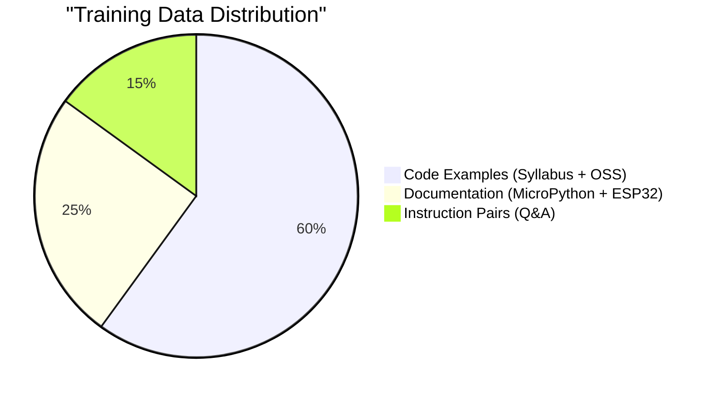

# 📊 Data Requirements — RoboMicroPython-LM

> This document specifies **every piece of data** required to train the RoboMicroPython-LM model.
> Use this as a checklist when collecting and preparing your training corpus.

---

## Table of Contents

1.  [Data Overview](#1-data-overview)
2.  [Source 1: 100 Graded Robotics Projects (Syllabus)](#2-source-1-100-graded-robotics-projects-syllabus)
3.  [Source 2: Blockly API Function Registry](#3-source-2-blockly-api-function-registry)
4.  [Source 3: MicroPython Documentation](#4-source-3-micropython-documentation)
5.  [Source 4: ESP32 Hardware Documentation](#5-source-4-esp32-hardware-documentation)
6.  [Source 5: Python Coding Guidelines](#6-source-5-python-coding-guidelines)
7.  [Source 6: Open-Source MicroPython Examples](#7-source-6-open-source-micropython-examples)
8.  [Source 7: Multilingual Translations](#8-source-7-multilingual-translations)
9.  [Data Format Specification](#9-data-format-specification)
10. [Data Augmentation Plan](#10-data-augmentation-plan)
11. [Data Quality Checklist](#11-data-quality-checklist)
12. [Estimated Data Volume](#12-estimated-data-volume)

---

## 1. Data Overview



| Category              | Percentage | Purpose                                            |
| --------------------- | ---------- | -------------------------------------------------- |
| **Code Examples**     | ~60%       | Teach the model MicroPython syntax and patterns    |
| **Documentation**     | ~25%       | Teach the model hardware concepts and API usage    |
| **Instruction Pairs** | ~15%       | Teach the model to follow natural language prompts |

---

## 2. Source 1: 100 Graded Robotics Projects (Syllabus)

### What to Collect

For **each of the 100 projects**, collect the following:

```yaml
# Example: data/raw/syllabus/project_001_blink_led.yaml
project_id: 1
grade_level: 1                      # 1 = easiest, 10 = hardest
title: "Blink an LED"
description: |
  Learn the basics of digital output by making an LED blink on and off.
  This project introduces the Pin class and time delays.
  
hardware_modules:
  - name: "LED"
    type: "output"
    connection: "GPIO pin 2"
    notes: "Built-in LED on most ESP32 boards"

learning_objectives:
  - "Understand digital output (HIGH/LOW)"
  - "Use the Pin class from the machine module"
  - "Use time.sleep() for delays"

blockly_blocks_used:
  - "set_pin_mode"
  - "digital_write"
  - "delay_ms"

micropython_code: |
  from machine import Pin
  import time

  # Set up the LED on pin 2 as output
  led = Pin(2, Pin.OUT)

  # Blink the LED 10 times
  for i in range(10):
      led.value(1)    # Turn LED ON
      time.sleep(0.5) # Wait 500ms
      led.value(0)    # Turn LED OFF
      time.sleep(0.5) # Wait 500ms

  print("Done blinking!")

code_explanation: |
  1. We import Pin from the machine module to control GPIO pins
  2. We import time for the sleep() function
  3. We create a Pin object on GPIO 2 in OUTPUT mode
  4. We loop 10 times, toggling the LED on and off with 500ms delays

prerequisites:
  - "None (this is the first project)"

next_projects:
  - 2  # Traffic Light

tags:
  - "beginner"
  - "digital_output"
  - "led"
  - "gpio"
```

### Grade Distribution (Recommended)

| Grade     | Difficulty     | # Projects | Topics                                  |
| --------- | -------------- | ---------- | --------------------------------------- |
| 1         | Beginner       | 15         | LED, buzzer, button, digital I/O        |
| 2         | Easy           | 15         | PWM, analog read, potentiometer         |
| 3         | Elementary     | 12         | Servo, DC motor, motor driver           |
| 4         | Intermediate   | 12         | I2C sensors (temp, humidity, distance)  |
| 5         | Mid-level      | 10         | LCD display, OLED, NeoPixel             |
| 6         | Upper-mid      | 8          | WiFi, web server, MQTT                  |
| 7         | Advanced       | 8          | Multi-sensor fusion, PID control        |
| 8         | Upper Advanced | 7          | Bluetooth, remote control               |
| 9         | Expert         | 7          | Autonomous navigation, line following   |
| 10        | Master         | 6          | Complete robot projects, AI integration |
| **Total** |                | **100**    |                                         |

### Sample Projects per Grade

**Grade 1 (Beginner):**
1. Blink an LED
2. Traffic Light (3 LEDs)
3. Button-controlled LED
4. Buzzer alarm
5. LED brightness with PWM
6. Multiple LED patterns
7. SOS Morse Code
8. Button counter with serial output
9. Toggle switch LED
10. LED fade in/out
11. Two-button game
12. Reaction timer
13. Night light (with LDR)
14. Simple metronome
15. LED chaser (Knight Rider)

**Grade 5 (Mid-level):**
1. LCD temperature display
2. OLED clock
3. NeoPixel color wheel
4. LED strip music visualizer
5. Scrolling text display
6. Weather station display
7. Digital dice
8. 7-segment counter
9. Mini scoreboard
10. Pixel art display

---

## 3. Source 2: Blockly API Function Registry

### What to Collect

Extract **every function** that your firmware exposes through Blockly. For each function:

```json
{
    "block_id": "motion_move_forward",
    "category": "Motion",
    "subcategory": "Basic Movement",
    "block_name": "Move Forward",
    "function_signature": "robot.move_forward(speed: int = 50) -> None",
    "parameters": [
        {
            "name": "speed",
            "type": "int",
            "range": [0, 100],
            "default": 50,
            "unit": "percent",
            "description": "Speed as percentage of maximum"
        }
    ],
    "return_type": "None",
    "description": "Move the robot forward at the specified speed.",
    "detailed_description": "Activates both DC motors in the forward direction. Speed is a percentage where 0 = stopped, 100 = full speed. Uses PWM on the motor driver pins.",
    "example_code": "from robot import Robot\n\nrobot = Robot()\nrobot.move_forward(75)  # Move at 75% speed\ntime.sleep(2)           # Move for 2 seconds\nrobot.stop()            # Stop the robot",
    "hardware_required": ["DC Motor x2", "L298N Motor Driver"],
    "related_blocks": ["motion_move_backward", "motion_turn_left", "motion_stop"],
    "micropython_implementation": "def move_forward(self, speed=50):\n    duty = int(speed * 1023 / 100)\n    self.motor_left.duty(duty)\n    self.motor_right.duty(duty)\n    self.dir_left.value(1)\n    self.dir_right.value(1)"
}
```

### Blockly Categories to Document

| Category          | # Functions (estimated) | Examples                                                              |
| ----------------- | ----------------------- | --------------------------------------------------------------------- |
| **Motion**        | 8–12                    | move_forward, move_backward, turn_left, turn_right, stop, set_speed   |
| **Sensors**       | 10–20                   | read_ir, read_ultrasonic, read_temperature, read_humidity, read_light |
| **Display**       | 5–10                    | lcd_print, oled_draw, neopixel_set, led_on, led_off                   |
| **Sound**         | 3–5                     | buzzer_tone, buzzer_off, play_melody                                  |
| **Communication** | 5–8                     | wifi_connect, send_data, receive_data, bluetooth_pair                 |
| **Control**       | 5–8                     | servo_angle, pwm_duty, pin_mode, digital_write, analog_read           |
| **Logic**         | 5–8                     | wait, repeat, if_sensor, while_condition                              |
| **Math**          | 3–5                     | map_range, constrain, random_number                                   |
| **Total**         | **~50–80**              |                                                                       |

---

## 4. Source 3: MicroPython Documentation

### Modules to Document

For each module, collect:

```yaml
module_name: "machine.Pin"
module_path: "machine"
class_name: "Pin"
description: "A pin object controls an I/O pin (GPIO). Pin objects are commonly associated with a physical pin on the MCU."

constructors:
  - signature: "Pin(id, mode=-1, pull=-1, value=None)"
    parameters:
      - name: "id"
        type: "int"
        description: "GPIO pin number (0-39 on ESP32)"
      - name: "mode"
        type: "int"
        description: "Pin mode: Pin.IN, Pin.OUT, Pin.OPEN_DRAIN"
        options: ["Pin.IN", "Pin.OUT", "Pin.OPEN_DRAIN"]
      - name: "pull"
        type: "int"
        description: "Pull resistor: Pin.PULL_UP, Pin.PULL_DOWN, None"
        options: ["Pin.PULL_UP", "Pin.PULL_DOWN", "None"]

methods:
  - signature: "Pin.value(x=None)"
    description: "Get or set the digital value of the pin"
    examples:
      - "pin.value()    # Read pin value (0 or 1)"
      - "pin.value(1)   # Set pin HIGH"
      - "pin.value(0)   # Set pin LOW"
  
  - signature: "Pin.on()"
    description: "Set pin to HIGH"
  
  - signature: "Pin.off()"
    description: "Set pin to LOW"

constants:
  - "Pin.IN"
  - "Pin.OUT"
  - "Pin.OPEN_DRAIN"
  - "Pin.PULL_UP"
  - "Pin.PULL_DOWN"
  - "Pin.IRQ_FALLING"
  - "Pin.IRQ_RISING"

complete_example: |
  from machine import Pin

  # LED output
  led = Pin(2, Pin.OUT)
  led.on()

  # Button input with pull-up
  button = Pin(0, Pin.IN, Pin.PULL_UP)
  if button.value() == 0:
      print("Button pressed!")
```

### Full Module List

| #   | Module          | Classes/Functions                  | Priority       | Estimated Tokens   |
| --- | --------------- | ---------------------------------- | -------------- | ------------------ |
| 1   | `machine.Pin`   | Pin, constants                     | 🔴 Critical     | ~2,000             |
| 2   | `machine.PWM`   | PWM, freq, duty                    | 🔴 Critical     | ~1,500             |
| 3   | `machine.ADC`   | ADC, read, atten                   | 🔴 Critical     | ~1,200             |
| 4   | `machine.I2C`   | I2C, scan, readfrom, writeto       | 🟡 Important    | ~2,000             |
| 5   | `machine.SPI`   | SPI, read, write                   | 🟡 Important    | ~1,500             |
| 6   | `machine.UART`  | UART, read, write                  | 🟡 Important    | ~1,500             |
| 7   | `machine.Timer` | Timer, init, callback              | 🟡 Important    | ~1,000             |
| 8   | `time`          | sleep, sleep_ms, ticks_ms          | 🔴 Critical     | ~800               |
| 9   | `network`       | WLAN, connect, isconnected         | 🟡 Important    | ~1,500             |
| 10  | `neopixel`      | NeoPixel, fill, write              | 🟡 Important    | ~1,000             |
| 11  | `dht`           | DHT11, DHT22, measure, temperature | 🟡 Important    | ~800               |
| 12  | `struct`        | pack, unpack                       | 🟢 Nice-to-have | ~600               |
| 13  | `json`          | dumps, loads                       | 🟢 Nice-to-have | ~500               |
| 14  | `os`            | listdir, remove, stat              | 🟢 Nice-to-have | ~600               |
|     | **Total**       |                                    |                | **~16,500 tokens** |

---

## 5. Source 4: ESP32 Hardware Documentation

### What to Collect

```yaml
# ESP32 Pin Reference
board: "ESP32-DevKitC V4"
total_gpio_pins: 34
usable_gpio_pins: 25

gpio_groups:
  digital_io:
    pins: [0, 1, 2, 3, 4, 5, 12, 13, 14, 15, 16, 17, 18, 19, 21, 22, 23, 25, 26, 27, 32, 33]
    notes: "Standard digital input/output"
  
  adc_pins:
    adc1: [32, 33, 34, 35, 36, 39]
    adc2: [0, 2, 4, 12, 13, 14, 15, 25, 26, 27]
    resolution: 12  # bits (0-4095)
    attenuations:
      - "ADC.ATTN_0DB: 0-1.1V"
      - "ADC.ATTN_2_5DB: 0-1.5V"
      - "ADC.ATTN_6DB: 0-2.2V"
      - "ADC.ATTN_11DB: 0-3.3V (recommended)"
    notes: "ADC2 cannot be used when WiFi is active"
  
  pwm_pins:
    pins: "Any GPIO pin"
    channels: 16
    frequency_range: "1 Hz - 40 MHz"
    resolution: "1-16 bits duty"
    notes: "All GPIO pins support PWM output"
  
  i2c_default:
    sda: 21
    scl: 22
    notes: "Software I2C can use any pins"
  
  spi_default:
    mosi: 23
    miso: 19
    sck: 18
    cs: 5
  
  uart_default:
    uart0_tx: 1
    uart0_rx: 3
    uart1_tx: 10
    uart1_rx: 9
    uart2_tx: 17
    uart2_rx: 16

  special_pins:
    - pin: 0
      notes: "BOOT button - pulled LOW during boot for flashing"
    - pin: 2
      notes: "Built-in LED on many boards"
    - pin: 34
      notes: "Input-only pin (no output capability)"
    - pin: 35
      notes: "Input-only pin (no output capability)"
    - pin: 36
      notes: "Input-only pin (VP - sensor pin)"
    - pin: 39
      notes: "Input-only pin (VN - sensor pin)"

memory:
  flash: "4MB (typical)"
  sram: "520KB"
  psram: "4MB (optional, on WROVER modules)"
  filesystem: "~1.5MB available for MicroPython scripts"

power:
  operating_voltage: "3.3V"
  digital_io_voltage: "3.3V (NOT 5V tolerant!)"
  max_current_per_pin: "40mA (recommended: 20mA)"
  deep_sleep_current: "10µA"
```

### Common Hardware Modules to Document

| #   | Module                  | Interface                   | Pins     | Typical Use            |
| --- | ----------------------- | --------------------------- | -------- | ---------------------- |
| 1   | LED                     | GPIO (digital out)          | Any      | Visual indicator       |
| 2   | Button/Switch           | GPIO (digital in + pull-up) | Any      | User input             |
| 3   | Buzzer (passive)        | PWM                         | Any      | Sound output           |
| 4   | Servo Motor (SG90)      | PWM (50Hz)                  | Any      | Angle control          |
| 5   | DC Motor + L298N        | GPIO + PWM                  | 4 pins   | Robot movement         |
| 6   | IR Sensor               | ADC or digital              | ADC pins | Line detection         |
| 7   | Ultrasonic (HC-SR04)    | GPIO (trig + echo)          | Any 2    | Distance measurement   |
| 8   | DHT11/DHT22             | One-wire                    | Any      | Temperature + humidity |
| 9   | LDR (Light Sensor)      | ADC                         | ADC pins | Light level            |
| 10  | Potentiometer           | ADC                         | ADC pins | Analog input           |
| 11  | LCD 16x2 (I2C)          | I2C                         | SDA, SCL | Text display           |
| 12  | OLED SSD1306            | I2C                         | SDA, SCL | Graphics display       |
| 13  | NeoPixel (WS2812)       | Digital                     | Any      | RGB LED strip          |
| 14  | MPU6050 (Accelerometer) | I2C                         | SDA, SCL | Motion sensing         |
| 15  | Relay Module            | GPIO                        | Any      | High-power switching   |
| 16  | Soil Moisture Sensor    | ADC                         | ADC pins | Moisture level         |
| 17  | PIR Motion Sensor       | GPIO (digital)              | Any      | Motion detection       |
| 18  | RFID (RC522)            | SPI                         | SPI pins | Card reading           |
| 19  | GPS (NEO-6M)            | UART                        | TX, RX   | Location               |
| 20  | Bluetooth (HC-05)       | UART                        | TX, RX   | Wireless comm          |

---

## 6. Source 5: Python Coding Guidelines

Include a compact version of PEP 8 conventions adapted for MicroPython:

```yaml
coding_guidelines:
  naming:
    variables: "snake_case (e.g., led_pin, motor_speed)"
    functions: "snake_case (e.g., read_sensor, move_forward)"
    classes: "PascalCase (e.g., Robot, SensorArray)"
    constants: "UPPER_SNAKE_CASE (e.g., MAX_SPEED, LED_PIN)"
  
  indentation: "4 spaces (never tabs)"
  max_line_length: 79
  
  imports:
    order:
      - "Standard library (time, os, json)"
      - "MicroPython modules (machine, network)"
      - "Custom/local modules"
    style: |
      # Good
      from machine import Pin, PWM
      import time
      
      # Bad
      from machine import *
  
  comments:
    inline: "# Two spaces before, one after hash"
    docstrings: |
      def read_temperature(pin):
          """Read temperature from DHT11 sensor.
          
          Args:
              pin: GPIO pin number where DHT11 is connected
          
          Returns:
              Temperature in Celsius (float)
          """
          ...
  
  best_practices:
    - "Always set pin modes explicitly"
    - "Use try/except for hardware operations"
    - "Clean up resources in finally blocks"
    - "Use constants for pin numbers"
    - "Add meaningful variable names"
    - "Keep functions small and focused"
    - "Add comments explaining WHY, not WHAT"
```

---

## 7. Source 6: Open-Source MicroPython Examples

### Where to Collect

| Source                 | URL                                                       | License | Content                     |
| ---------------------- | --------------------------------------------------------- | ------- | --------------------------- |
| MicroPython official   | `github.com/micropython/micropython/tree/master/examples` | MIT     | Official examples           |
| Awesome MicroPython    | `github.com/mcauser/awesome-micropython`                  | CC0     | Curated library list        |
| ESP32 MicroPython docs | `docs.micropython.org/en/latest/esp32/`                   | MIT     | ESP32-specific guides       |
| Random Nerd Tutorials  | `randomnerdtutorials.com`                                 | —       | Beginner-friendly tutorials |
| Community forums       | `forum.micropython.org`                                   | —       | Community solutions         |

### Collection Guidelines

- ✅ **Include**: Complete, runnable examples with comments
- ✅ **Include**: Examples that use documented hardware modules
- ✅ **Include**: Examples following PEP 8 style
- ❌ **Exclude**: Incomplete snippets without context
- ❌ **Exclude**: Examples using non-standard or rare hardware
- ❌ **Exclude**: Examples with licensing restrictions (GPL)
- ❌ **Exclude**: Examples longer than 100 lines (split into parts)

---

## 8. Source 7: Multilingual Translations

### What to Translate

For each of the 25 supported languages, translate:

| Content Type           | # Items  | Example                                    |
| ---------------------- | -------- | ------------------------------------------ |
| Project descriptions   | 100      | "Blink an LED" → "एक LED को ब्लिंक करें" (Hindi) |
| Project explanations   | 100      | step-by-step explanations                  |
| Hardware descriptions  | 20       | "LED is a light source..." → translated    |
| Concept explanations   | 30       | "PWM allows controlling..." → translated   |
| Error messages         | 20       | "Pin number out of range" → translated     |
| UI strings             | 50       | "Run", "Stop", "Upload" → translated       |
| **Total per language** | **~320** |                                            |

### Translation Quality Requirements

| Requirement                    | Details                                                               |
| ------------------------------ | --------------------------------------------------------------------- |
| **Technical accuracy**         | All technical terms must be correct                                   |
| **Native speaker review**      | At least one native speaker review per language                       |
| **Code stays English**         | Variable names, function names, Python keywords stay in English       |
| **Comments can be translated** | Code comments may be in the target language                           |
| **Consistent terminology**     | Use the same translation for the same technical term across all texts |

### Translation Format

```json
{
    "id": "blink_led_description",
    "category": "project_description",
    "original_lang": "en",
    "translations": {
        "en": "This project teaches you how to make an LED blink using MicroPython on ESP32.",
        "hi": "यह प्रोजेक्ट आपको ESP32 पर MicroPython का उपयोग करके LED को ब्लिंक करना सिखाता है।",
        "bn": "এই প্রকল্প আপনাকে ESP32-এ MicroPython ব্যবহার করে একটি LED ব্লিংক করতে শেখায়।",
        "ta": "இந்த திட்டம் ESP32 இல் MicroPython ஐப் பயன்படுத்தி LED ஐ மின்னச் செய்ய கற்றுக்கொடுக்கிறது.",
        "te": "ఈ ప్రాజెక్ట్ ESP32లో MicroPython ఉపయోగించి LED ని బ్లింక్ చేయడం నేర్పిస్తుంది.",
        "es": "Este proyecto te enseña cómo hacer parpadear un LED usando MicroPython en ESP32.",
        "fr": "Ce projet vous apprend à faire clignoter une LED en utilisant MicroPython sur ESP32.",
        "zh": "本项目教你如何使用ESP32上的MicroPython来让LED闪烁。",
        "ja": "このプロジェクトでは、ESP32上のMicroPythonを使用してLEDを点滅させる方法を学びます。",
        "ar": "يعلمك هذا المشروع كيفية جعل مصباح LED يومض باستخدام MicroPython على ESP32.",
        "pt": "Este projeto ensina como fazer um LED piscar usando MicroPython no ESP32."
    }
}
```

---

## 9. Data Format Specification

### Unified JSON Lines Format

All data is converted to a single `.jsonl` file for training:

```
data/processed/training_corpus.jsonl
```

#### Record Types

**Type 1: Code Generation (`type: "code"`)**
```json
{
    "type": "code",
    "grade": 3,
    "project_id": 15,
    "prompt": "Write MicroPython code to control a servo motor to sweep from 0 to 180 degrees",
    "code": "from machine import Pin, PWM\nimport time\n\nservo = PWM(Pin(13), freq=50)\n\ndef angle_to_duty(angle):\n    return int(26 + (angle / 180) * 102)\n\nfor angle in range(0, 181, 5):\n    servo.duty(angle_to_duty(angle))\n    time.sleep_ms(50)\n\nservo.deinit()",
    "hardware": ["Servo Motor SG90"],
    "api_functions": ["machine.PWM", "machine.Pin", "time.sleep_ms"],
    "blockly_blocks": ["servo_set_angle", "delay_ms"],
    "lang": "en"
}
```

**Type 2: Documentation (`type: "doc"`)**
```json
{
    "type": "doc",
    "topic": "machine.PWM",
    "subtopic": "constructor",
    "content": "PWM (Pulse Width Modulation) is used to generate a signal with a specific frequency and duty cycle. On ESP32, any GPIO pin can output a PWM signal.\n\nUsage:\n```python\nfrom machine import Pin, PWM\npwm = PWM(Pin(13), freq=1000, duty=512)\n```",
    "lang": "en"
}
```

**Type 3: Instruction Pair (`type: "instruction"`)**
```json
{
    "type": "instruction",
    "prompt": "How do I connect and read data from a DHT11 temperature sensor?",
    "response": "Connect the DHT11 data pin to GPIO 4 on your ESP32. Here's the code:\n\n```python\nimport dht\nfrom machine import Pin\n\nsensor = dht.DHT11(Pin(4))\nsensor.measure()\ntemp = sensor.temperature()\nhum = sensor.humidity()\nprint(f'Temperature: {temp}°C')\nprint(f'Humidity: {hum}%')\n```\n\nMake sure to add a 10K pull-up resistor between the data pin and 3.3V.",
    "hardware": ["DHT11"],
    "lang": "en"
}
```

**Type 4: API Reference (`type: "api"`)**
```json
{
    "type": "api",
    "block_name": "set_servo_angle",
    "function": "servo.angle(degrees)",
    "signature": "servo.angle(degrees: int) -> None",
    "parameters": {"degrees": {"type": "int", "range": [0, 180]}},
    "description": "Set the servo motor to the specified angle in degrees.",
    "example": "from machine import Pin, PWM\nservo = PWM(Pin(13), freq=50)\n# Set to 90 degrees\nservo.duty(77)",
    "lang": "en"
}
```

---

## 10. Data Augmentation Plan

### Augmentation Techniques (with examples)

#### 1. Variable Renaming (3–5x multiplier)

**Original:**
```python
led = Pin(2, Pin.OUT)
led.value(1)
```

**Augmented variations:**
```python
# Variation 1
my_led = Pin(2, Pin.OUT)
my_led.value(1)

# Variation 2
led_pin = Pin(2, Pin.OUT)
led_pin.value(1)

# Variation 3
output_led = Pin(2, Pin.OUT)
output_led.value(1)
```

#### 2. Pin Remapping (3x multiplier)

**Original:** `Pin(2, Pin.OUT)`

**Augmented:** `Pin(4, Pin.OUT)`, `Pin(13, Pin.OUT)`, `Pin(15, Pin.OUT)`

#### 3. Prompt Paraphrasing (5x multiplier)

**Original prompt:** "Blink an LED"

**Augmented prompts:**
1. "Make an LED flash on and off"
2. "Toggle an LED repeatedly"
3. "Write code to blink a light"
4. "Create a blinking LED program"
5. "How do I make an LED blink?"

#### 4. Comment Injection (2x multiplier)

**Without comments:**
```python
led = Pin(2, Pin.OUT)
led.value(1)
time.sleep(0.5)
```

**With comments:**
```python
# Initialize LED on GPIO 2
led = Pin(2, Pin.OUT)
# Turn LED on
led.value(1)
# Wait for half a second
time.sleep(0.5)
```

#### 5. Function Wrapping (2x multiplier)

**Inline:**
```python
led = Pin(2, Pin.OUT)
led.value(1)
time.sleep(0.5)
led.value(0)
```

**Wrapped:**
```python
def blink_led(pin_num, duration=0.5):
    """Blink an LED on the specified pin."""
    led = Pin(pin_num, Pin.OUT)
    led.value(1)
    time.sleep(duration)
    led.value(0)

blink_led(2)
```

### Augmentation Pipeline

```bash
uv run python scripts/data/augment_data.py \
    --input data/raw/syllabus/ \
    --output data/augmented/ \
    --techniques variable_rename,pin_remap,prompt_paraphrase,comment_inject,function_wrap \
    --multiplier 10
```

---

## 11. Data Quality Checklist

Before training, verify ALL data passes these checks:

### Code Quality Checks

- [ ] All code samples parse successfully (`ast.parse()`)
- [ ] All code uses only documented MicroPython modules
- [ ] All Pin numbers are valid ESP32 GPIO numbers
- [ ] All hardware references match documented modules
- [ ] All Blockly block names exist in the API registry
- [ ] Code follows PEP 8 naming conventions
- [ ] Code has proper indentation (4 spaces)
- [ ] No syntax errors in any code sample

### Documentation Quality Checks

- [ ] All module references are accurate
- [ ] All parameter types and ranges are correct
- [ ] All example code in documentation is runnable
- [ ] No broken cross-references

### Multilingual Quality Checks

- [ ] Technical terms are consistently translated
- [ ] Code snippets remain in English
- [ ] No machine-translation artifacts
- [ ] Character encoding is correct (UTF-8)
- [ ] Right-to-left languages (Arabic, Urdu) render correctly

### Data Integrity Checks

- [ ] No duplicate entries
- [ ] All JSON records are valid
- [ ] All required fields are present
- [ ] Grade levels are in range [1, 10]
- [ ] Language codes match supported languages

---

## 12. Estimated Data Volume

### Raw Data

| Source              | Records | Avg Tokens/Record | Total Tokens |
| ------------------- | ------- | ----------------- | ------------ |
| 100 Projects (code) | 100     | 200               | 20,000       |
| 100 Projects (desc) | 100     | 150               | 15,000       |
| Blockly API         | 80      | 300               | 24,000       |
| MicroPython Docs    | 50      | 400               | 20,000       |
| ESP32 Docs          | 20      | 500               | 10,000       |
| Python Guidelines   | 10      | 300               | 3,000        |
| OSS Examples        | 100     | 250               | 25,000       |
| Instruction Pairs   | 200     | 200               | 40,000       |
| **Raw Total**       | **660** |                   | **~157,000** |

### After Augmentation

| Source              | Multiplier | Records   | Total Tokens |
| ------------------- | ---------- | --------- | ------------ |
| Code samples        | 10x        | 1,000     | 200,000      |
| Augmented prompts   | 5x         | 500       | 75,000       |
| Augmented docs      | 2x         | 260       | 104,000      |
| Instruction pairs   | 5x         | 1,000     | 200,000      |
| **Augmented Total** |            | **2,760** | **~579,000** |

### With Multilingual Data

| Source               | Languages | Records     | Total Tokens   |
| -------------------- | --------- | ----------- | -------------- |
| Augmented English    | 1         | 2,760       | 579,000        |
| Multilingual docs    | 25        | ~8,000      | ~1,600,000     |
| Multilingual prompts | 25        | ~7,500      | ~1,500,000     |
| **Grand Total**      |           | **~18,260** | **~3,679,000** |

> **Final corpus size**: ~3.7M tokens (raw) → ~5M–15M tokens with additional augmentation passes.
>
> This is sufficient for a 25M–80M parameter model targeting a narrow domain. For comparison, TinyStories (used in tiny-lm) has ~500M tokens for a similar model size, but covers a much broader domain (story generation).

---

## Data Collection Action Items

| #   | Action                                                | Owner | Deadline | Status |
| --- | ----------------------------------------------------- | ----- | -------- | ------ |
| 1   | Export 100 graded projects to YAML format             |       |          | ⬜ TODO |
| 2   | Extract all Blockly function signatures from firmware |       |          | ⬜ TODO |
| 3   | Scrape MicroPython documentation for ESP32            |       |          | ⬜ TODO |
| 4   | Create ESP32 hardware reference document              |       |          | ⬜ TODO |
| 5   | Write PEP 8 guidelines for MicroPython                |       |          | ⬜ TODO |
| 6   | Collect open-source MicroPython examples              |       |          | ⬜ TODO |
| 7   | Translate top 100 descriptions to 25 languages        |       |          | ⬜ TODO |
| 8   | Write 200 instruction pairs (Q&A)                     |       |          | ⬜ TODO |
| 9   | Run data augmentation pipeline                        |       |          | ⬜ TODO |
| 10  | Run data quality checks                               |       |          | ⬜ TODO |
| 11  | Tokenize and create train/val splits                  |       |          | ⬜ TODO |
