# ⚙️ Parameter Reference — Complete Tuning Guide

> **Every knob explained**: what it does, how to set it, and how it impacts training and inference.
> Cross-references use `[[GLOSSARY#Term]]` Obsidian syntax — hover to preview.
>
> **Hardware baseline**: NVIDIA RTX 5070 (12 GB VRAM, Blackwell architecture)

---

## Table of Contents

1. [Model Architecture Parameters](#1-model-architecture-parameters)
2. [Training Hyperparameters](#2-training-hyperparameters)
3. [Data Configuration](#3-data-configuration)
4. [Tokenizer Configuration](#4-tokenizer-configuration)
5. [Export & Quantization Parameters](#5-export--quantization-parameters)
6. [Pre-built Model Profiles](#6-pre-built-model-profiles)
7. [Interactive Decision Flowchart](#7-interactive-decision-flowchart)

---

## 1. Model Architecture Parameters

These parameters are defined in `configs/models/*.yaml` and determine the model's capacity.

### 1.1 `vocab_size`
> See also: [[GLOSSARY#vocab_size]]

```yaml
vocab_size: 8192
```

| Setting  | Params Impact | Training Impact | Inference Impact |
| -------- | ------------- | --------------- | ---------------- |
| 4096     | –3M params    | Faster embed    | Smaller GGUF     |
| **8192** | Baseline      | Baseline        | Baseline         |
| 16384    | +3M params    | Slower embed    | Larger GGUF      |
| 32000    | +9M params    | Much slower     | Much larger      |

**How to choose:**
- **8K** → English + code only. Best for MicroPython-focused models.
- **16K** → Multilingual support (Indian + world languages). Required if training with Hindi/Tamil/Bengali docs.
- **32K** → Only if you need CJK character coverage (Chinese, Japanese, Korean).

**Effect on GGUF size:**
```
Embedding params = vocab_size × d_model
Example: 8192 × 384 = 3.1M params = 6.3 MB (FP16)
Example: 16384 × 384 = 6.3M params = 12.6 MB (FP16)
```

---

### 1.2 `d_model` (Model Width)
> See also: [[GLOSSARY#d_model]]

```yaml
d_model: 384
```

**This is the most impactful parameter.** It controls the dimension of every hidden vector.

| d_model | Total Params (4L) | VRAM (training) | Quality | RTX 5070 tok/s |
| ------- | ----------------- | --------------- | ------- | -------------- |
| 128     | ~2M               | <1 GB           | Poor    | ~800K          |
| 256     | ~8M               | ~1 GB           | Fair    | ~500K          |
| **384** | ~25M              | ~3 GB           | Good    | ~200K          |
| 512     | ~50M              | ~5 GB           | Better  | ~100K          |
| 640     | ~80M              | ~8 GB           | Best    | ~50K           |
| 768     | ~120M             | ~11 GB          | Premium | ~30K           |

**Parameter count scaling formula:**
```
Total ≈ vocab_size × d_model                      (embeddings)
      + n_layers × (12 × d_model² + 13 × d_model) (GPT-2 blocks)
```

**Rule of thumb:** For 12 GB VRAM, stay at d_model ≤ 640 for comfortable training.

---

### 1.3 `n_layers` (Model Depth)
> See also: [[GLOSSARY#n_layers]]

```yaml
n_layers: 4
```

| n_layers | Impact                         | When to Use                  |
| -------- | ------------------------------ | ---------------------------- |
| 2        | Very fast, limited capacity    | Speed runs, testing pipeline |
| **4**    | Good balance for 25M model     | MicroPython code generation  |
| 6        | Better quality, more knowledge | 50M model, complex code      |
| 8        | Strong code understanding      | 80M model, multilingual      |
| 12       | Near-optimal for small GPTs    | 120M+ model, maximum quality |

**Depth vs Width tradeoff:**

```mermaid
graph LR
    subgraph "Same ~25M params"
        A["4 layers × 384 wide<br/>⭐ Recommended<br/>Better per-layer quality"] 
        B["8 layers × 256 wide<br/>More pattern depth<br/>Each layer weaker"]
    end
    
    A -.->|"Prefer for<br/>code generation"| R[Result]
    B -.->|"Prefer for<br/>reasoning chains"| R
```


**Recommendation:** For code generation (our use case), prefer **wider and shallower** — code patterns are more about local structure than deep reasoning.

---

### 1.4 `n_heads` (Attention Heads)
> See also: [[GLOSSARY#n_heads]]

```yaml
n_heads: 6
```

| d_model | Recommended n_heads | head_dim |
| ------- | ------------------- | -------- |
| 128     | 2                   | 64       |
| 256     | 4                   | 64       |
| 384     | 6                   | 64       |
| 512     | 8                   | 64       |
| 640     | 10                  | 64       |
| 768     | 12                  | 64       |

**Rule:** `head_dim = d_model / n_heads` should be 64 or 128. Avoid head_dim < 32 (too small to learn useful patterns).

---

### 1.5 `n_kv_heads` (GQA Heads) — Llama only
> See also: [[GLOSSARY#Grouped Query Attention (GQA)]]

```yaml
n_kv_heads: 2  # Only for Llama-style models
```

| n_kv_heads | Memory Saving | Quality | When to Use          |
| ---------- | ------------- | ------- | -------------------- |
| = n_heads  | None          | Best    | Training             |
| n_heads/2  | ~15%          | Good    | Balanced             |
| **2**      | ~30%          | Good    | Mobile inference     |
| 1          | ~40%          | Fair    | Extreme memory limit |

---

### 1.6 `d_ff` (FFN Width)
> See also: [[GLOSSARY#Feed-Forward Network (FFN)]]

```yaml
d_ff: 1536  # GPT-2 style: 4 × d_model
```

| Model Style | Formula         | Example (d_model=384) |
| ----------- | --------------- | --------------------- |
| GPT-2       | 4 × d_model     | 1536                  |
| Llama       | (8/3) × d_model | 1024                  |
| Custom      | 2–6 × d_model   | Varies                |

**Impact:** ~2/3 of the model's parameters are in the FFN layers. Increasing d_ff adds knowledge capacity but costs proportionally in parameters and VRAM.

---

### 1.7 `context_length`
> See also: [[GLOSSARY#context_length]]

```yaml
context_length: 512
```

| Context | Memory (attention) | Suitable For                         |
| ------- | ------------------ | ------------------------------------ |
| 128     | Very low           | Single-line completions              |
| 256     | Low                | Short functions (5–15 lines)         |
| **512** | Medium             | Full MicroPython scripts (up to 40L) |
| 1024    | High               | Multiple functions + docstrings      |
| 2048    | Very high          | Full modules (may not fit in 12 GB)  |

**Memory scaling:** Attention memory ∝ `batch_size × n_heads × seq_len²`

**Recommendation for MicroPython:** **512** is the sweet spot. Most robotics scripts are 10–50 lines, which fits in ~200–400 tokens.

---

### 1.8 `dropout` Parameters
> See also: [[GLOSSARY#dropout]]

```yaml
dropout: 0.1       # General dropout
emb_dropout: 0.1   # After embedding layer
attn_dropout: 0.1  # On attention weights
resid_dropout: 0.1 # On residual connections
```

| Dataset Size | Recommended Dropout | Rationale                    |
| ------------ | ------------------- | ---------------------------- |
| < 5M tokens  | 0.2                 | Strong regularization needed |
| 5–20M tokens | **0.1**             | Standard setting             |
| > 20M tokens | 0.0                 | Enough data, no overfitting  |

⚠️ **Always set to 0.0 during inference/export.** Dropout is **only** used during training.

---

## 2. Training Hyperparameters

These parameters are defined in `configs/training/*.yaml`.

### 2.1 `learning_rate`
> See also: [[GLOSSARY#Learning Rate]]

```yaml
learning_rate: 3.0e-4
```

**The single most important training parameter.**

```mermaid
graph LR
    subgraph "Learning Rate Effects"
        LOW["LR too low (1e-5)<br/>❌ Trains very slowly<br/>May never converge"]
        GOOD["LR just right (3e-4)<br/>✅ Smooth convergence<br/>Good final quality"]
        HIGH["LR too high (1e-2)<br/>❌ Loss oscillates<br/>May diverge to NaN"]
    end
    LOW --> GOOD --> HIGH
```



| Phase         | Recommended LR | Why                                 |
| ------------- | -------------- | ----------------------------------- |
| Pre-training  | **3e-4**       | Standard for AdamW + small models   |
| Fine-tuning   | 5e-5 – 1e-4    | Don't destroy pre-trained knowledge |
| Learning warm | 1e-6 → 3e-4    | Ramp up during [[GLOSSARY#Warmup]]  |

**Scaling rule (Chinchilla):** When doubling model size, reduce LR by ~30%.

---

### 2.2 `warmup_ratio`
> See also: [[GLOSSARY#Warmup]]

```yaml
warmup_ratio: 0.05  # 5% of total steps
```

| Setting  | Steps (at 2000 total) | When to Use                  |
| -------- | --------------------- | ---------------------------- |
| 0.01     | 20 steps              | Large batch, stable training |
| **0.05** | 100 steps             | Standard recommendation      |
| 0.10     | 200 steps             | Small batch, noisy gradients |

---

### 2.3 `min_lr`
> See also: [[GLOSSARY#min_lr]]

```yaml
min_lr: 6.0e-5  # Usually max_lr / 5
```

| Ratio to max_lr | Behavior                                |
| --------------- | --------------------------------------- |
| 1/3             | Aggressive decay, lower final loss      |
| **1/5**         | Standard, good balance                  |
| 1/10            | Very low floor, risk of stalling        |
| 0               | Complete decay to zero, not recommended |

---

### 2.4 `weight_decay`
> See also: [[GLOSSARY#Weight Decay]]

```yaml
weight_decay: 0.1
```

Applied to all parameters **except** biases and normalization layers.

| Dataset Size | Recommended | Effect                |
| ------------ | ----------- | --------------------- |
| Small (<5M)  | **0.1**     | Prevents memorization |
| Medium       | 0.05        | Light regularization  |
| Large (>50M) | 0.01        | Minimal needed        |

---

### 2.5 `betas` (Adam Optimizer Momentum)

```yaml
betas: [0.9, 0.95]
```

- **β₁ = 0.9**: Exponential decay rate for first moment (gradient mean). Lower = less momentum, more responsive.
- **β₂ = 0.95**: Exponential decay rate for second moment (gradient variance). Lower = faster adaptation, less stable.

**Standard settings:**
- `[0.9, 0.999]` — Original Adam, good for most tasks
- `[0.9, 0.95]` — GPT-style, slightly more aggressive, better for LLM training

---

### 2.6 `grad_clip_norm`
> See also: [[GLOSSARY#Gradient Clipping]]

```yaml
grad_clip_norm: 1.0
```

| Setting | Effect                                  |
| ------- | --------------------------------------- |
| 0.5     | Very aggressive clipping                |
| **1.0** | Standard, prevents most gradient issues |
| 5.0     | Loose, only catches severe spikes       |
| None    | No clipping, risky for small models     |

---

### 2.7 `precision`
> See also: [[GLOSSARY#Precision (bf16-mixed)]]

```yaml
precision: "bf16-mixed"
```

| Setting          | Speed | Memory | Compatibility          |
| ---------------- | ----- | ------ | ---------------------- |
| "32-true"        | 1.0×  | 1.0×   | All GPUs               |
| "16-mixed"       | ~1.8× | ~0.6×  | Most GPUs              |
| **"bf16-mixed"** | ~1.8× | ~0.6×  | RTX 3000+ / RTX 5070 ✅ |

**RTX 5070 recommendation:** Always use `bf16-mixed`. bf16 has wider dynamic range than fp16 and doesn't need loss scaling.

---

### 2.8 `accumulate_grad_batches`
> See also: [[GLOSSARY#Gradient Accumulation]]

```yaml
accumulate_grad_batches: 4
```

**Effective batch formula:**
```
effective_batch_tokens = batch_size × seq_len × accumulate_grad_batches × num_gpus
```

**Example (RTX 5070, 50M model):**
```
32 × 512 × 4 × 1 = 65,536 tokens per update (~64K)
```

| GPU Memory | Micro Batch | Accumulate | Effective Tokens |
| ---------- | ----------- | ---------- | ---------------- |
| 8 GB       | 16          | 8          | 65K              |
| **12 GB**  | 32          | 4          | 65K              |
| 24 GB      | 64          | 2          | 65K              |

---

### 2.9 `max_steps` — How Long to Train
> See also: [[GLOSSARY#max_steps]]

```yaml
max_steps: 2000
```

**Calculation:**
```
max_steps = total_training_tokens / effective_batch_tokens

Example:
  10M tokens / 65K tokens_per_step = ~154 steps
  But we typically want 3–10 epochs, so:
  10M × 5 epochs / 65K = ~770 steps
```

**Training time on RTX 5070:**

| Model | Steps | tok/s | Estimated Time |
| ----- | ----- | ----- | -------------- |
| 5M    | 500   | 400K  | ~2 min         |
| 25M   | 1000  | 150K  | ~10 min        |
| 50M   | 2000  | 80K   | ~30 min        |
| 80M   | 3000  | 45K   | ~90 min        |

---

## 3. Data Configuration

```yaml
# configs/data/robo-code-8k.yaml
train_path: "data/processed/train.bin"
val_path: "data/processed/val.bin"
block_size: 512        # = context_length
stride: 512            # Non-overlapping blocks
dtype: "uint16"        # Token IDs fit in uint16 (vocab < 65535)
batch_size: 32         # Micro batch size
num_workers: 4         # DataLoader workers
```

| Parameter     | Description                     | Impact                           |
| ------------- | ------------------------------- | -------------------------------- |
| `block_size`  | Sequence length per sample      | Must match model context_length  |
| `stride`      | Step between consecutive blocks | < block_size = overlapping data  |
| `dtype`       | Token storage format            | uint16 for vocab < 65K           |
| `batch_size`  | Samples per micro-batch         | Increase until VRAM fills        |
| `num_workers` | Parallel data loading threads   | 4 is usually optimal on RTX 5070 |

---

## 4. Tokenizer Configuration

```yaml
# configs/tokenizers/robo-code-8k.yaml
algorithm: "bpe"
vocab_size: 8192
training_files:
  - "data/processed/train_corpus.jsonl"
special_tokens:
  pad: "<pad>"
  eos: "<eos>"
  bos: "<bos>"
  unk: "<unk>"
split_pattern: "..."  # regex for pre-tokenization
```

---

## 5. Export & Quantization Parameters

### 5.1 GGUF Output Types

```bash
# --outtype options for convert_hf_to_gguf.py
--outtype f32    # Full 32-bit (largest, lossless)
--outtype f16    # 16-bit float (half size, near-lossless)
--outtype q8_0   # 8-bit quantized (quarter size)
```

### 5.2 Quantization Levels

```bash
# llama-quantize options
# Format: llama-quantize input.gguf output.gguf TYPE
```

| Type       | Bits | Size (25M model) | Quality | Recommended For  |
| ---------- | ---- | ---------------- | ------- | ---------------- |
| F16        | 16   | 50 MB            | Best    | GPU inference    |
| Q8_0       | 8    | 26 MB            | Great   | Server/desktop   |
| Q5_K_M     | 5    | 18 MB            | Good    | Laptop           |
| **Q4_K_M** | 4    | 15 MB            | Good    | **Best balance** |
| Q3_K_S     | 3    | 11 MB            | Fair    | Mobile           |
| Q2_K       | 2    | 8 MB             | Poor    | Extreme size     |

### 5.3 Ollama Modelfile Parameters

```dockerfile
FROM ./model.gguf

# Generation parameters
PARAMETER temperature 0.7      # 0.0=deterministic, 1.0=creative
PARAMETER top_p 0.9            # Nucleus sampling threshold
PARAMETER top_k 40             # Top-K sampling
PARAMETER repeat_penalty 1.1   # Penalize repetition
PARAMETER num_predict 200      # Max tokens to generate
PARAMETER stop "<eos>"         # Stop generation token
```

| Parameter        | Range   | Low Value Effect     | High Value Effect  |
| ---------------- | ------- | -------------------- | ------------------ |
| `temperature`    | 0.0–2.0 | Precise, repetitive  | Creative, chaotic  |
| `top_p`          | 0.0–1.0 | Narrow token choices | Wide token choices |
| `top_k`          | 1–100   | Very focused         | More diverse       |
| `repeat_penalty` | 1.0–2.0 | Allows repetition    | Strongly penalizes |
| `num_predict`    | 1–4096  | Short responses      | Longer responses   |

---

## 6. Pre-built Model Profiles

### Profile A: Nano (5M params) — Testing & Prototyping

```yaml
# configs/models/robo-nano-5m.yaml
vocab_size: 8192
context_length: 256
d_model: 384
n_layers: 2
n_heads: 6
d_ff: 1536
dropout: 0.1
```

| Metric          | Value              |
| --------------- | ------------------ |
| Parameters      | ~5M                |
| FP16 GGUF       | ~10 MB             |
| Q4_K_M GGUF     | ~4 MB              |
| RTX 5070 train  | ~5 min (500 steps) |
| Inference speed | ~1ms/token         |
| **Use case**    | Pipeline testing   |

### Profile B: Tiny (25M params) — Mobile-Ready ⭐ Recommended Start

```yaml
# configs/models/robo-tiny-25m.yaml
vocab_size: 8192
context_length: 512
d_model: 384
n_layers: 4
n_heads: 6
d_ff: 1536
dropout: 0.1
```

| Metric          | Value                 |
| --------------- | --------------------- |
| Parameters      | ~25M                  |
| FP16 GGUF       | ~50 MB                |
| Q4_K_M GGUF     | ~15 MB                |
| RTX 5070 train  | ~15 min (1000 steps)  |
| Inference speed | ~2ms/token            |
| **Use case**    | **Production mobile** |

### Profile C: Small (50M params) — Laptop/Desktop

```yaml
# configs/models/robo-small-50m.yaml
vocab_size: 8192
context_length: 512
d_model: 512
n_layers: 6
n_heads: 8
d_ff: 2048
dropout: 0.1
```

| Metric          | Value                |
| --------------- | -------------------- |
| Parameters      | ~50M                 |
| FP16 GGUF       | ~100 MB              |
| Q4_K_M GGUF     | ~28 MB               |
| RTX 5070 train  | ~30 min (2000 steps) |
| Inference speed | ~5ms/token           |
| **Use case**    | Desktop deployment   |

### Profile D: Medium (80M params) — Maximum Quality

```yaml
# configs/models/robo-medium-80m.yaml
vocab_size: 16384
context_length: 1024
d_model: 640
n_layers: 8
n_heads: 10
d_ff: 2560
dropout: 0.05
```

| Metric          | Value                |
| --------------- | -------------------- |
| Parameters      | ~80M                 |
| FP16 GGUF       | ~160 MB              |
| Q4_K_M GGUF     | ~45 MB               |
| RTX 5070 train  | ~90 min (3000 steps) |
| Inference speed | ~10ms/token          |
| **Use case**    | Max quality, server  |

### Model Size Decision Flow

```mermaid
graph TD
    START["How much training data<br/>do you have?"] --> Q1{"< 5M tokens?"}
    Q1 -->|Yes| NANO["🔹 Nano (5M)<br/>Avoid overfitting<br/>with limited data"]
    Q1 -->|No| Q2{"5M–15M tokens?"}
    Q2 -->|Yes| TINY["⭐ Tiny (25M)<br/>Best balance for<br/>MicroPython domain"]
    Q2 -->|No| Q3{"15M–50M tokens?"}
    Q3 -->|Yes| SMALL["🔸 Small (50M)<br/>Good if data supports<br/>multilingual too"]
    Q3 -->|No| MEDIUM["🔶 Medium (80M)<br/>Full multilingual<br/>+ complex code"]
    
    NANO -->|"GGUF: ~4 MB"| D1["📱 Mobile deploy"]
    TINY -->|"GGUF: ~15 MB"| D2["📱💻 Mobile + Laptop"]
    SMALL -->|"GGUF: ~28 MB"| D3["💻 Laptop + Desktop"]
    MEDIUM -->|"GGUF: ~45 MB"| D4["🖥️ Desktop + Server"]
    
    style TINY fill:#e8f5e9,stroke:#2e7d32,stroke-width:3px
```



---

## 7. Interactive Decision Flowchart

### "What settings should I use?"


