# 🛠️ Training Guide — RoboMicroPython-LM

> **Step-by-step instructions for training your MicroPython Robotics Code Generation model.**
>
> This guide walks you through the complete process: from raw data collection to deploying a model on mobile devices.

---

## Table of Contents

1.  [Prerequisites](#1-prerequisites)
2.  [Phase 0: Environment Setup](#2-phase-0-environment-setup)
3.  [Phase 1: Data Collection & Preparation](#3-phase-1-data-collection--preparation)
4.  [Phase 2: Tokenizer Training](#4-phase-2-tokenizer-training)
5.  [Phase 3: Data Tokenization](#5-phase-3-data-tokenization)
6.  [Phase 4: Pre-training](#6-phase-4-pre-training)
7.  [Phase 5: Fine-tuning (Instruction Tuning)](#7-phase-5-fine-tuning-instruction-tuning)
8.  [Phase 6: Evaluation](#8-phase-6-evaluation)
9.  [Phase 7: Export & Quantization](#9-phase-7-export--quantization)
10. [Phase 8: Inference](#10-phase-8-inference)
11. [Training Tips & Troubleshooting](#11-training-tips--troubleshooting)
12. [Hardware Requirements](#12-hardware-requirements)
13. [Monitoring Training](#13-monitoring-training)
14. [Configuring Languages](#14-configuring-languages)

---

## 1. Prerequisites

### Required Software

| Software      | Version | Purpose                |
| ------------- | ------- | ---------------------- |
| Python        | >= 3.10 | Runtime                |
| uv            | latest  | Python package manager |
| CUDA          | >= 12.0 | GPU acceleration       |
| Git           | latest  | Version control        |
| NVIDIA Driver | >= 550  | For RTX 5000 series    |

### Required Hardware

| Component | Minimum         | Recommended                        |
| --------- | --------------- | ---------------------------------- |
| GPU       | RTX 3060 (12GB) | RTX 5070 (12GB) / RTX 4090 (24GB)  |
| RAM       | 16GB            | 32GB                               |
| Storage   | 10GB free       | 50GB free (for data + checkpoints) |
| CPU       | 4 cores         | 8+ cores                           |

### Knowledge Prerequisites

- Basic understanding of machine learning concepts
- Familiarity with Python and command line
- Understanding of what MicroPython/ESP32 does (for data curation)

---

## 2. Phase 0: Environment Setup

### Step 0.1: Clone the Repository

```bash
git clone <repo-url>
cd robo-micropython-lm
```

### Step 0.2: Install Dependencies

```bash
# Install uv if not already installed
curl -LsSf https://astral.sh/uv/install.sh | sh

# Install all dependencies
uv sync
```

### Step 0.3: Verify GPU Access

```bash
uv run python -c "import torch; print(f'CUDA available: {torch.cuda.is_available()}'); print(f'GPU: {torch.cuda.get_device_name(0)}'); print(f'VRAM: {torch.cuda.get_device_properties(0).total_mem / 1e9:.1f}GB')"
```

Expected output:
```
CUDA available: True
GPU: NVIDIA GeForce RTX 5070
VRAM: 12.0GB
```

### Step 0.4: Set Environment Variables

```bash
# (Optional) Set experiment tracking project name
export TRACKIO_PROJECT="robo-micropython-lm"

# (Optional) Set data directory
export ROBO_LM_DATA_DIR="./data"
```

---

## 3. Phase 1: Data Collection & Preparation

### Step 1.1: Organize Your 100 Graded Projects

Create one YAML file per project in `data/raw/syllabus/`:

```bash
# Create directory structure
mkdir -p data/raw/syllabus
mkdir -p data/raw/blockly_api
mkdir -p data/raw/micropython_docs
mkdir -p data/raw/esp32_docs
mkdir -p data/raw/multilingual
```

Place your project files:
```
data/raw/syllabus/
├── project_001_blink_led.yaml
├── project_002_traffic_light.yaml
├── ...
└── project_100_autonomous_robot.yaml
```

See `DATA_REQUIREMENTS.md` for the exact YAML schema.

### Step 1.2: Extract Blockly API

Export your firmware's Blockly function definitions:

```bash
uv run python scripts/data/extract_blockly_api.py \
    --config configs/datasets/blockly-api.yaml \
    --firmware-source <path-to-your-firmware-blockly-definitions>
```

This will create `data/raw/blockly_api/functions.jsonl`.

### Step 1.3: Download MicroPython Documentation

```bash
uv run python scripts/data/download_data.py \
    --config configs/datasets/micropython-docs.yaml
```

This scrapes the official MicroPython documentation for ESP32 modules.

### Step 1.4: Prepare the Structured Corpus

```bash
uv run python scripts/data/prepare_syllabus.py \
    --config configs/datasets/robo-syllabus.yaml \
    --syllabus-dir data/raw/syllabus/ \
    --blockly-api data/raw/blockly_api/functions.jsonl \
    --micropython-docs data/raw/micropython_docs/ \
    --output data/processed/corpus.jsonl
```

**What this does:**
- Parses all 100 project YAML files
- Combines Blockly API documentation
- Merges MicroPython docs
- Creates instruction pairs from project descriptions
- Outputs a unified `corpus.jsonl` file

### Step 1.5: Generate Multilingual Documentation

```bash
uv run python scripts/data/translate_docs.py \
    --input data/processed/corpus.jsonl \
    --output data/raw/multilingual/ \
    --language-config configs/languages/all-languages.yaml
```

> **Note**: This step requires either:
> - Pre-prepared human translations (recommended for quality)
> - A translation API (Google Translate, DeepL) for initial drafts
> - Both: API for drafts + human review for quality

### Step 1.6: Run Data Augmentation

```bash
uv run python scripts/data/augment_data.py \
    --input data/processed/corpus.jsonl \
    --multilingual data/raw/multilingual/ \
    --output data/augmented/augmented_corpus.jsonl \
    --techniques variable_rename,pin_remap,prompt_paraphrase,comment_inject,function_wrap \
    --multiplier 10
```

### Step 1.7: Create Train/Validation Split

```bash
uv run python scripts/data/create_splits.py \
    --input data/augmented/augmented_corpus.jsonl \
    --train-ratio 0.95 \
    --val-ratio 0.05 \
    --output-dir data/processed/ \
    --seed 42
```

This creates:
- `data/processed/train_corpus.jsonl`
- `data/processed/val_corpus.jsonl`

### Step 1.8: Validate Data Quality

```bash
uv run python scripts/data/validate_data.py \
    --input data/processed/train_corpus.jsonl \
    --check-syntax \
    --check-api-compliance \
    --check-encoding \
    --blockly-api data/raw/blockly_api/functions.jsonl
```

Expected output:
```
✅ All 15,234 records parsed successfully
✅ All code samples pass syntax check (ast.parse)
✅ All API functions match Blockly registry
✅ All language codes are valid
✅ No duplicate records found
✅ UTF-8 encoding verified for all records
```

---

## 4. Phase 2: Tokenizer Training

### Step 2.1: Configure the Tokenizer

Choose your tokenizer configuration:

**For English + Code only (8K vocab):**
```bash
# configs/tokenizers/robo-code-8k.yaml
uv run python scripts/data/train_tokenizer.py \
    --config configs/tokenizers/robo-code-8k.yaml
```

**For Multilingual + Code (16K vocab):**
```bash
# Use 16K if training with many languages
uv run python scripts/data/train_tokenizer.py \
    --config configs/tokenizers/robo-code-16k.yaml
```

### Step 2.2: Verify the Tokenizer

```bash
uv run python -c "
import pickle

# Load the trained tokenizer
with open('tokenizers/robo-code-8k/tokenizer.pkl', 'rb') as f:
    enc = pickle.load(f)

# Test encoding
test_code = '''from machine import Pin
led = Pin(2, Pin.OUT)
led.value(1)'''

tokens = enc.encode(test_code)
print(f'Vocab size: {enc.n_vocab}')
print(f'Test code tokens: {len(tokens)}')
print(f'Token IDs: {tokens}')
print(f'Decoded: {enc.decode(tokens)}')

# Verify code keywords are single tokens
for kw in ['from', 'import', 'Pin', 'machine', 'def', 'while', 'True']:
    t = enc.encode(kw)
    print(f'{kw}: {len(t)} token(s) -> {t}')
"
```

**Expected: Most Python/MicroPython keywords should be single tokens.**

---

## 5. Phase 3: Data Tokenization

### Step 3.1: Tokenize the Corpus

```bash
uv run python scripts/data/tokenize_data.py \
    --config configs/tokenizers/robo-code-8k.yaml \
    --input data/processed/train_corpus.jsonl \
    --output-dir data/processed/
```

This creates:
- `data/processed/train.bin` — tokenized training data
- `data/processed/val.bin` — tokenized validation data
- `data/processed/metadata.json` — statistics

### Step 3.2: Inspect the Metadata

```bash
uv run python -c "
import json
with open('data/processed/metadata.json') as f:
    meta = json.load(f)
print(json.dumps(meta, indent=2))
"
```

Expected:
```json
{
    "vocab_size": 8192,
    "train_tokens": 5000000,
    "val_tokens": 250000,
    "total_samples": 18260,
    "avg_tokens_per_sample": 274,
    "dtype": "uint16"
}
```

---

## 6. Phase 4: Pre-training

### Step 4.1: Choose Your Model Size

| Your GPU             | Recommended Model | Config                                |
| -------------------- | ----------------- | ------------------------------------- |
| RTX 3060 (12GB)      | Tiny (25M)        | `configs/models/robo-tiny-25m.yaml`   |
| RTX 4070/5070 (12GB) | Small (50M)       | `configs/models/robo-small-50m.yaml`  |
| RTX 4090 (24GB)      | Medium (80M)      | `configs/models/robo-medium-80m.yaml` |

### Step 4.2: Count Model Parameters

```bash
uv run python scripts/training/count_model_params.py \
    --model-config configs/models/robo-small-50m.yaml
```

### Step 4.3: Find Optimal Batch Size

```bash
uv run python scripts/training/find_batch_size.py \
    --model-config configs/models/robo-small-50m.yaml \
    --data-config configs/data/robo-code-8k.yaml
```

### Step 4.4: Start Pre-training

```bash
uv run python scripts/training/pretrain.py \
    --model-config configs/models/robo-small-50m.yaml \
    --training-config configs/training/pretrain-base.yaml \
    --data-config configs/data/robo-code-8k.yaml \
    --language-config configs/languages/all-languages.yaml
```

**Expected training time:**

| Model        | GPU      | Tokens | Estimated Time |
| ------------ | -------- | ------ | -------------- |
| Tiny (25M)   | RTX 3060 | 5M     | ~30 min        |
| Tiny (25M)   | RTX 5070 | 5M     | ~15 min        |
| Small (50M)  | RTX 5070 | 10M    | ~45 min        |
| Medium (80M) | RTX 4090 | 15M    | ~90 min        |

### Step 4.5: Monitor Training

Open a separate terminal:

```bash
# Watch training metrics
tail -f runs/pretrain/logs/train.log

# Or use Trackio dashboard (if configured)
# Visit: http://localhost:8080
```

Key metrics to watch:
- `train_loss` should steadily decrease
- `val_loss` should decrease (watch for overfitting)
- `train_ppl` (perplexity) should decrease
- `tokens/sec` should be stable

---

## 7. Phase 5: Fine-tuning (Instruction Tuning)

### Step 5.1: Prepare Instruction Data

The instruction data should already be in your augmented corpus. If you need to add more:

```bash
uv run python scripts/data/prepare_instructions.py \
    --syllabus data/raw/syllabus/ \
    --output data/processed/instructions.jsonl
```

### Step 5.2: Start Fine-tuning

```bash
uv run python scripts/training/finetune.py \
    --model-config configs/models/robo-small-50m.yaml \
    --training-config configs/training/finetune-instruct.yaml \
    --data-config configs/data/robo-code-8k.yaml \
    --checkpoint runs/pretrain/checkpoints/last.ckpt
```

Fine-tuning is shorter than pre-training:

| Model        | GPU      | Estimated Time |
| ------------ | -------- | -------------- |
| Tiny (25M)   | RTX 5070 | ~10 min        |
| Small (50M)  | RTX 5070 | ~20 min        |
| Medium (80M) | RTX 4090 | ~45 min        |

### Step 5.3: Verify Fine-tuning Quality

Quick smoke test:

```bash
uv run python scripts/inference/generate_code.py \
    --checkpoint runs/finetune/checkpoints/last.ckpt \
    --model-config configs/models/robo-small-50m.yaml \
    --tokenizer tokenizers/robo-code-8k/tokenizer.pkl \
    --prompt "Blink an LED on pin 2" \
    --max-new-tokens 100 \
    --temperature 0.7
```

Expected output:
```python
from machine import Pin
import time

led = Pin(2, Pin.OUT)

while True:
    led.value(1)
    time.sleep(0.5)
    led.value(0)
    time.sleep(0.5)
```

---

## 8. Phase 6: Evaluation

### Step 6.1: Code Syntax Evaluation

```bash
uv run python scripts/evaluation/eval_code_quality.py \
    --checkpoint runs/finetune/checkpoints/last.ckpt \
    --model-config configs/models/robo-small-50m.yaml \
    --test-prompts data/raw/syllabus/test_prompts.json \
    --num-samples 100 \
    --temperature 0.7
```

Expected output:
```
=== Code Quality Evaluation ===
Total samples: 100
Syntax valid: 96/100 (96.0%)
API compliant: 92/100 (92.0%)
Avg code length: 8.3 lines
Avg generation time: 0.12s
```

**Target**: >= 95% syntax validity, >= 90% API compliance.

### Step 6.2: API Compliance Evaluation

```bash
uv run python scripts/evaluation/eval_api_compliance.py \
    --checkpoint runs/finetune/checkpoints/last.ckpt \
    --model-config configs/models/robo-small-50m.yaml \
    --blockly-api data/raw/blockly_api/functions.jsonl \
    --num-samples 50
```

### Step 6.3: Multilingual Evaluation (if applicable)

```bash
uv run python scripts/evaluation/eval_multilingual.py \
    --checkpoint runs/finetune/checkpoints/last.ckpt \
    --model-config configs/models/robo-small-50m.yaml \
    --test-prompts data/raw/multilingual/test_prompts/ \
    --languages hi,ta,es,fr,zh
```

---

## 9. Phase 7: Export & Quantization

### Step 7.1: Export to ONNX (for Desktop/Laptop Inference)

```bash
uv run python scripts/export/export_onnx.py \
    --checkpoint runs/finetune/checkpoints/last.ckpt \
    --model-config configs/models/robo-small-50m.yaml \
    --output exports/robo-small-50m.onnx
```

### Step 7.2: Quantize to INT8 (for Laptop without GPU)

```bash
uv run python scripts/export/quantize_model.py \
    --model runs/finetune/checkpoints/last.ckpt \
    --model-config configs/models/robo-small-50m.yaml \
    --method dynamic \
    --bits 8 \
    --output exports/robo-small-50m-int8.onnx
```

### Step 7.3: Quantize to INT4 (for Mobile)

```bash
uv run python scripts/export/quantize_model.py \
    --model runs/finetune/checkpoints/last.ckpt \
    --model-config configs/models/robo-tiny-25m.yaml \
    --method gptq \
    --bits 4 \
    --output exports/robo-tiny-25m-int4.gguf
```

### Step 7.4: Export to TFLite (for Android/iOS)

```bash
uv run python scripts/export/export_tflite.py \
    --onnx-model exports/robo-tiny-25m-int8.onnx \
    --output exports/robo-tiny-25m.tflite
```

### Step 7.5: Verify Exported Model

```bash
# Test ONNX model
uv run python -c "
import onnxruntime as ort
session = ort.InferenceSession('exports/robo-small-50m.onnx')
print('ONNX model loaded successfully!')
print(f'Input: {session.get_inputs()[0].name}, shape: {session.get_inputs()[0].shape}')
print(f'Output: {session.get_outputs()[0].name}, shape: {session.get_outputs()[0].shape}')
"
```

---

## 10. Phase 8: Inference

### Desktop/Laptop Inference (PyTorch)

```bash
uv run python scripts/inference/generate_code.py \
    --checkpoint runs/finetune/checkpoints/last.ckpt \
    --model-config configs/models/robo-small-50m.yaml \
    --tokenizer tokenizers/robo-code-8k/tokenizer.pkl \
    --prompt "Read distance from ultrasonic sensor on pins 12 and 14" \
    --max-new-tokens 200 \
    --temperature 0.7 \
    --top-p 0.9
```

### Desktop Inference (ONNX — faster)

```bash
uv run python scripts/inference/generate_code_onnx.py \
    --model exports/robo-small-50m.onnx \
    --tokenizer tokenizers/robo-code-8k/tokenizer.pkl \
    --prompt "Control a servo motor to sweep from 0 to 180 degrees" \
    --max-new-tokens 200
```

### Interactive Mode

```bash
uv run python scripts/inference/interactive.py \
    --checkpoint runs/finetune/checkpoints/last.ckpt \
    --model-config configs/models/robo-small-50m.yaml \
    --tokenizer tokenizers/robo-code-8k/tokenizer.pkl
```

This starts an interactive session:
```
🤖 RoboMicroPython Code Generator
Type your prompt (or 'quit' to exit):

> Blink 3 LEDs in sequence on pins 2, 4, and 5

Generated code:
─────────────────────────────────────────
from machine import Pin
import time

led1 = Pin(2, Pin.OUT)
led2 = Pin(4, Pin.OUT)
led3 = Pin(5, Pin.OUT)

leds = [led1, led2, led3]

while True:
    for led in leds:
        led.value(1)
        time.sleep(0.3)
        led.value(0)
─────────────────────────────────────────
✅ Syntax valid | ⏱ Generated in 0.08s

>
```

---

## 11. Training Tips & Troubleshooting

### Common Issues

| Issue                                              | Cause                                        | Solution                                                        |
| -------------------------------------------------- | -------------------------------------------- | --------------------------------------------------------------- |
| `CUDA out of memory`                               | Batch size too large                         | Reduce batch size or use gradient accumulation                  |
| High `train_loss` not decreasing                   | Learning rate too low/high                   | Try 3e-4 for pre-training, 5e-5 for fine-tuning                 |
| `val_loss` increasing while `train_loss` decreases | Overfitting                                  | Add more data augmentation, increase dropout, reduce model size |
| Generated code has syntax errors                   | Insufficient code data                       | Add more code examples, increase code data percentage           |
| Wrong function names in output                     | Blockly API not in training data             | Ensure all API functions are in the training corpus             |
| Garbage output in Hindi/other languages            | Insufficient multilingual tokenizer coverage | Increase vocab size to 16K, add more multilingual data          |
| Slow training                                      | No GPU optimization                          | Enable `torch.compile()`, TF32, Flash Attention                 |

### Hyperparameter Recommendations

| Hyperparameter    | Pre-training | Fine-tuning |
| ----------------- | ------------ | ----------- |
| Learning rate     | 3e-4         | 5e-5        |
| Min learning rate | 3e-5         | 1e-6        |
| Warmup ratio      | 0.05 (5%)    | 0.10 (10%)  |
| Weight decay      | 0.1          | 0.01        |
| Batch size        | 32–64        | 16–32       |
| Grad accumulation | 4            | 2           |
| Max steps         | 50,000       | 10,000      |
| Gradient clip     | 1.0          | 1.0         |
| Precision         | bf16-mixed   | bf16-mixed  |

### Training Timeline

```mermaid
gantt
    title Training Pipeline Timeline (RTX 5070)
    dateFormat X
    axisFormat %s min

    section Data Prep
    Prepare syllabus      :0, 10
    Extract Blockly API   :10, 15
    Translate docs        :15, 60
    Augment data         :60, 80
    Train tokenizer      :80, 85
    Tokenize data        :85, 95

    section Training
    Pre-train (50M)      :95, 140
    Fine-tune            :140, 160

    section Evaluation
    Evaluate quality     :160, 170
    Export & quantize    :170, 180
```



---

## 12. Hardware Requirements

### GPU Memory Usage by Model

| Model        | Training (bf16) | Inference (FP16) | Inference (INT8) | Inference (INT4) |
| ------------ | --------------- | ---------------- | ---------------- | ---------------- |
| Tiny (25M)   | ~3GB            | ~200MB           | ~100MB           | ~50MB            |
| Small (50M)  | ~5GB            | ~400MB           | ~200MB           | ~100MB           |
| Medium (80M) | ~8GB            | ~600MB           | ~300MB           | ~150MB           |

### Inference Device Compatibility

| Device          | Model Tier        | Format  | Expected Speed       |
| --------------- | ----------------- | ------- | -------------------- |
| RTX 5090 (32GB) | Medium (80M) FP16 | PyTorch | < 100ms / 100 tokens |
| RTX 5070 (12GB) | Medium (80M) FP16 | PyTorch | < 200ms / 100 tokens |
| RTX 3060 (12GB) | Small (50M) FP16  | PyTorch | < 300ms / 100 tokens |
| GTX 1660 (6GB)  | Tiny (25M) FP16   | PyTorch | < 500ms / 100 tokens |
| Laptop (no GPU) | Tiny (25M) INT8   | ONNX    | < 1.5s / 100 tokens  |
| Android Phone   | Tiny (25M) INT4   | TFLite  | < 3s / 100 tokens    |
| iPhone          | Tiny (25M) INT4   | Core ML | < 3s / 100 tokens    |

---

## 13. Monitoring Training

### Trackio Dashboard

If using Trackio (configured in `tiny-lm`):

```bash
export TRACKIO_PROJECT="robo-micropython-lm"
# Training will automatically log to Trackio
```

### Key Metrics to Monitor

| Metric                   | Good Range                   | Warning                         |
| ------------------------ | ---------------------------- | ------------------------------- |
| `train_loss`             | Steadily decreasing to < 1.0 | Stuck above 3.0 after 10K steps |
| `val_loss`               | Close to train_loss          | > 2x train_loss (overfitting)   |
| `train_ppl` (perplexity) | < 20                         | > 100 after 10K steps           |
| `tokens/sec`             | > 50K (RTX 5070)             | < 10K (bottleneck)              |
| `lr`                     | Following cosine schedule    | Stuck or NaN                    |
| `grad_norm`              | < 1.0 (with clipping)        | > 10.0 (exploding gradients)    |

---

## 14. Configuring Languages

### Quick Language Selection

**English only (fastest training, smallest model):**
```bash
# Create a minimal language config
cat > configs/languages/english-only.yaml << 'EOF'
name: "english-only"
enabled_languages:
  - code: "en"
    name: "English"
    script: "Latin"
    enabled: true
mixing_strategy: "proportional"
english_ratio: 1.0
EOF

uv run python scripts/training/pretrain.py \
    --language-config configs/languages/english-only.yaml \
    # ... other args
```

**English + Top 3 Indian:**
```bash
cat > configs/languages/top3-indian.yaml << 'EOF'
name: "top3-indian"
enabled_languages:
  - {code: "en", name: "English", script: "Latin", enabled: true}
  - {code: "hi", name: "Hindi", script: "Devanagari", enabled: true}
  - {code: "bn", name: "Bengali", script: "Bengali", enabled: true}
  - {code: "ta", name: "Tamil", script: "Tamil", enabled: true}
mixing_strategy: "english_heavy"
english_ratio: 0.6
EOF
```

**All 25 languages:**
```bash
uv run python scripts/training/pretrain.py \
    --language-config configs/languages/all-languages.yaml \
    # ... other args
```

### Impact on Training

| Config       | Languages | Tokenizer Size | Training Time Multiplier |
| ------------ | --------- | -------------- | ------------------------ |
| English only | 1         | 8K vocab       | 1.0x (baseline)          |
| + 3 Indian   | 4         | 12K vocab      | 1.3x                     |
| + 5 World    | 6         | 12K vocab      | 1.5x                     |
| + 18 Indian  | 19        | 16K vocab      | 2.0x                     |
| All 25       | 25        | 16K vocab      | 2.5x                     |

> **Recommendation**: Start with English-only training, verify code quality, then progressively add languages.
